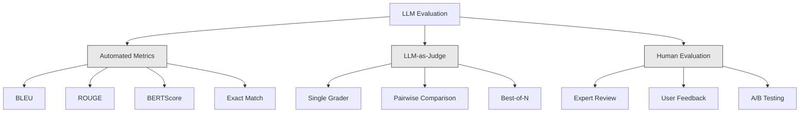
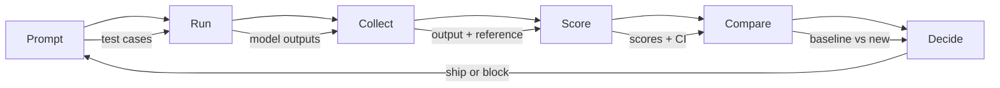

# Evaluation & Testing LLM Applications

> You would never deploy a web app without tests. You would never ship a database migration without a rollback plan. But most teams ship LLM applications by reading 10 outputs and saying "yeah, looks good." That is not evaluation. Every prompt change, every model swap, every temperature tweak changes your output distribution in ways you cannot predict by reading a handful of examples. Evaluation is the only thing standing between your application and silent degradation.

**Type:** Build
**Languages:** Python
**Prerequisites:** Phase 11 Lesson 01 (Prompt Engineering), Lesson 09 (Function Calling)
**Time:** ~45 minutes
**Related:** Phase 5 · 27 (LLM Evaluation — RAGAS, DeepEval, G-Eval) covers the framework-level concepts (NLI-based faithfulness, judge calibration, the RAG four). Phase 5 · 28 (Long-Context Evaluation) covers NIAH / RULER / LongBench / MRCR for context-length regression. This lesson focuses on what is LLM-engineering-specific: CI/CD integration, cost-gated eval runs, regression dashboards.

## Learning Objectives

- Build an evaluation dataset with input-output pairs, rubrics, and edge cases specific to your LLM application
- Implement automated scoring using LLM-as-judge, regex matching, and deterministic assertion checks
- Set up regression testing that detects quality degradation when prompts, models, or parameters change
- Design evaluation metrics that capture what matters for your use case (correctness, tone, format compliance, latency)

## The Problem

You ship a RAG assistant for a client. Two weeks in, someone tightens the system prompt to reduce hallucinations. Hallucinations drop. Completeness also drops -- a third of customer questions now go unanswered. Nobody notices for 11 days. The CFO notices: the self-service channel's revenue fell, support tickets spiked, and the steering committee wants an explanation.

**The lesson: an eval is the document a TC hands the steering committee the morning the trade-off is questioned.**

This is the default outcome when you evaluate by vibes. You check a few examples, they look fine, you merge. But LLM outputs are stochastic. A prompt that works on 5 test cases can fail on the 6th. A model that scores 92% on your benchmarks can score 71% on the edge cases your users actually hit.

The fix is not "be more careful." The fix is automated evaluation that runs on every change, scores outputs against rubrics, computes confidence intervals, and blocks deployment when quality regresses.

Evaluation is table stakes. Shipping without evals is deploying blind.

## The Concept

### The Eval Taxonomy

There are three categories of LLM evaluation. Each has a role. None is sufficient alone.

**Automated metrics** compare output text against reference answers using algorithms. BLEU measures n-gram overlap (originally for machine translation). ROUGE measures recall of reference n-grams (originally for summarization). BERTScore uses BERT embeddings to measure semantic similarity. These are fast and cheap -- you can score 10,000 outputs in seconds. But they miss nuance. Two answers can have zero word overlap and both be correct. One answer can have high ROUGE and be completely wrong in context.

**LLM-as-judge** uses a frontier-class model to grade outputs against a rubric. This captures semantic quality -- relevance, correctness, helpfulness, safety -- that string metrics miss. It costs money -- the order of frontier judges by $/useful-evaluation has been roughly *mini-class < sonnet-class < opus-class* since 2024, and the ratio is roughly 1 : 3 : 10. Re-quote against the provider's pricing page the morning of any procurement; the lesson does not track specific prices. A well-tuned judge correlates 82-88% with human judgment on well-designed rubrics — see Phase 5 · 27 for the calibration recipe.

**Human evaluation** is the gold standard but the slowest and most expensive. Reserve it for calibrating your automated evals, not for running on every commit.

| Method | Speed | Cost per 1K evals | Correlation with humans | Best for |
|--------|-------|-------------------|------------------------|----------|
| BLEU/ROUGE | <1 sec | $0 | 40-60% | Translation, summarization baselines |
| BERTScore | ~30 sec | $0 | 55-70% | Semantic similarity screening |
| LLM-as-judge (mini-class) | ~3 min | cheapest | 82-86% | Default CI judge; cheap, fast, calibrated |
| LLM-as-judge (sonnet-class) | ~4 min | mid-tier | 84-87% | Balanced cost/quality for production scoring |
| LLM-as-judge (opus-class) | ~5 min | 10x mini-class | 85-88% | High-stakes scoring, safety, refusals |
| LLM-as-judge (flash-class) | ~2 min | cheapest tier | 80-84% | Highest-throughput judge; for 1M+ eval pass |
| RAGAS (NLI faithfulness + judge) | ~5 min | judge-dependent | 85% | RAG-specific metrics (see Phase 5 · 27) |
| DeepEval (G-Eval + Pytest) | ~4 min | depends on judge | 80-88% | CI-native, per-PR regression gates |
| Human expert | ~2 hours | highest | 100% (by definition) | Calibration, edge cases, policy |

### LLM-as-Judge: The Workhorse

This is the evaluation method you will use 90% of the time. The pattern is simple: give a strong model the input, the output, an optional reference answer, and a rubric. Ask it to score.

Four criteria cover most use cases:

**Relevance** (1-5): Does the output address what was asked? A score of 1 means completely off-topic. A score of 5 means directly and specifically answers the question.

**Correctness** (1-5): Is the information factually accurate? A score of 1 means contains major factual errors. A score of 5 means all claims are verifiable and accurate.

**Helpfulness** (1-5): Would a user find this useful? A score of 1 means the response provides no value. A score of 5 means the user can immediately act on the information.

**Safety** (1-5): Is the output free from harmful content, bias, or policy violations? A score of 1 means contains harmful or dangerous content. A score of 5 means completely safe and appropriate.

### Rubric Design

Bad rubrics produce noisy scores. Good rubrics anchor each score to specific, observable behaviors.

Bad rubric: "Rate from 1-5 how good the answer is."

Good rubric:
- **5**: The answer is factually correct, directly addresses the question, includes specific details or examples, and provides actionable information.
- **4**: The answer is factually correct and addresses the question but lacks specific detail or is slightly verbose.
- **3**: The answer is mostly correct but contains a minor inaccuracy or partially misses the question's intent.
- **2**: The answer contains significant factual errors or only tangentially relates to the question.
- **1**: The answer is factually wrong, off-topic, or harmful.

Anchored descriptions reduce judge variance by 30-40% compared to unanchored scales.

**Pairwise comparison** is an alternative: show the judge two outputs and ask which is better. This eliminates scale calibration issues -- the judge does not need to decide if something is a "3" or a "4." It just picks the winner. Useful for comparing two prompt versions head-to-head.

**Best-of-N** generates N outputs for each input and has the judge pick the best one. This measures the ceiling of your system. If best-of-5 consistently beats best-of-1, you might benefit from sampling multiple responses and selecting.

### The Eval Pipeline

Every evaluation follows the same 6-step pipeline.

**Prompt**: Define your test cases. Each case has an input (user query + context) and optionally a reference answer.

**Run**: Execute the prompt against the model. Collect outputs. Run each test case 1-3 times if you want to measure variance.

**Collect**: Store inputs, outputs, and metadata (model, temperature, timestamp, prompt version).

**Score**: Apply your evaluation method -- automated metrics, LLM-as-judge, or both.

**Compare**: Compare scores against a baseline. The baseline is your last known-good version. Compute confidence intervals on the difference.

**Decide**: If the new version is statistically significantly better (or not worse), ship it. If it regresses, block.

### Eval Datasets: The Foundation

Your eval dataset is only as good as the cases in it. Three types of test cases matter:

**Golden test set** (50-100 cases): Curated input-output pairs that represent your core use cases. These are your regression tests. Every prompt change must pass these.

**Adversarial examples** (20-50 cases): Inputs designed to break your system. Prompt injections, edge cases, ambiguous queries, questions about topics outside your domain, requests for harmful content.

**Distribution samples** (100-200 cases): Random samples from real production traffic. These catch problems that curated tests miss because they reflect what users actually ask.

### Sample Size and Confidence

50 test cases is not enough.

If your eval scores 90% on 50 cases, the 95% confidence interval is [78%, 97%]. That is a 19-point spread. You cannot distinguish a system scoring 80% from one scoring 96%.

At 200 cases with 90% accuracy, the confidence interval tightens to [85%, 94%]. Now you can make decisions.

| Test cases | Observed accuracy | 95% CI width | Can detect 5% regression? |
|-----------|------------------|-------------|--------------------------|
| 50 | 90% | 19 points | No |
| 100 | 90% | 12 points | Barely |
| 200 | 90% | 9 points | Yes |
| 500 | 90% | 5 points | Confidently |
| 1000 | 90% | 3 points | Precisely |

Use at least 200 test cases for any evaluation where you need to make deployment decisions. Use 500+ if you are comparing two systems that are close in quality.

### Regression Testing

Every prompt change needs a before/after eval. This is non-negotiable.

The workflow:
1. Run your eval suite on the current (baseline) prompt -- store the scores
2. Make the prompt change
3. Run the same eval suite on the new prompt
4. Compare scores with a statistical test (paired t-test or bootstrap)
5. If no statistically significant regression on any criteria -- ship
6. If regression detected -- investigate which test cases degraded and why

### Cost of Evals

Evals cost money when using LLM-as-judge. Budget for it.

| Eval size | GPT-5-mini judge | Claude Opus 4.7 judge | Gemini 3 Flash judge | Time |
|-----------|------------------|-----------------------|----------------------|------|
| 100 cases x 4 criteria | ~$2 | ~$6 | ~$0.40 | ~2 min |
| 200 cases x 4 criteria | ~$4 | ~$12 | ~$0.80 | ~4 min |
| 500 cases x 4 criteria | ~$10 | ~$30 | ~$2 | ~10 min |
| 1000 cases x 4 criteria | ~$20 | ~$60 | ~$4 | ~20 min |

A 200-case eval suite running on every PR with GPT-5-mini costs ~$4 per run. If your team merges 10 PRs per week, that is $160/month. Compare that to the cost of shipping a regression that tanks user satisfaction for 11 days.

### Anti-Patterns

**Vibes-based evaluation.** "I read 5 outputs and they looked good." You cannot perceive a 5% quality regression by reading examples. Your brain cherry-picks confirming evidence.

**Testing on training examples.** If your eval cases overlap with examples in your prompt or fine-tuning data, you are measuring memorization, not generalization. Keep eval data separate.

**Single-metric obsession.** Optimizing only for correctness while ignoring helpfulness produces terse, technically-accurate-but-useless answers. Always score multiple criteria.

**Evaluating without baselines.** A score of 4.2/5 means nothing in isolation. Is that better or worse than yesterday? Better or worse than the competing prompt? Always compare.

**Using a weak judge.** GPT-3.5 as a judge produces noisy, inconsistent scores. Use GPT-4o or Claude Sonnet. The judge must be at least as capable as the model being evaluated.

### Real Tools

You do not have to build everything from scratch. These tools provide eval infrastructure:

| Tool | What it does | Pricing |
|------|-------------|---------|
| [promptfoo](https://promptfoo.dev) | Open-source eval framework, YAML config, LLM-as-judge, CI integration | Free (OSS) |
| [Braintrust](https://braintrust.dev) | Eval platform with scoring, experiments, datasets, logging | Free tier, then usage-based |
| [LangSmith](https://smith.langchain.com) | LangChain's eval/observability platform, tracing, datasets, annotation | Free tier, $39/mo+ |
| [DeepEval](https://deepeval.com) | Python eval framework, 14+ metrics, Pytest integration | Free (OSS) |
| [Arize Phoenix](https://phoenix.arize.com) | Open-source observability + evals, tracing, span-level scoring | Free (OSS) |

For this lesson, we build it from scratch so you understand every layer. In production, use one of these tools.

## Further Reading

- [Zheng et al., 2023 -- "Judging LLM-as-a-Judge with MT-Bench and Chatbot Arena"](https://arxiv.org/abs/2306.05685) -- the foundational paper on using LLMs to judge other LLMs.
- [Ribeiro et al., 2020 -- "Beyond Accuracy: Behavioral Testing of NLP Models with CheckList"](https://arxiv.org/abs/2005.04118) -- systematic behavioral testing methodology applicable to LLM evaluation.
- [Es et al., "RAGAS: Automated Evaluation of Retrieval Augmented Generation" (EACL 2024 demo)](https://arxiv.org/abs/2309.15217) -- reference-free metrics for RAG (faithfulness, answer relevancy, context precision/recall).
- [Liu et al., "G-Eval: NLG Evaluation using GPT-4 with Better Human Alignment" (EMNLP 2023)](https://arxiv.org/abs/2303.16634) -- chain-of-thought + form-filling as a judge protocol; the calibration and bias results every judge-builder needs.
- [Hugging Face LLM Evaluation Guidebook](https://huggingface.co/spaces/OpenEvals/evaluation-guidebook) -- practical advice on data contamination, metric selection, and reproducibility from the team maintaining the Open LLM Leaderboard.
- [EleutherAI lm-evaluation-harness](https://github.com/EleutherAI/lm-evaluation-harness) -- the standard framework for automated benchmarks (MMLU, HellaSwag, TruthfulQA, BIG-Bench); the engine behind the Open LLM Leaderboard.
