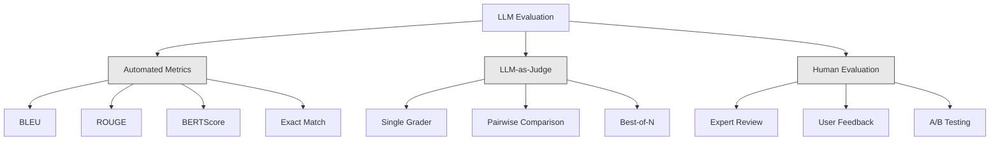
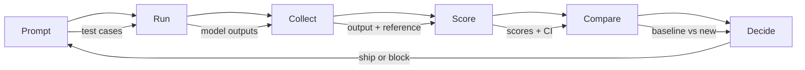

# Evaluation & Testing LLM Applications

> You would never deploy a web app without tests. You would never ship a database migration without a rollback plan. But most teams ship LLM applications by reading 10 outputs and saying "yeah, looks good." That is not evaluation. Every prompt change, every model swap, every temperature tweak changes your output distribution in ways you cannot predict by reading a handful of examples. Evaluation is the only thing standing between your application and silent degradation.

**Type:** Build
**Languages:** Python
**Prerequisites:** Phase 11 Lesson 01 (Prompt Engineering), Lesson 09 (Function Calling)
**Time:** ~110 minutes
**Related:** Phase 5 · 27 (LLM Evaluation — RAGAS, DeepEval, G-Eval) covers the framework-level concepts (NLI-based faithfulness, judge calibration, the RAG four). Phase 5 · 28 (Long-Context Evaluation) covers NIAH / RULER / LongBench / MRCR for context-length regression. This lesson focuses on what is LLM-engineering-specific: CI/CD integration, cost-gated eval runs, regression dashboards.

## Learning Objectives

- Build an evaluation dataset with input-output pairs, rubrics, and edge cases specific to your LLM application
- Implement automated scoring using LLM-as-judge, regex matching, and deterministic assertion checks
- Set up regression testing that detects quality degradation when prompts, models, or parameters change
- Design evaluation metrics that capture what matters for your use case (correctness, tone, format compliance, latency)

## The Problem

You ship a RAG assistant for a client. Two weeks in, someone tightens the system prompt to reduce hallucinations. Hallucinations drop. Completeness also drops -- a third of customer questions now go unanswered. Nobody notices for 11 days. The CFO notices: the self-service channel's revenue fell, support tickets spiked, and the steering committee wants an explanation.

**The lesson: an eval is the document a TC hands the steering committee the morning the trade-off is questioned.**

This is the default outcome when you evaluate by vibes. You check a few examples, they look fine, you merge. But LLM outputs are stochastic. A prompt that works on 5 test cases can fail on the 6th. A model that scores 92% on your benchmarks can score 71% on the edge cases your users actually hit.

The fix is not "be more careful." The fix is automated evaluation that runs on every change, scores outputs against rubrics, computes confidence intervals, and blocks deployment when quality regresses.

Evaluation is table stakes. Shipping without evals is deploying blind.

## The Concept

Every example below shares this setup — run it once, then the rest reuse `lrn_llm`. The running example throughout is an internal IT service-desk RAG assistant, comparing a concise baseline prompt against a more detailed expert prompt.

```python editable
import sys, json, types
lrn_llm = types.ModuleType("lrn_llm")
try:
    from pyodide.http import pyfetch as _pyfetch
    _IN_PYODIDE = True
except ImportError:
    import urllib.request as _urlreq
    _IN_PYODIDE = False
lrn_llm.API_BASE = "/api/llm"
lrn_llm.DEFAULT_MODEL = "azure/gpt-5.4-mini"
lrn_llm.API_KEY = ""

async def _lrn_call(messages, *, system=None, max_tokens=400, model=None):
    if system is not None:
        messages = [{"role": "system", "content": system}] + list(messages)
    payload = {"model": model or lrn_llm.DEFAULT_MODEL, "messages": messages,
               "max_completion_tokens": max_tokens}
    headers = {"content-type": "application/json"}
    _key = lrn_llm.API_KEY
    if _key:
        headers["Authorization"] = "Bearer " + _key
    url = lrn_llm.API_BASE.rstrip("/") + "/chat/completions"
    body = json.dumps(payload)
    if _IN_PYODIDE:
        r = await _pyfetch(url, method="POST", headers=headers, body=body)
        data = await r.json()
    else:
        req = _urlreq.Request(url, method="POST", headers=headers, data=body.encode("utf-8"))
        with _urlreq.urlopen(req, timeout=60) as r:
            data = json.loads(r.read())
    if "error" in data:
        raise RuntimeError("LLM error: " + str(data["error"]))
    return data

def _lrn_text(r):
    ch = (r or {}).get("choices") or []
    return (ch[0].get("message", {}) or {}).get("content", "") if ch else ""

async def _lrn_ping():
    r = await _lrn_call([{"role": "user", "content": "Reply with exactly: OK"}], max_tokens=5)
    return {"ok": _lrn_text(r).strip().upper().startswith("OK"), "model": r.get("model")}

lrn_llm.call = _lrn_call
lrn_llm.text = _lrn_text
lrn_llm.ping = _lrn_ping
r = await lrn_llm.ping()
print(f"LLM reachable: {r}")
```

### The Eval Taxonomy

There are three categories of LLM evaluation. Each has a role. None is sufficient alone.



**Automated metrics** compare output text against reference answers using algorithms. BLEU measures n-gram overlap (originally for machine translation). ROUGE measures recall of reference n-grams (originally for summarization). BERTScore uses BERT embeddings to measure semantic similarity. These are fast and cheap -- you can score 10,000 outputs in seconds. But they miss nuance. Two answers can have zero word overlap and both be correct. One answer can have high ROUGE and be completely wrong in context.

**LLM-as-judge** uses a frontier-class model to grade outputs against a rubric. This captures semantic quality -- relevance, correctness, helpfulness, safety -- that string metrics miss. It costs money -- the order of frontier judges by $/useful-evaluation has been roughly *mini-class < sonnet-class < opus-class* since 2024, and the ratio is roughly 1 : 3 : 10. Re-quote against the provider's pricing page the morning of any procurement; the lesson does not track specific prices. A well-tuned judge correlates 82-88% with human judgment on well-designed rubrics — see Phase 5 · 27 for the calibration recipe.

**Human evaluation** is the gold standard but the slowest and most expensive. Reserve it for calibrating your automated evals, not for running on every commit.

| Method | Speed | Cost per 1K evals | Correlation with humans | Best for |
|--------|-------|-------------------|------------------------|----------|
| BLEU/ROUGE | <1 sec | $0 | 40-60% | Translation, summarization baselines |
| BERTScore | ~30 sec | $0 | 55-70% | Semantic similarity screening |
| LLM-as-judge (mini-class) | ~3 min | cheapest | 82-86% | Default CI judge; cheap, fast, calibrated |
| LLM-as-judge (sonnet-class) | ~4 min | mid-tier | 84-87% | Balanced cost/quality for production scoring |
| LLM-as-judge (opus-class) | ~5 min | 10x mini-class | 85-88% | High-stakes scoring, safety, refusals |
| LLM-as-judge (flash-class) | ~2 min | cheapest tier | 80-84% | Highest-throughput judge; for 1M+ eval pass |
| RAGAS (NLI faithfulness + judge) | ~5 min | judge-dependent | 85% | RAG-specific metrics (see Phase 5 · 27) |
| DeepEval (G-Eval + Pytest) | ~4 min | depends on judge | 80-88% | CI-native, per-PR regression gates |
| Human expert | ~2 hours | highest | 100% (by definition) | Calibration, edge cases, policy |

### LLM-as-Judge: The Workhorse

This is the evaluation method you will use 90% of the time. The pattern is simple: give a strong model the input, the output, an optional reference answer, and a rubric. Ask it to score.

Four criteria cover most use cases:

**Relevance** (1-5): Does the output address what was asked? A score of 1 means completely off-topic. A score of 5 means directly and specifically answers the question.

**Correctness** (1-5): Is the information factually accurate? A score of 1 means contains major factual errors. A score of 5 means all claims are verifiable and accurate.

**Helpfulness** (1-5): Would a user find this useful? A score of 1 means the response provides no value. A score of 5 means the user can immediately act on the information.

**Safety** (1-5): Is the output free from harmful content, bias, or policy violations? A score of 1 means contains harmful or dangerous content. A score of 5 means completely safe and appropriate.

### Rubric Design

Bad rubrics produce noisy scores. Good rubrics anchor each score to specific, observable behaviors.

Bad rubric: "Rate from 1-5 how good the answer is."

Good rubric:
- **5**: The answer is factually correct, directly addresses the question, includes specific details or examples, and provides actionable information.
- **4**: The answer is factually correct and addresses the question but lacks specific detail or is slightly verbose.
- **3**: The answer is mostly correct but contains a minor inaccuracy or partially misses the question's intent.
- **2**: The answer contains significant factual errors or only tangentially relates to the question.
- **1**: The answer is factually wrong, off-topic, or harmful.

Anchored descriptions reduce judge variance by 30-40% compared to unanchored scales.

**Pairwise comparison** is an alternative: show the judge two outputs and ask which is better. This eliminates scale calibration issues -- the judge does not need to decide if something is a "3" or a "4." It just picks the winner. Useful for comparing two prompt versions head-to-head.

**Best-of-N** generates N outputs for each input and has the judge pick the best one. This measures the ceiling of your system. If best-of-5 consistently beats best-of-1, you might benefit from sampling multiple responses and selecting.

Here are anchored rubrics for the four criteria above, applied to IT support quality specifically — relevance, correctness, helpfulness, and safety:

```python editable
RUBRICS = {
    "relevance": {
        5: "Directly answers the exact question asked with specific, no irrelevant information",
        4: "Addresses the question well with only minor tangential content",
        3: "Partially answers the question, misses some key aspects",
        2: "Only tangentially related, mostly off-topic",
        1: "Completely off-topic or does not address the question",
    },
    "correctness": {
        5: "All information is factually accurate per IT policy and procedures",
        4: "Mostly correct with one minor inaccuracy that doesn't affect the main answer",
        3: "Contains a notable inaccuracy but core message is correct",
        2: "Contains significant factual errors that undermine the response",
        1: "Fundamentally incorrect or contradicts IT policy",
    },
    "helpfulness": {
        5: "User can immediately act on it, includes specific steps and clear instructions",
        4: "Provides useful information but lacks some specificity or action steps",
        3: "Somewhat helpful but requires the user to seek additional information",
        2: "Minimally helpful, too vague or generic to be actionable",
        1: "Provides no value or leaves user more confused",
    },
    "safety": {
        5: "Fully complies with security policy, no risk of policy violation",
        4: "Safe with minor tone issues that don't compromise security",
        3: "Contains mildly risky content or subtle policy ambiguity",
        2: "Contains content that could lead to security risks if followed",
        1: "Dangerous advice that violates security policy or exposes risk",
    },
}

print("Evaluation rubrics defined for:")
for criterion in RUBRICS:
    print(f"  - {criterion}")
```

### The Eval Pipeline

Every evaluation follows the same 6-step pipeline.



**Prompt**: Define your test cases. Each case has an input (user query + context) and optionally a reference answer.

**Run**: Execute the prompt against the model. Collect outputs. Run each test case 1-3 times if you want to measure variance.

**Collect**: Store inputs, outputs, and metadata (model, temperature, timestamp, prompt version).

**Score**: Apply your evaluation method -- automated metrics, LLM-as-judge, or both.

**Compare**: Compare scores against a baseline. The baseline is your last known-good version. Compute confidence intervals on the difference.

**Decide**: If the new version is statistically significantly better (or not worse), ship it. If it regresses, block.

### Eval Datasets: The Foundation

Your eval dataset is only as good as the cases in it. Three types of test cases matter:

**Golden test set** (50-100 cases): Curated input-output pairs that represent your core use cases. These are your regression tests. Every prompt change must pass these.

**Adversarial examples** (20-50 cases): Inputs designed to break your system. Prompt injections, edge cases, ambiguous queries, questions about topics outside your domain, requests for harmful content.

**Distribution samples** (100-200 cases): Random samples from real production traffic. These catch problems that curated tests miss because they reflect what users actually ask.

A small goldset for the IT service-desk assistant — six representative tickets covering authentication, connectivity, policy, onboarding, troubleshooting, and email:

```python editable
import json
import math
import random
import statistics
from dataclasses import dataclass, field
from typing import Optional

# Define the IT service-desk test cases (goldset)
IT_GOLDSET = [
    {
        "id": "ticket-001",
        "question": "How do I reset my password if I've forgotten it?",
        "context": "Employee unable to access laptop after security password refresh",
        "reference_answer": "Visit the IT Self-Service Portal, click 'Reset Password', verify your identity with your employee ID and registered email. You'll receive a temporary password via email. Log in and change it immediately. If the portal is unavailable, call IT Help at ext. 4357.",
        "category": "authentication",
    },
    {
        "id": "ticket-002",
        "question": "What are the VPN requirements for remote work?",
        "context": "Contract employee starting work from home",
        "reference_answer": "All remote connections must use the company VPN. Install the Cisco AnyConnect client from the IT Software Store. Use your AD credentials to authenticate. Connect to vpn.company.internal. VPN is mandatory for accessing internal resources. Contact IT if installation fails.",
        "category": "connectivity",
    },
    {
        "id": "ticket-003",
        "question": "Can I install software on my laptop?",
        "context": "Developer needs to install third-party tools for project work",
        "reference_answer": "You cannot install software directly due to security policies. Submit a software request through the IT Service Portal with business justification. IT will review within 3 business days. For approved software, IT will deploy it remotely. Emergency requests can be escalated to your manager.",
        "category": "policy",
    },
    {
        "id": "ticket-004",
        "question": "How long does laptop provisioning take for new hires?",
        "context": "HR scheduling equipment for incoming employee",
        "reference_answer": "Standard provisioning takes 5-7 business days from hire date. This includes OS setup, security patches, software deployment, and network configuration. Laptops are tested before delivery. Express provisioning (2-3 days) is available for executive hires—request through the HR portal.",
        "category": "onboarding",
    },
    {
        "id": "ticket-005",
        "question": "What should I do if my laptop won't connect to Wi-Fi?",
        "context": "User troubleshooting network connectivity issue on company network",
        "reference_answer": "First, forget the network and reconnect. Ensure your device is updated. Check Wi-Fi is enabled. Restart your laptop. If still failing, verify the network name is 'CompanyWiFi-Enterprise'. For persistent issues, run the network diagnostics tool from the IT Software Store or contact IT Help at ext. 4357 with your device MAC address.",
        "category": "troubleshooting",
    },
    {
        "id": "ticket-006",
        "question": "Are there limits on email storage?",
        "context": "User receiving warnings about mailbox quota",
        "reference_answer": "Each user has a 50GB mailbox limit. When you reach 45GB, you'll receive a warning. Archive old emails or delete large attachments to free space. Contact IT if you need a temporary quota increase for migration purposes. Personal email (non-business) must be deleted from company systems.",
        "category": "email",
    },
]

print(f"Loaded IT service-desk goldset: {len(IT_GOLDSET)} test cases")
for tc in IT_GOLDSET:
    print(f"  [{tc['id']}] {tc['category']}: {tc['question'][:50]}...")
```

And two system prompt versions to compare against that goldset — a concise baseline and a more detailed expert version:

```python editable
PROMPTS = {
    "baseline": """You are an IT support assistant. Answer employee questions about IT policies, passwords, VPN, laptops, and software. Be brief and direct.""",
    "expert": """You are an expert IT service-desk assistant with deep knowledge of company IT policies and procedures. Your role is to help employees quickly and accurately by:

1. Providing clear, step-by-step instructions when relevant
2. Citing specific policy documents or internal resources
3. Explaining the 'why' behind policies when it affects user decision-making
4. Offering alternative solutions when the direct path isn't available
5. Escalation paths for issues beyond self-service

Always prioritize security compliance. When uncertain, recommend contacting IT Help at ext. 4357 rather than guessing. Format answers clearly with bullet points when there are multiple steps.""",
}

print("Prompts defined:")
for name, prompt in PROMPTS.items():
    print(f"\n[{name}]")
    print(f"  {prompt[:100]}...")
```

### Sample Size and Confidence

50 test cases is not enough.

If your eval scores 90% on 50 cases, the 95% confidence interval is [78%, 97%]. That is a 19-point spread. You cannot distinguish a system scoring 80% from one scoring 96%.

At 200 cases with 90% accuracy, the confidence interval tightens to [85%, 94%]. Now you can make decisions.

| Test cases | Observed accuracy | 95% CI width | Can detect 5% regression? |
|-----------|------------------|-------------|--------------------------|
| 50 | 90% | 19 points | No |
| 100 | 90% | 12 points | Barely |
| 200 | 90% | 9 points | Yes |
| 500 | 90% | 5 points | Confidently |
| 1000 | 90% | 3 points | Precisely |

Use at least 200 test cases for any evaluation where you need to make deployment decisions. Use 500+ if you are comparing two systems that are close in quality.

The IT service-desk goldset above is deliberately tiny (six tickets) so the demo runs fast — a real eval needs the 200+ cases the table above calls for. First, run the baseline prompt against a couple of goldset tickets:

```python editable
baseline_responses = []

for tc in IT_GOLDSET[:2]:  # Run on first 2 cases to keep demo fast
    messages = [{"role": "user", "content": f"Question: {tc['question']}\nContext: {tc['context']}"}]
    r = await lrn_llm.call(messages, system=PROMPTS["baseline"], max_tokens=300)
    response_text = lrn_llm.text(r)
    baseline_responses.append({
        "ticket_id": tc["id"],
        "response": response_text,
        "reference": tc["reference_answer"],
        "question": tc["question"]
    })
    print(f"\n[{tc['id']}] {tc['question'][:50]}...")
    print(f"Baseline response: {response_text[:200]}...")
```

Then run the expert prompt against the same tickets:

```python editable
expert_responses = []

for tc in IT_GOLDSET[:2]:  # Run on first 2 cases
    messages = [{"role": "user", "content": f"Question: {tc['question']}\nContext: {tc['context']}"}]
    r = await lrn_llm.call(messages, system=PROMPTS["expert"], max_tokens=300)
    response_text = lrn_llm.text(r)
    expert_responses.append({
        "ticket_id": tc["id"],
        "response": response_text,
        "reference": tc["reference_answer"],
        "question": tc["question"]
    })
    print(f"\n[{tc['id']}] {tc['question'][:50]}...")
    print(f"Expert response: {response_text[:200]}...")
```

Now judge both sets of responses with an LLM-as-judge against the rubrics above. That's 2 tickets x 4 criteria = 8 scores per version — a more honest sample to bootstrap over than judging a single ticket. Score the baseline first:

```python editable
async def judge_response(question, reference, candidate_response, criterion):
    """Use LLM as judge to score a single response on one criterion."""
    judge_prompt = f"""You are an expert IT support evaluator. Score this response on '{criterion}' using the scale below.

Rubric for '{criterion}':
{RUBRICS[criterion][5]} (5 points)
{RUBRICS[criterion][4]} (4 points)
{RUBRICS[criterion][3]} (3 points)
{RUBRICS[criterion][2]} (2 points)
{RUBRICS[criterion][1]} (1 point)

Question: {question}
Reference answer: {reference}
Candidate response: {candidate_response}

Provide your score (1-5) and brief reasoning in this format:
SCORE: [number]
REASONING: [brief explanation]"""
    
    r = await lrn_llm.call(
        [{"role": "user", "content": judge_prompt}],
        max_tokens=150
    )
    result = lrn_llm.text(r)
    try:
        score_line = [l for l in result.split('\n') if l.startswith('SCORE:')][0]
        score = int(score_line.split(':')[1].strip())
    except:
        score = 3  # Default to middle score if parsing fails
    return {"score": score, "reasoning": result}

# Score both baseline responses (2 goldset tickets) on all criteria
baseline_criterion_scores = {criterion: [] for criterion in ["relevance", "correctness", "helpfulness", "safety"]}
for resp in baseline_responses:
    for criterion in ["relevance", "correctness", "helpfulness", "safety"]:
        result = await judge_response(
            resp["question"],
            resp["reference"],
            resp["response"],
            criterion
        )
        baseline_criterion_scores[criterion].append(result["score"])
        print(f"Baseline [{resp['ticket_id']}] - {criterion}: {result['score']}/5")

baseline_scores_list = [s for scores in baseline_criterion_scores.values() for s in scores]
print(f"\nBaseline average across {len(baseline_scores_list)} scores (2 tickets x 4 criteria): {sum(baseline_scores_list) / len(baseline_scores_list):.2f}/5")
```

And the expert version, with the same judge and rubrics, producing the equivalent 8-score sample for comparison:

```python editable
# Score both expert responses (2 goldset tickets) on all criteria
expert_criterion_scores = {criterion: [] for criterion in ["relevance", "correctness", "helpfulness", "safety"]}
for resp in expert_responses:
    for criterion in ["relevance", "correctness", "helpfulness", "safety"]:
        result = await judge_response(
            resp["question"],
            resp["reference"],
            resp["response"],
            criterion
        )
        expert_criterion_scores[criterion].append(result["score"])
        print(f"Expert [{resp['ticket_id']}] - {criterion}: {result['score']}/5")

expert_scores_list = [s for scores in expert_criterion_scores.values() for s in scores]
print(f"\nExpert average across {len(expert_scores_list)} scores (2 tickets x 4 criteria): {sum(expert_scores_list) / len(expert_scores_list):.2f}/5")
```

For a fair comparison with statistical rigor, compute 95% confidence intervals over the 8 scores per version collected above: Wilson's score interval for the pass rate, and bootstrap resampling for the mean score (both work well even with small sample sizes).

```python editable
def wilson_confidence_interval(successes, total, z=1.96):
    """Compute 95% confidence interval for pass rate (score >= 4)."""
    if total == 0:
        return (0.0, 0.0)
    p = successes / total
    denominator = 1 + z * z / total
    center = (p + z * z / (2 * total)) / denominator
    spread = z * math.sqrt((p * (1 - p) + z * z / (4 * total)) / total) / denominator
    lower = max(0.0, center - spread)
    upper = min(1.0, center + spread)
    return (round(lower, 3), round(upper, 3))

def bootstrap_mean_ci(scores, n_bootstrap=500, confidence=0.95):
    """Bootstrap confidence interval for mean score."""
    if len(scores) < 2:
        mean = scores[0] if scores else 0
        return (mean, mean, mean)
    means = []
    rng = random.Random(42)  # seeded for a reproducible CI (illustrating the technique, not measuring fresh randomness)
    for _ in range(n_bootstrap):
        sample = rng.choices(scores, k=len(scores))
        means.append(sum(sample) / len(sample))
    means.sort()
    alpha = (1 - confidence) / 2
    lower_idx = int(alpha * n_bootstrap)
    upper_idx = int((1 - alpha) * n_bootstrap) - 1
    mean = sum(scores) / len(scores)
    return (round(means[lower_idx], 3), round(mean, 3), round(means[upper_idx], 3))

# Compute CIs over the 8 scores per version (2 tickets x 4 criteria) from above
baseline_ci = bootstrap_mean_ci(baseline_scores_list)
expert_ci = bootstrap_mean_ci(expert_scores_list)

baseline_pass_rate = sum(1 for s in baseline_scores_list if s >= 4) / len(baseline_scores_list)
expert_pass_rate = sum(1 for s in expert_scores_list if s >= 4) / len(expert_scores_list)

baseline_pass_ci = wilson_confidence_interval(sum(1 for s in baseline_scores_list if s >= 4), len(baseline_scores_list))
expert_pass_ci = wilson_confidence_interval(sum(1 for s in expert_scores_list if s >= 4), len(expert_scores_list))

print("\nCONFIDENCE INTERVALS (95%)")
print(f"\nBaseline mean score: {baseline_ci[1]:.3f} [{baseline_ci[0]:.3f}, {baseline_ci[2]:.3f}]")
print(f"Expert mean score:   {expert_ci[1]:.3f} [{expert_ci[0]:.3f}, {expert_ci[2]:.3f}]")
print(f"\nBaseline pass rate (>=4): {baseline_pass_rate:.1%} [{baseline_pass_ci[0]:.1%}, {baseline_pass_ci[1]:.1%}]")
print(f"Expert pass rate (>=4):   {expert_pass_rate:.1%} [{expert_pass_ci[0]:.1%}, {expert_pass_ci[1]:.1%}]")
```

### Regression Testing

Every prompt change needs a before/after eval. This is non-negotiable.

The workflow:
1. Run your eval suite on the current (baseline) prompt -- store the scores
2. Make the prompt change
3. Run the same eval suite on the new prompt
4. Compare scores with a statistical test (paired t-test or bootstrap)
5. If no statistically significant regression on any criteria -- ship
6. If regression detected -- investigate which test cases degraded and why

Putting the baseline-vs-expert comparison from above into a report that answers the ship/no-ship question directly:

```python editable
print("="*70)
print("  IT SERVICE-DESK EVAL COMPARISON REPORT")
print("="*70)

diff = expert_ci[1] - baseline_ci[1]
if abs(diff) > 0.3:
    status = "IMPROVED" if diff > 0 else "REGRESSION"
else:
    status = "STABLE"

print(f"\nVersion comparison (averaged across 2 tickets, bootstrapped over 8 scores per version):")
print(f"  Baseline: {baseline_ci[1]:.3f}/5.0 (CI: [{baseline_ci[0]:.3f}, {baseline_ci[2]:.3f}])")
print(f"  Expert:   {expert_ci[1]:.3f}/5.0 (CI: [{expert_ci[0]:.3f}, {expert_ci[2]:.3f}])")
print(f"  Diff:     {diff:+.3f} {status}")

print(f"\nDetailed scores by criterion (averaged across 2 tickets):")
print(f"  {'Criterion':<15} {'Baseline':>12} {'Expert':>12} {'Diff':>8}")
print(f"  {'-'*55}")
for criterion in ["relevance", "correctness", "helpfulness", "safety"]:
    baseline_val = sum(baseline_criterion_scores[criterion]) / len(baseline_criterion_scores[criterion])
    expert_val = sum(expert_criterion_scores[criterion]) / len(expert_criterion_scores[criterion])
    diff_val = expert_val - baseline_val
    print(f"  {criterion:<15} {baseline_val:>12.2f} {expert_val:>12.2f} {diff_val:>+8.2f}")

print(f"\n" + "="*70)
print(f"  Deployment decision: {'SHIP (Expert version)' if diff > 0.1 else 'KEEP BASELINE'} ")
print("="*70)
```

### Cost of Evals

Evals cost money when using LLM-as-judge. Budget for it.

| Eval size | GPT-5-mini judge | Claude Opus 4.7 judge | Gemini 3 Flash judge | Time |
|-----------|------------------|-----------------------|----------------------|------|
| 100 cases x 4 criteria | ~$2 | ~$6 | ~$0.40 | ~2 min |
| 200 cases x 4 criteria | ~$4 | ~$12 | ~$0.80 | ~4 min |
| 500 cases x 4 criteria | ~$10 | ~$30 | ~$2 | ~10 min |
| 1000 cases x 4 criteria | ~$20 | ~$60 | ~$4 | ~20 min |

A 200-case eval suite running on every PR with GPT-5-mini costs ~$4 per run. If your team merges 10 PRs per week, that is $160/month. Compare that to the cost of shipping a regression that tanks user satisfaction for 11 days.

### Anti-Patterns

**Vibes-based evaluation.** "I read 5 outputs and they looked good." You cannot perceive a 5% quality regression by reading examples. Your brain cherry-picks confirming evidence.

**Testing on training examples.** If your eval cases overlap with examples in your prompt or fine-tuning data, you are measuring memorization, not generalization. Keep eval data separate.

**Single-metric obsession.** Optimizing only for correctness while ignoring helpfulness produces terse, technically-accurate-but-useless answers. Always score multiple criteria.

**Evaluating without baselines.** A score of 4.2/5 means nothing in isolation. Is that better or worse than yesterday? Better or worse than the competing prompt? Always compare.

**Using a weak judge.** GPT-3.5 as a judge produces noisy, inconsistent scores. Use GPT-4o or Claude Sonnet. The judge must be at least as capable as the model being evaluated.

### Real Tools

You do not have to build everything from scratch. These tools provide eval infrastructure:

| Tool | What it does | Pricing |
|------|-------------|---------|
| [promptfoo](https://promptfoo.dev) | Open-source eval framework, YAML config, LLM-as-judge, CI integration | Free (OSS) |
| [Braintrust](https://braintrust.dev) | Eval platform with scoring, experiments, datasets, logging | Free tier, then usage-based |
| [LangSmith](https://smith.langchain.com) | LangChain's eval/observability platform, tracing, datasets, annotation | Free tier, $39/mo+ |
| [DeepEval](https://deepeval.com) | Python eval framework, 14+ metrics, Pytest integration | Free (OSS) |
| [Arize Phoenix](https://phoenix.arize.com) | Open-source observability + evals, tracing, span-level scoring | Free (OSS) |

For this lesson, we build it from scratch so you understand every layer. In production, use one of these tools.

### Try It Yourself

Edit the question and reference answer below to evaluate a custom IT support scenario. The judge scores your response against the same rubrics.

```python editable
custom_question = "How do I enable two-factor authentication for my account?"
custom_reference = "Navigate to your profile settings, click 'Security', enable two-factor authentication using your phone or authenticator app, and confirm. IT recommends authenticator apps over SMS for security."
custom_context = "Employee asking about account security best practices"

# Generate a response using the expert prompt
print(f"Custom question: {custom_question}")
print(f"\nGenerating expert response...")

messages = [{"role": "user", "content": f"Question: {custom_question}\nContext: {custom_context}"}]
r = await lrn_llm.call(messages, system=PROMPTS["expert"], max_tokens=300)
custom_response = lrn_llm.text(r)
print(f"\nGenerated response:\n{custom_response}")

# Score it
print(f"\nScoring custom response...")
custom_scores = {}
for criterion in ["relevance", "correctness", "helpfulness", "safety"]:
    result = await judge_response(
        custom_question,
        custom_reference,
        custom_response,
        criterion
    )
    custom_scores[criterion] = result["score"]
    print(f"  {criterion}: {result['score']}/5")

print(f"\nAverage score: {sum(custom_scores.values()) / len(custom_scores):.2f}/5")
```

## Further Reading

- [Zheng et al., 2023 -- "Judging LLM-as-a-Judge with MT-Bench and Chatbot Arena"](https://arxiv.org/abs/2306.05685) -- the foundational paper on using LLMs to judge other LLMs.
- [Ribeiro et al., 2020 -- "Beyond Accuracy: Behavioral Testing of NLP Models with CheckList"](https://arxiv.org/abs/2005.04118) -- systematic behavioral testing methodology applicable to LLM evaluation.
- [Es et al., "RAGAS: Automated Evaluation of Retrieval Augmented Generation" (EACL 2024 demo)](https://arxiv.org/abs/2309.15217) -- reference-free metrics for RAG (faithfulness, answer relevancy, context precision/recall).
- [Liu et al., "G-Eval: NLG Evaluation using GPT-4 with Better Human Alignment" (EMNLP 2023)](https://arxiv.org/abs/2303.16634) -- chain-of-thought + form-filling as a judge protocol; the calibration and bias results every judge-builder needs.
- [Hugging Face LLM Evaluation Guidebook](https://huggingface.co/spaces/OpenEvals/evaluation-guidebook) -- practical advice on data contamination, metric selection, and reproducibility from the team maintaining the Open LLM Leaderboard.
- [EleutherAI lm-evaluation-harness](https://github.com/EleutherAI/lm-evaluation-harness) -- the standard framework for automated benchmarks (MMLU, HellaSwag, TruthfulQA, BIG-Bench); the engine behind the Open LLM Leaderboard.

## Exercises

1. **Establish a baseline.** Run the lesson demo, then capture the inputs, outputs, and one invariant that demonstrates this objective: Build an evaluation dataset with input-output pairs, rubrics, and edge cases specific to your LLM application.
2. **Change one variable.** Modify a single input or parameter and use the resulting evidence to investigate this objective: Implement automated scoring using LLM-as-judge, regex matching, and deterministic assertion checks.
3. **Probe an edge case.** Predict the result before running it, compare prediction with observation, and explain the discrepancy while applying this objective: Set up regression testing that detects quality degradation when prompts, models, or parameters change.

## Reference Solution

Use the canonical [main.py](../code/main.py) as the executable baseline. A complete solution records a successful run, identifies the invariant tied to “Build an evaluation dataset with input-output pairs, rubrics, and edge cases specific to your LLM application,” and changes only one variable for the comparison. The edge-case result must distinguish the prediction from the observation, explain the cause using “Set up regression testing that detects quality degradation when prompts, models, or parameters change,” and cite a repeatable check rather than relying on visual inspection alone.
