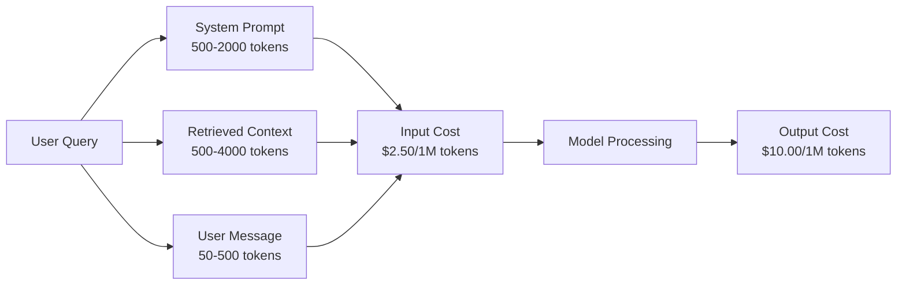
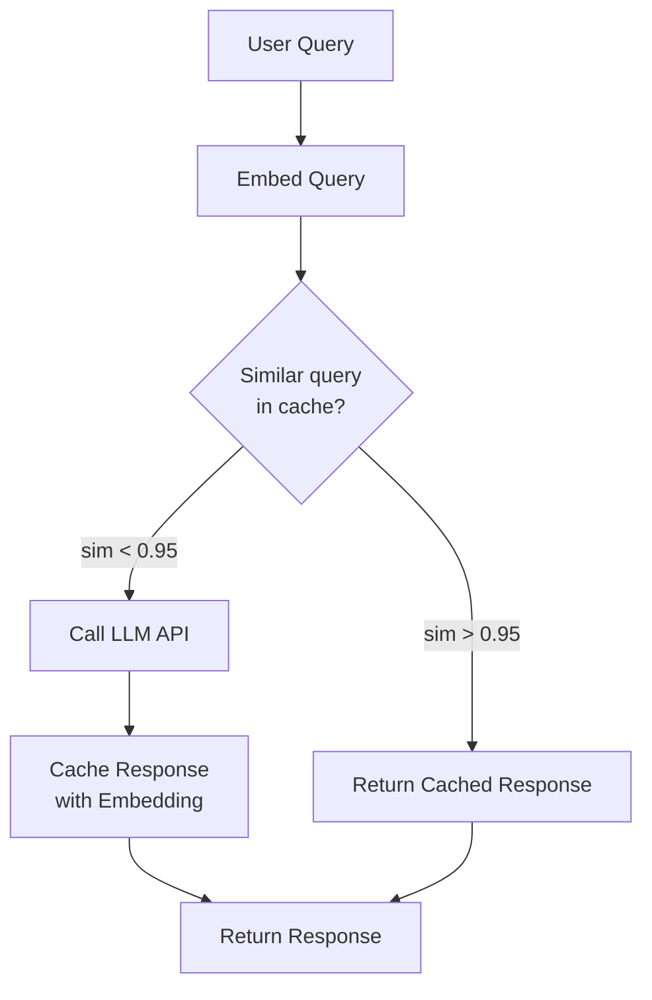
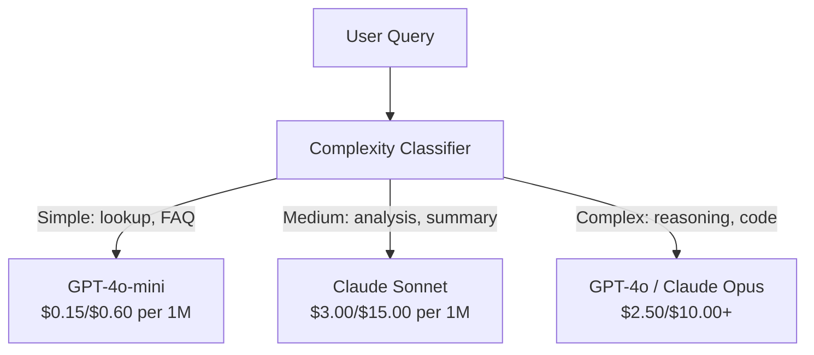

# Caching, Rate Limiting & Cost Optimization

> Most AI startups do not die from bad models. They die from bad unit economics. A single GPT-4o call costs fractions of a cent. Ten thousand users making ten calls per day costs $250 in input tokens alone -- before you charge a single dollar. The companies that survive are the ones that treat every API call as a financial transaction, not a function call.

**Type:** Build
**Languages:** Python
**Prerequisites:** Phase 11 Lesson 09 (Function Calling)
**Time:** ~45 minutes
**Related:** Phase 11 · 15 (Prompt Caching) — this lesson covers application-layer caching (semantic cache, exact hash cache, model routing). Lesson 15 covers provider-layer prompt caching (Anthropic cache_control, OpenAI automatic, Gemini CachedContent). Combine both for 50-95% cost reduction.

## Learning Objectives

- Implement semantic caching that serves repeated or similar queries from cache instead of making a new API call
- Calculate per-request costs across providers and implement token-aware rate limiting and budget alerts
- Build a cost optimization layer with prompt compression, model routing (expensive vs cheap), and response caching
- Design a tiered caching strategy using exact match, semantic similarity, and prefix caching for different query types

## The Problem

You build a RAG chatbot. It works beautifully. Users love it.

Then the invoice arrives.

Pricing changes quarterly. Before you write a single number into a Statement of Work or a FinOps dashboard, pull the current input/output price per million tokens from each provider's pricing page (links in Further Reading). Build a per-request cost model from those numbers — input cost + output cost + cached-input cost — and refresh it whenever a vendor ships a new SKU. The figures below are illustrative placeholders, not quotable prices.

Here is the math that kills startups:

- 10,000 daily active users
- 10 queries per user per day
- 1,000 input tokens per query (system prompt + context + user message)
- 500 output tokens per response

**Daily input cost:** 10,000 x 10 x 1,000 / 1,000,000 x $2.50 = **$250/day**
**Daily output cost:** 10,000 x 10 x 500 / 1,000,000 x $10.00 = **$500/day**
**Monthly total:** **$22,500/month**

That is just the LLM. Add embeddings, vector database hosting, infrastructure. You are looking at $30,000/month for a chatbot.

The brutal part: 40-60% of those queries are near-duplicates. Users ask the same questions in slightly different words. Your system prompt -- identical across every request -- gets billed every single time. Context documents retrieved by RAG repeat across users who ask about the same topic.

You are paying full price for redundant computation.

## The Concept

Every example below shares this setup — run it once, then the rest reuse `lrn_llm`:

```python editable
import sys, json, types
lrn_llm = types.ModuleType("lrn_llm")
try:
    from pyodide.http import pyfetch as _pyfetch
    _IN_PYODIDE = True
except ImportError:
    import urllib.request as _urlreq
    _IN_PYODIDE = False
lrn_llm.API_BASE = "/api/llm"
lrn_llm.DEFAULT_MODEL = "azure/gpt-5.4-mini"
lrn_llm.API_KEY = ""

async def _lrn_call(messages, *, system=None, max_tokens=400, model=None):
    if system is not None:
        messages = [{"role": "system", "content": system}] + list(messages)
    payload = {"model": model or lrn_llm.DEFAULT_MODEL, "messages": messages,
               "max_completion_tokens": max_tokens}
    headers = {"content-type": "application/json"}
    _key = lrn_llm.API_KEY
    if _key:
        headers["Authorization"] = "Bearer " + _key
    url = lrn_llm.API_BASE.rstrip("/") + "/chat/completions"
    body = json.dumps(payload)
    if _IN_PYODIDE:
        r = await _pyfetch(url, method="POST", headers=headers, body=body)
        data = await r.json()
    else:
        req = _urlreq.Request(url, method="POST", headers=headers, data=body.encode("utf-8"))
        with _urlreq.urlopen(req, timeout=60) as r:
            data = json.loads(r.read())
    if "error" in data:
        raise RuntimeError("LLM error: " + str(data["error"]))
    return data

def _lrn_text(r):
    ch = (r or {}).get("choices") or []
    return (ch[0].get("message", {}) or {}).get("content", "") if ch else ""

async def _lrn_ping():
    r = await _lrn_call([{"role": "user", "content": "Reply with exactly: OK"}], max_tokens=5)
    return {"ok": _lrn_text(r).strip().upper().startswith("OK"), "model": r.get("model")}

lrn_llm.call = _lrn_call
lrn_llm.text = _lrn_text
lrn_llm.ping = _lrn_ping
r = await lrn_llm.ping()
print(f"LLM reachable: {r}")
```

### The Cost Anatomy of an LLM Call

Every API call has five cost components.



System prompts are the silent killer. A 1,500-token system prompt sent with every request costs $3,750 per million requests just for that prefix (1,500 tokens x $2.50/1M input rate). At 100K requests per day, that is $375/day -- $11,250/month -- for text that never changes.

```python editable
import hashlib, time, math
from dataclasses import dataclass

MODEL_PRICING = {
    "gpt-4o": {"input": 2.50, "output": 10.00, "cached_input": 1.25},
    "gpt-4o-mini": {"input": 0.15, "output": 0.60, "cached_input": 0.075},
    "claude-opus-4": {"input": 15.00, "output": 75.00, "cached_input": 1.50},
    "claude-sonnet-4": {"input": 3.00, "output": 15.00, "cached_input": 0.30},
    "claude-haiku-3.5": {"input": 0.80, "output": 4.00, "cached_input": 0.08},
    "gpt-5.4-mini": {"input": 0.15, "output": 0.60, "cached_input": 0.075},
}

def calculate_cost(model, input_tokens, output_tokens, cached_input_tokens=0):
    pricing_key = model.split("/")[-1]
    if pricing_key not in MODEL_PRICING:
        return {"error": f"Unknown model: {model}"}
    pricing = MODEL_PRICING[pricing_key]
    non_cached = input_tokens - cached_input_tokens
    input_cost = (non_cached / 1_000_000) * pricing["input"]
    cached_cost = (cached_input_tokens / 1_000_000) * pricing["cached_input"]
    output_cost = (output_tokens / 1_000_000) * pricing["output"]
    total = input_cost + cached_cost + output_cost
    return {
        "model": model, "input_tokens": input_tokens, "output_tokens": output_tokens,
        "cached_input_tokens": cached_input_tokens, "input_cost": round(input_cost, 6),
        "cached_input_cost": round(cached_cost, 6), "output_cost": round(output_cost, 6),
        "total_cost": round(total, 6),
    }

for model in ["gpt-4o", "gpt-4o-mini", "claude-sonnet-4", "claude-haiku-3.5"]:
    cost = calculate_cost(model, 1000, 500)
    print(f"{model:20} ${cost['total_cost']:.6f}")
```

### Provider Caching: Built-in Discounts

All three major providers offer provider-side prompt caching in 2026, but the mechanics differ. See Phase 11 · 15 for the deep dive.

| Provider | Mechanism | Discount | Minimum | Cache Duration |
|----------|-----------|----------|---------|----------------|
| Anthropic | Explicit cache_control markers | 90% on cache hits (pay 25% extra on write) | 1,024 tokens (Sonnet/Opus), 2,048 (Haiku) | 5 min default; 1h extended (2x write premium) |
| OpenAI | Automatic prefix matching | 50% on cache hits | 1,024 tokens | Best-effort up to 1 hour |
| Google Gemini | Explicit CachedContent API | ~75% reduction (plus storage) | 4,096 (Flash) / 32,768 (Pro) | User-configurable TTL |

**Anthropic's approach** is explicit. You mark sections of your prompt with `cache_control: {"type": "ephemeral"}`. The first request pays a 25% write premium. Subsequent requests with the same prefix get a 90% discount. A 2,000-token system prompt that costs $0.005 normally costs $0.000625 on cache hits. Over 100K requests, that saves $437.50/day.

**OpenAI's approach** is automatic. Any prompt prefix that matches a previous request gets a 50% discount. No markers needed. The tradeoff: less discount, less control, but zero implementation effort.

### Semantic Caching: Your Custom Layer

Provider caching only works for identical prefixes. Semantic caching handles the harder case: different queries with the same meaning.

"What is the return policy?" and "How do I return an item?" are different strings but identical intent. A semantic cache embeds both queries, computes cosine similarity, and returns the cached response if similarity exceeds a threshold (typically 0.92-0.95).



The embedding costs are negligible. OpenAI's text-embedding-3-small costs $0.02 per million tokens. Checking the cache costs almost nothing compared to a full LLM call.

```python editable
def simple_embed(text):
    """Bag-of-words embedding (cosine similarity ready)."""
    words = text.lower().split()
    vocab = {}
    for w in words:
        vocab[w] = vocab.get(w, 0) + 1
    norm = math.sqrt(sum(v * v for v in vocab.values()))
    return {k: v / norm for k, v in vocab.items()} if norm > 0 else {}

def cosine_similarity(a, b):
    """Dot product of normalized vectors."""
    if not a or not b:
        return 0.0
    all_keys = set(a) | set(b)
    return sum(a.get(k, 0) * b.get(k, 0) for k in all_keys)

class SemanticCache:
    def __init__(self, similarity_threshold=0.85, max_size=500, ttl_seconds=3600):
        self.entries = []
        self.threshold = similarity_threshold
        self.max_size = max_size
        self.ttl = ttl_seconds
        self.hits = 0
        self.misses = 0

    def get(self, query):
        query_embedding = simple_embed(query)
        now = time.time()
        best_match = None
        best_sim = 0.0
        for entry in self.entries:
            if now - entry["timestamp"] > self.ttl:
                continue
            sim = cosine_similarity(query_embedding, entry["embedding"])
            if sim > best_sim:
                best_sim = sim
                best_match = entry
        if best_match and best_sim >= self.threshold:
            self.hits += 1
            best_match["access_count"] += 1
            return {"response": best_match["response"], "similarity": round(best_sim, 4), "original_query": best_match["query"]}
        self.misses += 1
        return None

    def put(self, query, response):
        if len(self.entries) >= self.max_size:
            self.entries.sort(key=lambda e: e["timestamp"])
            self.entries.pop(0)
        self.entries.append({"query": query, "embedding": simple_embed(query), "response": response, "timestamp": time.time(), "access_count": 1})

    def stats(self):
        total = self.hits + self.misses
        return {"hits": self.hits, "misses": self.misses, "hit_rate": round(self.hits / total, 4) if total > 0 else 0, "size": len(self.entries)}

sem_cache = SemanticCache(similarity_threshold=0.75)
print("🧠 Semantic Cache Demo")
test_queries = [
    ("What is the return policy?", "Items can be returned within 30 days."),
    ("How do I return an item?", None),
    ("What are your store hours?", "Open 9am-9pm Mon-Sat."),
    ("When does the store open?", None),
]
for query, response in test_queries:
    cached = sem_cache.get(query)
    if cached:
        print(f"✓ '{query}' -> HIT (sim={cached['similarity']}, orig='{cached['original_query']}')")
    elif response:
        sem_cache.put(query, response)
        print(f"✗ '{query}' -> MISS (stored)")
    else:
        print(f"✗ '{query}' -> MISS (no match)")
print(f"\nStats: {sem_cache.stats()}")
```

### Exact Caching: Hash and Match

For deterministic calls (temperature=0, same model, same prompt), exact caching is simpler and faster. Hash the full prompt, check the cache, return if found.

This works perfectly for:
- System prompt + fixed context + identical user queries
- Function calling with identical tool definitions
- Batch processing where the same document gets processed multiple times

```python editable
class ExactCache:
    def __init__(self, max_size=1000, ttl_seconds=3600):
        self.cache = {}
        self.max_size = max_size
        self.ttl = ttl_seconds
        self.hits = 0
        self.misses = 0

    def _hash(self, model, messages, temperature):
        key_data = json.dumps({"model": model, "messages": messages, "temperature": temperature}, sort_keys=True)
        return hashlib.sha256(key_data.encode()).hexdigest()

    def get(self, model, messages, temperature=0.0):
        if temperature > 0:
            self.misses += 1
            return None
        key = self._hash(model, messages, temperature)
        if key in self.cache:
            entry = self.cache[key]
            if time.time() - entry["timestamp"] < self.ttl:
                self.hits += 1
                entry["access_count"] += 1
                return entry["response"]
            del self.cache[key]
        self.misses += 1
        return None

    def put(self, model, messages, temperature, response):
        if temperature > 0:
            return
        if len(self.cache) >= self.max_size:
            oldest_key = min(self.cache, key=lambda k: self.cache[k]["timestamp"])
            del self.cache[oldest_key]
        key = self._hash(model, messages, temperature)
        self.cache[key] = {"response": response, "timestamp": time.time(), "access_count": 1}

    def stats(self):
        total = self.hits + self.misses
        return {"hits": self.hits, "misses": self.misses, "hit_rate": round(self.hits / total, 4) if total > 0 else 0, "size": len(self.cache)}

exact = ExactCache()
msgs = [{"role": "user", "content": "What is the return policy?"}]
print("🔍 Exact Cache Demo")
print(f"First lookup (MISS): {exact.get('gpt-4o-mini', msgs, 0.0)}")
exact.put('gpt-4o-mini', msgs, 0.0, "You can return items within 30 days.")
result = exact.get('gpt-4o-mini', msgs, 0.0)
print(f"Second lookup (HIT): {result}")
print(f"Stats: {exact.stats()}")
```

Now the same cache backed by a real LLM call — cache a live response, then hit it on the identical query with no round-trip:

```python editable
import time as t

SYSTEM_PROMPT = """You are a helpful customer service agent for an online retailer. 
Answer questions about returns, shipping, and policies briefly (2-3 sentences max)."""

print("📞 Real LLM Calls with Caching Demo\n")
print("=" * 60)
print("Call 1: Original query (cache MISS)")
print("=" * 60)

start = t.time()
resp1 = await lrn_llm.call(
    [{"role": "user", "content": "What is the return policy?"}],
    system=SYSTEM_PROMPT,
    max_tokens=150
)
latency1 = t.time() - start
text1 = lrn_llm.text(resp1)

print(f"Response: {text1}")
print(f"Latency: {latency1*1000:.0f}ms")
print(f"Input tokens: {resp1.get('usage', {}).get('prompt_tokens', 0)}")
print(f"Output tokens: {resp1.get('usage', {}).get('completion_tokens', 0)}")

# Cache the response
exact.put('gpt-4o-mini', [{"role": "user", "content": "What is the return policy?"}], 0.0, text1)
print(f"✓ Cached response for next identical query\n")

print("=" * 60)
print("Call 2: Identical query (cache HIT - no LLM call)")
print("=" * 60)

start = t.time()
messages2 = [{"role": "user", "content": "What is the return policy?"}]
cached = exact.get('gpt-4o-mini', messages2, 0.0)
latency2 = t.time() - start

if cached:
    print(f"Response: {cached} (from cache)")
    print(f"Latency: {latency2*1000:.1f}ms")
    print(f"✓ Cache HIT: {latency1*1000/latency2:.0f}x faster, 100% cost savings")
else:
    print("Cache miss (unexpected)")
```

### Rate Limiting: Protecting Your Budget

Rate limiting is not just about fairness. It is about survival.

**Token bucket algorithm:** each user gets a bucket of N tokens that refills at rate R per second. A request consumes tokens from the bucket. If the bucket is empty, the request is rejected. This allows bursts (use the full bucket at once) while enforcing an average rate.

**Per-user quotas:** set daily/monthly token limits per user tier.

| Tier | Daily Token Limit | Max Requests/min | Model Access |
|------|------------------|------------------|-------------|
| Free | 50,000 | 10 | GPT-4o-mini only |
| Pro | 500,000 | 60 | GPT-4o, Claude Sonnet |
| Enterprise | 5,000,000 | 300 | All models |

```python editable
class TokenBucketRateLimiter:
    def __init__(self):
        self.buckets = {}
        self.tiers = {
            "free": {"capacity": 50_000, "refill_rate": 500, "max_rpm": 10},
            "pro": {"capacity": 500_000, "refill_rate": 5_000, "max_rpm": 60},
            "enterprise": {"capacity": 5_000_000, "refill_rate": 50_000, "max_rpm": 300},
        }

    def _get_bucket(self, user_id, tier="free"):
        if user_id not in self.buckets:
            cfg = self.tiers.get(tier, self.tiers["free"])
            self.buckets[user_id] = {
                "tokens": cfg["capacity"],
                "capacity": cfg["capacity"],
                "refill_rate": cfg["refill_rate"],
                "last_refill": time.time(),
                "max_rpm": cfg["max_rpm"],
                "tier": tier,
                "total_used": 0,
            }
        return self.buckets[user_id]

    def _refill(self, bucket):
        now = time.time()
        elapsed = now - bucket["last_refill"]
        refill = int(elapsed * bucket["refill_rate"])
        if refill > 0:
            bucket["tokens"] = min(bucket["capacity"], bucket["tokens"] + refill)
            bucket["last_refill"] = now

    def check(self, user_id, tokens_needed, tier="free"):
        bucket = self._get_bucket(user_id, tier)
        self._refill(bucket)
        if bucket["tokens"] < tokens_needed:
            deficit = tokens_needed - bucket["tokens"]
            wait = deficit / bucket["refill_rate"]
            return {"allowed": False, "reason": "insufficient_tokens", "available": bucket["tokens"], "wait_sec": round(wait, 1)}
        return {"allowed": True, "available": bucket["tokens"]}

    def consume(self, user_id, tokens_used, tier="free"):
        bucket = self._get_bucket(user_id, tier)
        bucket["tokens"] -= tokens_used
        bucket["total_used"] += tokens_used

    def get_usage(self, user_id):
        if user_id not in self.buckets:
            return {"error": "User not found"}
        b = self.buckets[user_id]
        return {"tier": b["tier"], "remaining": b["tokens"], "capacity": b["capacity"], "used": b["total_used"]}

limiter = TokenBucketRateLimiter()
print("🚦 Token Bucket Rate Limiter Demo (free tier: 50K tokens)")
for i in range(12):
    check = limiter.check("user_1", 10000, "free")
    if check["allowed"]:
        limiter.consume("user_1", 10000, "free")
        status = "✓ ALLOWED"
    else:
        status = f"✗ BLOCKED ({check['reason']}, wait {check['wait_sec']}s)"
    if i < 5 or not check["allowed"]:
        print(f"  Request {i+1}: {status}")
print(f"\nUsage: {limiter.get_usage('user_1')}")
```

### Model Routing: Right Model for the Right Job

Not every query needs GPT-4o.

"What time does the store close?" does not require a $10/M-output model. GPT-4o-mini at $0.60/M output handles it perfectly. Claude Haiku at $1.25/M output handles it. A simple classifier routes cheap queries to cheap models and complex queries to expensive models.



A well-tuned router saves 40-70% on model costs alone.

```python editable
SIMPLE_KEYWORDS = ["what time", "hours", "address", "phone", "price", "return", "hello", "hi"]
COMPLEX_KEYWORDS = ["analyze", "compare", "explain why", "code", "debug", "design"]

def classify_complexity(query):
    q = query.lower()
    if len(q.split()) <= 5 or any(kw in q for kw in SIMPLE_KEYWORDS):
        return "simple"
    if any(kw in q for kw in COMPLEX_KEYWORDS):
        return "complex"
    return "medium"

def route_model(query, tier="pro"):
    complexity = classify_complexity(query)
    routing = {
        "simple": {"free": "gpt-4o-mini", "pro": "gpt-4o-mini", "ent": "gpt-4o-mini"},
        "medium": {"free": "gpt-4o-mini", "pro": "claude-sonnet-4", "ent": "claude-sonnet-4"},
        "complex": {"free": "gpt-4o-mini", "pro": "gpt-4o", "ent": "claude-opus-4"},
    }
    model = routing[complexity].get(tier, "gpt-4o-mini")
    return {"query": query, "complexity": complexity, "model": model}

print("🎯 Model Routing Demo (Pro tier)\n")
test_queries = [
    "What time do you close?",
    "Analyze the cost breakdown",
    "Hello",
    "Write code for binary search",
    "What is your address?",
]
for q in test_queries:
    route = route_model(q, "pro")
    cost_expensive = calculate_cost("gpt-4o", 800, 200)
    cost_routed = calculate_cost(route["model"], 800, 200)
    savings = cost_expensive["total_cost"] - cost_routed["total_cost"]
    print(f"{q:35} → {route['model']:18} save ${savings:.6f} per call")
```

### Cost Tracking: Know Where the Money Goes

You cannot optimize what you do not measure. Log every API call with:

- Timestamp
- Model name
- Input tokens
- Output tokens
- Latency (ms)
- Computed cost ($)
- User ID
- Cache hit/miss
- Request category

This data reveals which features are expensive, which users are heavy consumers, and where caching has the most impact. The same tracker also implements the budget thresholds from Budget Alerts below (`_check_budget`), logging the real call and the cache hit from the demo above:

```python editable
class CostTracker:
    def __init__(self, monthly_budget=100.0):
        self.logs = []
        self.monthly_budget = monthly_budget
        self.alerts = []

    def log_call(self, model, input_tokens, output_tokens, cached_input_tokens=0, latency_ms=0, user_id="anon", cache_status="miss"):
        cost = calculate_cost(model, input_tokens, output_tokens, cached_input_tokens)
        entry = {
            "timestamp": time.time(),
            "model": model,
            "input_tokens": input_tokens,
            "output_tokens": output_tokens,
            "latency_ms": latency_ms,
            "cost": cost["total_cost"],
            "user_id": user_id,
            "cache_status": cache_status,
        }
        self.logs.append(entry)
        self._check_budget()
        return entry

    def _check_budget(self):
        total = self.total_cost()
        pct = total / self.monthly_budget if self.monthly_budget > 0 else 0
        if pct >= 0.95 and not any(a["level"] == "stop" for a in self.alerts):
            self.alerts.append({"level": "stop", "msg": f"95% budget consumed: ${total:.2f}"})
        elif pct >= 0.85 and not any(a["level"] == "throttle" for a in self.alerts):
            self.alerts.append({"level": "throttle", "msg": f"85% budget consumed: ${total:.2f}"})
        elif pct >= 0.70 and not any(a["level"] == "warning" for a in self.alerts):
            self.alerts.append({"level": "warning", "msg": f"70% budget consumed: ${total:.2f}"})

    def total_cost(self):
        return round(sum(e["cost"] for e in self.logs), 6)

    def cost_by_model(self):
        by_model = {}
        for e in self.logs:
            m = e["model"]
            if m not in by_model:
                by_model[m] = {"calls": 0, "cost": 0, "in_tokens": 0, "out_tokens": 0}
            by_model[m]["calls"] += 1
            by_model[m]["cost"] = round(by_model[m]["cost"] + e["cost"], 6)
            by_model[m]["in_tokens"] += e["input_tokens"]
            by_model[m]["out_tokens"] += e["output_tokens"]
        return by_model

    def cache_savings(self):
        cache_hits = [e for e in self.logs if e["cache_status"] == "hit"]
        if not cache_hits:
            return {"saved": 0, "hits": 0}
        saved = sum(calculate_cost(e["model"], e["input_tokens"], e["output_tokens"])["total_cost"] for e in cache_hits)
        return {"saved": round(saved, 4), "hits": len(cache_hits)}

    def summary(self):
        if not self.logs:
            return {"calls": 0, "cost": 0}
        cache_hits = sum(1 for e in self.logs if e["cache_status"] == "hit")
        return {
            "calls": len(self.logs),
            "cost": self.total_cost(),
            "avg_cost_per_call": round(self.total_cost() / len(self.logs), 6),
            "cache_hit_rate": round(cache_hits / len(self.logs), 4),
            "by_model": self.cost_by_model(),
            "savings": self.cache_savings(),
            "alerts": self.alerts,
        }

tracker = CostTracker(monthly_budget=50.0)
print("💾 Cost Tracker Demo\n")

# Log the real LLM call from Step 6
tracker.log_call(
    "azure/gpt-5.4-mini",
    resp1.get('usage', {}).get('prompt_tokens', 100),
    resp1.get('usage', {}).get('completion_tokens', 50),
    latency_ms=latency1*1000,
    user_id="user_1",
    cache_status="miss"
)

# Log the cache hit
tracker.log_call(
    "azure/gpt-5.4-mini",
    100, 50, latency_ms=1, user_id="user_1", cache_status="hit"
)

summary = tracker.summary()
print(f"Total calls: {summary['calls']}")
print(f"Total cost: ${summary['cost']:.6f} / ${tracker.monthly_budget}")
print(f"Cache hit rate: {summary['cache_hit_rate']:.0%}")
print(f"Cache savings: ${summary['savings']['saved']:.6f}")
if summary['alerts']:
    for alert in summary['alerts']:
        print(f"⚠️  [{alert['level'].upper()}] {alert['msg']}")
```

### Batching: Bulk Discounts

OpenAI's Batch API processes requests asynchronously at a 50% discount. You submit a batch of up to 50,000 requests, and results come back within 24 hours.

Use batching for:
- Nightly document processing
- Bulk classification
- Evaluation runs
- Data enrichment pipelines

Not for: real-time user-facing queries (latency matters).

### Budget Alerts and Circuit Breakers

A circuit breaker stops spending when you hit a limit. Without one, a bug or abuse can burn through your monthly budget in hours.

Set three thresholds:
1. **Warning** (70% of budget): send an alert
2. **Throttle** (85% of budget): switch to cheaper models only
3. **Stop** (95% of budget): reject new requests, return cached responses only

### The Optimization Stack

Apply these techniques in order. Each layer compounds on the previous ones.

| Layer | Technique | Typical Savings | Implementation Effort |
|-------|-----------|----------------|----------------------|
| 1 | Provider prompt caching | 30-50% | Low (add cache markers) |
| 2 | Exact caching | 10-20% | Low (hash + dict) |
| 3 | Semantic caching | 15-30% | Medium (embeddings + similarity) |
| 4 | Model routing | 40-70% | Medium (classifier) |
| 5 | Rate limiting | Budget protection | Low (token bucket) |
| 6 | Prompt compression | 10-30% | Medium (rewrite prompts) |
| 7 | Batching | 50% on eligible | Low (batch API) |

A RAG app applying layers 1-5 typically reduces costs from $22,500/month to $4,000-6,000/month. That is the difference between burning runway and building a business.

Put it together: ten common queries run through a single expensive model with no caching, then through the full stack (exact cache, semantic cache, model routing).

```python editable
def simulate_llm_call(model, query):
    """Simulate token usage for a query."""
    in_tokens = len(query.split()) * 4 + 500
    out_tokens = 150 + (len(query.split()) * 2)
    return {"model": model, "input_tokens": in_tokens, "output_tokens": out_tokens, "latency_ms": 200 + out_tokens * 2}

queries = [
    "What is the return policy?",
    "How do I return an item?",
    "What are your store hours?",
    "When do you open?",
    "Explain the supply chain",
    "Tell me about inventory",
    "Hello",
    "What is your phone?",
    "Design a shipping strategy",
    "Analyze demand patterns",
]

print("\n" + "=" * 60)
print("Before Optimization: single model (gpt-4o), no caching")
print("=" * 60)

before = CostTracker(monthly_budget=1000)
for q in queries:
    result = simulate_llm_call("gpt-4o", q)
    before.log_call("gpt-4o", result["input_tokens"], result["output_tokens"], latency_ms=result["latency_ms"], cache_status="miss")

before_summary = before.summary()
print(f"Total cost: ${before_summary['cost']:.6f}")
print(f"Avg cost/call: ${before_summary['avg_cost_per_call']:.6f}")
print(f"Avg latency: {before_summary.get('avg_latency_ms', 'N/A')}ms")

print("\n" + "=" * 60)
print("After Optimization: caching + routing")
print("=" * 60)

after = CostTracker(monthly_budget=1000)
exact_opt = ExactCache()
sem_opt = SemanticCache(similarity_threshold=0.75)

for q in queries:
    messages = [{"role": "user", "content": q}]
    cached = exact_opt.get("gpt-4o-mini", messages, 0.0)
    if cached:
        after.log_call("gpt-4o-mini", 0, 0, latency_ms=5, cache_status="hit")
        continue
    
    sem_cached = sem_opt.get(q)
    if sem_cached:
        after.log_call("gpt-4o-mini", 0, 0, latency_ms=15, cache_status="hit")
        continue
    
    route = route_model(q)
    result = simulate_llm_call(route["model"], q)
    after.log_call(route["model"], result["input_tokens"], result["output_tokens"], latency_ms=result["latency_ms"], cache_status="miss")
    exact_opt.put(route["model"], messages, 0.0, f"Response to {q}")
    sem_opt.put(q, f"Response to {q}")

after_summary = after.summary()
print(f"Total cost: ${after_summary['cost']:.6f}")
print(f"Avg cost/call: ${after_summary['avg_cost_per_call']:.6f}")
print(f"Cache hit rate: {after_summary['cache_hit_rate']:.0%}")
print(f"Cache savings: ${after_summary['savings']['saved']:.6f}")

if before_summary['cost'] > 0:
    savings_pct = (1 - after_summary['cost'] / before_summary['cost']) * 100
    print(f"\n🎉 Total savings: {savings_pct:.0f}% cost reduction")
    print(f"   ${before_summary['cost']:.6f} → ${after_summary['cost']:.6f}")
```

Now try it yourself with a real call — swap in your own system prompt and query, then ask a similar question afterward to see the semantic cache trigger:

```python editable
# TODO: Customize this query and system prompt
# Try asking different questions and see how cost changes
# Experiment with similar questions to trigger semantic cache hits

YOUR_SYSTEM = """You are a helpful assistant. Be concise (1-2 sentences)."""
YOUR_QUERY = "What are the benefits of machine learning?"

print(f"🚀 Your Custom LLM Call\n")
print(f"System: {YOUR_SYSTEM}")
print(f"Query: {YOUR_QUERY}\n")

start = t.time()
resp = await lrn_llm.call(
    [{"role": "user", "content": YOUR_QUERY}],
    system=YOUR_SYSTEM,
    max_tokens=200
)
latency = t.time() - start
text = lrn_llm.text(resp)

print(f"Response:\n{text}\n")

in_tokens = resp.get('usage', {}).get('prompt_tokens', 100)
out_tokens = resp.get('usage', {}).get('completion_tokens', 50)
cost = calculate_cost("azure/gpt-5.4-mini", in_tokens, out_tokens)

print(f"📊 Cost Breakdown:")
print(f"  Input tokens: {in_tokens}")
print(f"  Output tokens: {out_tokens}")
print(f"  Cost: ${cost['total_cost']:.6f}")
print(f"  Latency: {latency*1000:.0f}ms")
print(f"\n💡 Try asking a similar question next to see semantic caching in action!")
```

## Further Reading

- [Anthropic Prompt Caching Guide](https://docs.anthropic.com/en/docs/build-with-claude/prompt-caching) -- the official docs for Anthropic's explicit cache_control markers, pricing, and cache lifetime behavior.
- [OpenAI Prompt Caching](https://platform.openai.com/docs/guides/prompt-caching) -- OpenAI's automatic caching and how to verify cache hits via usage fields.
- [Kwon et al., "Efficient Memory Management for Large Language Model Serving with PagedAttention" (SOSP 2023)](https://arxiv.org/abs/2309.06180) -- the vLLM paper; why paged KV-cache + continuous batching beat naive servers 24× on throughput.
- [Dao et al., "FlashAttention-2: Faster Attention with Better Parallelism and Work Partitioning" (ICLR 2024)](https://arxiv.org/abs/2307.08691) -- kernel-level cost reduction orthogonal to prompt caching; read alongside speculative decoding and GQA for the full cost-curve picture.

## Exercises

1. **Establish a baseline.** Run the lesson demo, then capture the inputs, outputs, and one invariant that demonstrates this objective: Implement semantic caching that serves repeated or similar queries from cache instead of making a new API call.
2. **Change one variable.** Modify a single input or parameter and use the resulting evidence to investigate this objective: Calculate per-request costs across providers and implement token-aware rate limiting and budget alerts.
3. **Probe an edge case.** Predict the result before running it, compare prediction with observation, and explain the discrepancy while applying this objective: Build a cost optimization layer with prompt compression, model routing (expensive vs cheap), and response caching.

## Reference Solution

Use the canonical [main.py](../code/main.py) as the executable baseline. A complete solution records a successful run, identifies the invariant tied to “Implement semantic caching that serves repeated or similar queries from cache instead of making a new API call,” and changes only one variable for the comparison. The edge-case result must distinguish the prediction from the observation, explain the cause using “Build a cost optimization layer with prompt compression, model routing (expensive vs cheap), and response caching,” and cite a repeatable check rather than relying on visual inspection alone.
