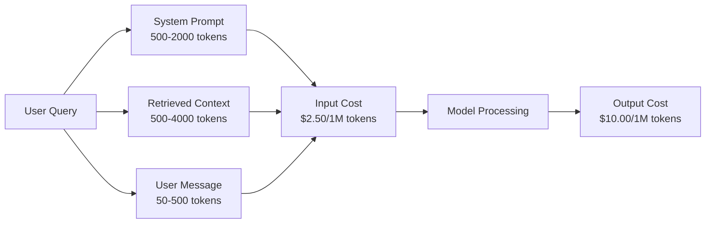
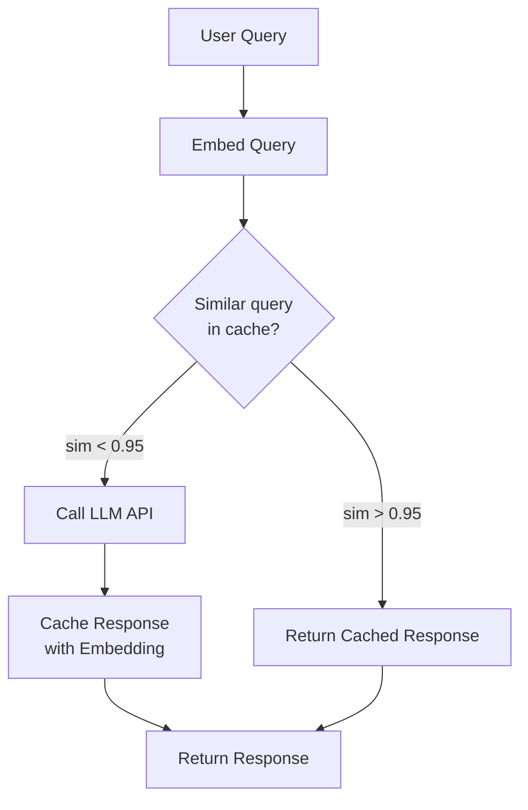
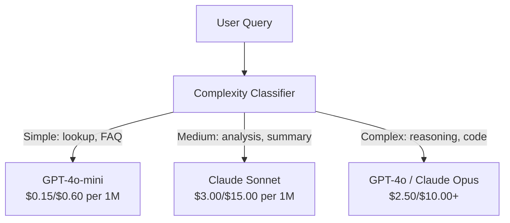

# Caching, Rate Limiting & Cost Optimization

> Most AI startups do not die from bad models. They die from bad unit economics. A single GPT-4o call costs fractions of a cent. Ten thousand users making ten calls per day costs $250 in input tokens alone -- before you charge a single dollar. The companies that survive are the ones that treat every API call as a financial transaction, not a function call.

**Type:** Build
**Languages:** Python
**Prerequisites:** Phase 11 Lesson 09 (Function Calling)
**Time:** ~45 minutes
**Related:** Phase 11 · 15 (Prompt Caching) — this lesson covers application-layer caching (semantic cache, exact hash cache, model routing). Lesson 15 covers provider-layer prompt caching (Anthropic cache_control, OpenAI automatic, Gemini CachedContent). Combine both for 50-95% cost reduction.

## Learning Objectives

- Implement semantic caching that serves repeated or similar queries from cache instead of making a new API call
- Calculate per-request costs across providers and implement token-aware rate limiting and budget alerts
- Build a cost optimization layer with prompt compression, model routing (expensive vs cheap), and response caching
- Design a tiered caching strategy using exact match, semantic similarity, and prefix caching for different query types

## The Problem

You build a RAG chatbot. It works beautifully. Users love it.

Then the invoice arrives.

Pricing changes quarterly. Before you write a single number into a Statement of Work or a FinOps dashboard, pull the current input/output price per million tokens from each provider's pricing page (links in Further Reading). Build a per-request cost model from those numbers — input cost + output cost + cached-input cost — and refresh it whenever a vendor ships a new SKU. The figures below are illustrative placeholders, not quotable prices.

Here is the math that kills startups:

- 10,000 daily active users
- 10 queries per user per day
- 1,000 input tokens per query (system prompt + context + user message)
- 500 output tokens per response

**Daily input cost:** 10,000 x 10 x 1,000 / 1,000,000 x $2.50 = **$250/day**
**Daily output cost:** 10,000 x 10 x 500 / 1,000,000 x $10.00 = **$500/day**
**Monthly total:** **$22,500/month**

That is just the LLM. Add embeddings, vector database hosting, infrastructure. You are looking at $30,000/month for a chatbot.

The brutal part: 40-60% of those queries are near-duplicates. Users ask the same questions in slightly different words. Your system prompt -- identical across every request -- gets billed every single time. Context documents retrieved by RAG repeat across users who ask about the same topic.

You are paying full price for redundant computation.

## The Concept

### The Cost Anatomy of an LLM Call

Every API call has five cost components.



System prompts are the silent killer. A 1,500-token system prompt sent with every request costs $3.75 per million requests just for that prefix. At 100K requests per day, that is $375/day -- $11,250/month -- for text that never changes.

### Provider Caching: Built-in Discounts

All three major providers offer provider-side prompt caching in 2026, but the mechanics differ. See Phase 11 · 15 for the deep dive.

| Provider | Mechanism | Discount | Minimum | Cache Duration |
|----------|-----------|----------|---------|----------------|
| Anthropic | Explicit cache_control markers | 90% on cache hits (pay 25% extra on write) | 1,024 tokens (Sonnet/Opus), 2,048 (Haiku) | 5 min default; 1h extended (2x write premium) |
| OpenAI | Automatic prefix matching | 50% on cache hits | 1,024 tokens | Best-effort up to 1 hour |
| Google Gemini | Explicit CachedContent API | ~75% reduction (plus storage) | 4,096 (Flash) / 32,768 (Pro) | User-configurable TTL |

**Anthropic's approach** is explicit. You mark sections of your prompt with `cache_control: {"type": "ephemeral"}`. The first request pays a 25% write premium. Subsequent requests with the same prefix get a 90% discount. A 2,000-token system prompt that costs $0.005 normally costs $0.000625 on cache hits. Over 100K requests, that saves $437.50/day.

**OpenAI's approach** is automatic. Any prompt prefix that matches a previous request gets a 50% discount. No markers needed. The tradeoff: less discount, less control, but zero implementation effort.

### Semantic Caching: Your Custom Layer

Provider caching only works for identical prefixes. Semantic caching handles the harder case: different queries with the same meaning.

"What is the return policy?" and "How do I return an item?" are different strings but identical intent. A semantic cache embeds both queries, computes cosine similarity, and returns the cached response if similarity exceeds a threshold (typically 0.92-0.95).



The embedding costs are negligible. OpenAI's text-embedding-3-small costs $0.02 per million tokens. Checking the cache costs almost nothing compared to a full LLM call.

### Exact Caching: Hash and Match

For deterministic calls (temperature=0, same model, same prompt), exact caching is simpler and faster. Hash the full prompt, check the cache, return if found.

This works perfectly for:
- System prompt + fixed context + identical user queries
- Function calling with identical tool definitions
- Batch processing where the same document gets processed multiple times

### Rate Limiting: Protecting Your Budget

Rate limiting is not just about fairness. It is about survival.

**Token bucket algorithm:** each user gets a bucket of N tokens that refills at rate R per second. A request consumes tokens from the bucket. If the bucket is empty, the request is rejected. This allows bursts (use the full bucket at once) while enforcing an average rate.

**Per-user quotas:** set daily/monthly token limits per user tier.

| Tier | Daily Token Limit | Max Requests/min | Model Access |
|------|------------------|------------------|-------------|
| Free | 50,000 | 10 | GPT-4o-mini only |
| Pro | 500,000 | 60 | GPT-4o, Claude Sonnet |
| Enterprise | 5,000,000 | 300 | All models |

### Model Routing: Right Model for the Right Job

Not every query needs GPT-4o.

"What time does the store close?" does not require a $10/M-output model. GPT-4o-mini at $0.60/M output handles it perfectly. Claude Haiku at $1.25/M output handles it. A simple classifier routes cheap queries to cheap models and complex queries to expensive models.



A well-tuned router saves 40-70% on model costs alone.

### Cost Tracking: Know Where the Money Goes

You cannot optimize what you do not measure. Log every API call with:

- Timestamp
- Model name
- Input tokens
- Output tokens
- Latency (ms)
- Computed cost ($)
- User ID
- Cache hit/miss
- Request category

This data reveals which features are expensive, which users are heavy consumers, and where caching has the most impact.

### Batching: Bulk Discounts

OpenAI's Batch API processes requests asynchronously at a 50% discount. You submit a batch of up to 50,000 requests, and results come back within 24 hours.

Use batching for:
- Nightly document processing
- Bulk classification
- Evaluation runs
- Data enrichment pipelines

Not for: real-time user-facing queries (latency matters).

### Budget Alerts and Circuit Breakers

A circuit breaker stops spending when you hit a limit. Without one, a bug or abuse can burn through your monthly budget in hours.

Set three thresholds:
1. **Warning** (70% of budget): send an alert
2. **Throttle** (85% of budget): switch to cheaper models only
3. **Stop** (95% of budget): reject new requests, return cached responses only

### The Optimization Stack

Apply these techniques in order. Each layer compounds on the previous ones.

| Layer | Technique | Typical Savings | Implementation Effort |
|-------|-----------|----------------|----------------------|
| 1 | Provider prompt caching | 30-50% | Low (add cache markers) |
| 2 | Exact caching | 10-20% | Low (hash + dict) |
| 3 | Semantic caching | 15-30% | Medium (embeddings + similarity) |
| 4 | Model routing | 40-70% | Medium (classifier) |
| 5 | Rate limiting | Budget protection | Low (token bucket) |
| 6 | Prompt compression | 10-30% | Medium (rewrite prompts) |
| 7 | Batching | 50% on eligible | Low (batch API) |

A RAG app applying layers 1-5 typically reduces costs from $22,500/month to $4,000-6,000/month. That is the difference between burning runway and building a business.


## Use It

### Anthropic Prompt Caching

```python
# import anthropic
#
# client = anthropic.Anthropic()
#
# response = client.messages.create(
#     model="claude-sonnet-4-20250514",
#     max_tokens=1024,
#     system=[
#         {
#             "type": "text",
#             "text": "You are a helpful customer support agent for Acme Corp...",
#             "cache_control": {"type": "ephemeral"},
#         }
#     ],
#     messages=[{"role": "user", "content": "What is the return policy?"}],
# )
#
# print(f"Input tokens: {response.usage.input_tokens}")
# print(f"Cache creation tokens: {response.usage.cache_creation_input_tokens}")
# print(f"Cache read tokens: {response.usage.cache_read_input_tokens}")
```

The first call writes to the cache (25% premium). Every subsequent call with the same system prompt prefix reads from the cache (90% discount). The cache lasts 5 minutes and resets the timer on every hit.

### OpenAI Automatic Caching

```python
# from openai import OpenAI
#
# client = OpenAI()
#
# response = client.chat.completions.create(
#     model="gpt-4o",
#     messages=[
#         {"role": "system", "content": "You are a helpful customer support agent..."},
#         {"role": "user", "content": "What is the return policy?"},
#     ],
# )
#
# print(f"Prompt tokens: {response.usage.prompt_tokens}")
# print(f"Cached tokens: {response.usage.prompt_tokens_details.cached_tokens}")
# print(f"Completion tokens: {response.usage.completion_tokens}")
```

OpenAI caches automatically. Any prompt prefix of 1,024+ tokens that matches a recent request gets a 50% discount. No code changes needed -- just check `prompt_tokens_details.cached_tokens` in the response to verify it is working.

### OpenAI Batch API

```python
# import json
# from openai import OpenAI
#
# client = OpenAI()
#
# requests = []
# for i, query in enumerate(queries):
#     requests.append({
#         "custom_id": f"request-{i}",
#         "method": "POST",
#         "url": "/v1/chat/completions",
#         "body": {
#             "model": "gpt-4o-mini",
#             "messages": [{"role": "user", "content": query}],
#         },
#     })
#
# with open("batch_input.jsonl", "w") as f:
#     for r in requests:
#         f.write(json.dumps(r) + "\n")
#
# batch_file = client.files.create(file=open("batch_input.jsonl", "rb"), purpose="batch")
# batch = client.batches.create(input_file_id=batch_file.id, endpoint="/v1/chat/completions", completion_window="24h")
# print(f"Batch ID: {batch.id}, Status: {batch.status}")
```

Batch API gives a flat 50% discount on all tokens. Results arrive within 24 hours. Perfect for non-real-time workloads: evaluations, data labeling, bulk summarization.

### Production Semantic Cache with Redis

```python
# import redis
# import numpy as np
# from openai import OpenAI
#
# r = redis.Redis()
# client = OpenAI()
#
# def get_embedding(text):
#     response = client.embeddings.create(model="text-embedding-3-small", input=text)
#     return response.data[0].embedding
#
# def semantic_cache_lookup(query, threshold=0.95):
#     query_emb = np.array(get_embedding(query))
#     keys = r.keys("cache:emb:*")
#     best_sim, best_key = 0, None
#     for key in keys:
#         stored_emb = np.frombuffer(r.get(key), dtype=np.float32)
#         sim = np.dot(query_emb, stored_emb) / (np.linalg.norm(query_emb) * np.linalg.norm(stored_emb))
#         if sim > best_sim:
#             best_sim, best_key = sim, key
#     if best_sim >= threshold and best_key:
#         response_key = best_key.decode().replace("cache:emb:", "cache:resp:")
#         return r.get(response_key).decode()
#     return None
```

In production, replace the linear scan with a vector index (Redis Vector Search, Pinecone, or pgvector). Linear scan works for <1,000 entries. Beyond that, use ANN (approximate nearest neighbor) for O(log n) lookup.

## Ship It

This lesson produces `outputs/prompt-cost-optimizer.md` -- a reusable prompt that analyzes your LLM application and recommends specific cost optimizations with projected savings.

It also produces `outputs/skill-cost-patterns.md` -- a decision framework for choosing the right caching strategy, rate limiting configuration, and model routing rules for your use case.


## Further Reading

- [Anthropic Prompt Caching Guide](https://docs.anthropic.com/en/docs/build-with-claude/prompt-caching) -- the official docs for Anthropic's explicit cache_control markers, pricing, and cache lifetime behavior.
- [OpenAI Prompt Caching](https://platform.openai.com/docs/guides/prompt-caching) -- OpenAI's automatic caching and how to verify cache hits via usage fields.
- [Kwon et al., "Efficient Memory Management for Large Language Model Serving with PagedAttention" (SOSP 2023)](https://arxiv.org/abs/2309.06180) -- the vLLM paper; why paged KV-cache + continuous batching beat naive servers 24× on throughput.
- [Dao et al., "FlashAttention-2: Faster Attention with Better Parallelism and Work Partitioning" (ICLR 2024)](https://arxiv.org/abs/2307.08691) -- kernel-level cost reduction orthogonal to prompt caching; read alongside speculative decoding and GQA for the full cost-curve picture.
