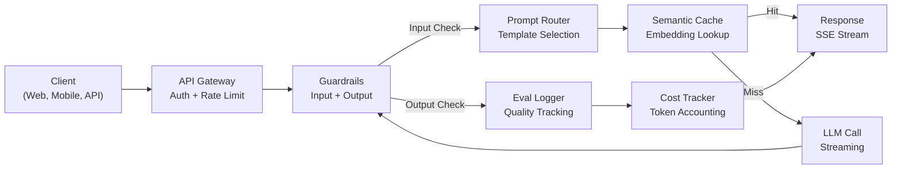
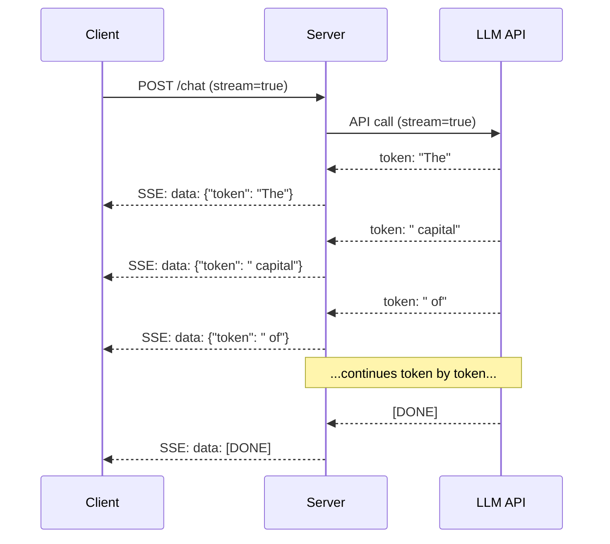
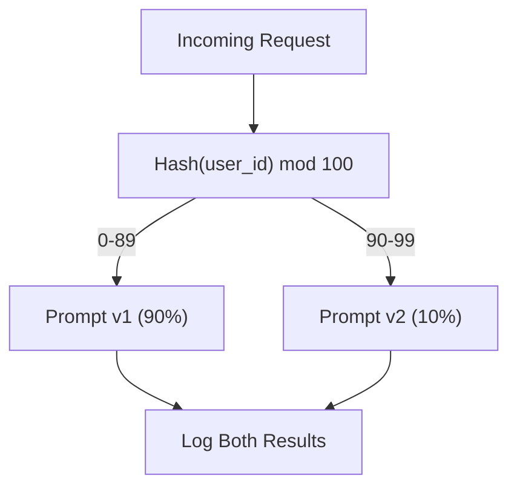

# Building a Production LLM Application

> You have built prompts, embeddings, RAG pipelines, function calling, caching layers, and guardrails. Separately. In isolation. This lesson wires every component from Lessons 01-12 into a single production-ready service. Not a toy. Not a demo. A system that handles real traffic, fails gracefully, streams tokens, tracks costs, and survives its first 10,000 users.

**Type:** Build (Capstone)
**Languages:** Python
**Prerequisites:** Phase 11 Lessons 01-15
**Time:** ~120 minutes
**Related:** Phase 11 · 14 (MCP) for replacing bespoke tool schemas with a shared protocol; Phase 11 · 15 (Prompt Caching) for 50-90% cost reduction on stable prefixes. Both are expected in every serious 2026 production stack.

## Learning Objectives

- Wire all Phase 11 components (prompts, RAG, function calling, caching, guardrails) into a single production-ready service
- Implement streaming token delivery, graceful error handling, and request timeout management
- Build observability into the application: request logging, cost tracking, latency percentiles, and error rate dashboards
- Deploy the application with health checks, rate limiting, and a fallback strategy for provider outages

## The Problem

Building an LLM feature takes an afternoon. Shipping an LLM product takes months.

The gap is not intelligence. It is infrastructure. Your prototype calls OpenAI, gets a response, prints it. Works on your laptop. Then reality arrives:

- A user sends a 50,000-token document. Your context window overflows.
- Two users ask the same question 4 seconds apart. You pay for both.
- The API returns a 500 error at 2am. Your service crashes.
- A user asks the model to generate SQL. The model outputs `DROP TABLE users`.
- Your monthly bill hits $12,000 and you have no idea which feature caused it.
- Response time averages 8 seconds. Users leave after 3.

Every LLM application in production today solved these problems. Not by being smarter about prompts. By being rigorous about engineering.

This is the capstone. You will build a complete production LLM service that integrates prompt management (L01-02), embeddings and vector search (L04-07), function calling (L09), evaluation (L10), caching (L11), guardrails (L12), streaming, error handling, observability, and cost tracking. One service. Every component wired together.

## The Concept

### Production Architecture

Every serious LLM application follows the same flow. The details vary. The structure does not.



The request enters through an API gateway that handles authentication and rate limiting. Input guardrails check for prompt injection and banned content before the prompt router selects the right template. A semantic cache checks if a similar question was answered recently. On a cache miss, the LLM is called with streaming enabled. Output guardrails validate the response. The eval logger records quality metrics. The cost tracker accounts for every token. The response streams back to the client.

Seven components. Each one is a lesson you already completed. The engineering is in the wiring.

### The Stack

| Component | Lesson | Technology | Purpose |
|-----------|--------|------------|---------|
| API Server | -- | FastAPI + Uvicorn | HTTP endpoints, SSE streaming, health checks |
| Prompt Templates | L01-02 | Jinja2 / string templates | Versioned prompt management with variable injection |
| Embeddings | L04 | text-embedding-3-small | Semantic similarity for cache and RAG |
| Vector Store | L06-07 | In-memory (prod: Pinecone/Qdrant) | Nearest neighbor search for context retrieval |
| Function Calling | L09 | Tool registry + JSON Schema | External data access, structured actions |
| Evaluation | L10 | Custom metrics + logging | Response quality, latency, accuracy tracking |
| Caching | L11 | Semantic cache (embedding-based) | Avoid redundant LLM calls, reduce cost and latency |
| Guardrails | L12 | Regex + classifier rules | Block prompt injection, PII, unsafe content |
| Cost Tracker | L11 | Token counter + pricing table | Per-request and aggregate cost accounting |
| Streaming | -- | Server-Sent Events (SSE) | Token-by-token delivery, sub-second first token |

### Streaming: Why It Matters

A GPT-5 response with 500 output tokens takes 3-8 seconds to fully generate. Without streaming, the user stares at a spinner for the entire duration. With streaming, the first token arrives in 200-500ms. The total time is the same. The perceived latency drops by 90%.



Three protocols for streaming:

| Protocol | Latency | Complexity | When to Use |
|----------|---------|------------|-------------|
| Server-Sent Events (SSE) | Low | Low | Most LLM apps. Unidirectional, HTTP-based, works everywhere |
| WebSockets | Low | Medium | Bidirectional needs: voice, real-time collaboration |
| Long Polling | High | Low | Legacy clients that cannot handle SSE or WebSockets |

SSE is the default choice. OpenAI, Anthropic, and Google all stream via SSE. Your server receives chunks from the LLM API and forwards them to the client as SSE events. The client uses `EventSource` (browser) or `httpx` (Python) to consume the stream.

### Error Handling: The Three Layers

Production LLM apps fail in three distinct ways. Each requires a different recovery strategy.

**Layer 1: API failures.** The LLM provider returns 429 (rate limit), 500 (server error), or times out. Solution: exponential backoff with jitter. Start at 1 second, double each retry, add random jitter to prevent thundering herd. Maximum 3 retries.

```
Attempt 1: immediate
Attempt 2: 1s + random(0, 0.5s)
Attempt 3: 2s + random(0, 1.0s)
Attempt 4: 4s + random(0, 2.0s)
Give up: return fallback response
```

**Layer 2: Model failures.** The model returns malformed JSON, hallucinates a function name, or produces an output that fails validation. Solution: retry with a corrected prompt. Include the error in the retry message so the model can self-correct.

**Layer 3: Application failures.** A downstream service is unreachable, the vector store is slow, a guardrail throws an exception. Solution: graceful degradation. If RAG context is unavailable, proceed without it. If the cache is down, bypass it. Never let a secondary system crash the primary flow.

| Failure | Retry? | Fallback | User Impact |
|---------|--------|----------|-------------|
| API 429 (rate limit) | Yes, with backoff | Queue the request | "Processing, please wait..." |
| API 500 (server error) | Yes, 3 attempts | Switch to fallback model | Transparent to user |
| API timeout (>30s) | Yes, 1 attempt | Shorter prompt, smaller model | Slightly lower quality |
| Malformed output | Yes, with error context | Return raw text | Minor formatting issues |
| Guardrail block | No | Explain why request was blocked | Clear error message |
| Vector store down | No retry on vector store | Skip RAG context | Lower quality, still functional |
| Cache down | No retry on cache | Direct LLM call | Higher latency, higher cost |

**Fallback model chain.** When your primary model is unavailable, fall through a chain:

```
claude-sonnet-4-20250514 -> gpt-4o -> gpt-4o-mini -> cached response -> "Service temporarily unavailable"
```

Each step trades quality for availability. The user always gets something.

### Observability: What to Measure

You cannot improve what you cannot see. Every production LLM app needs three pillars of observability.

**Structured logging.** Every request produces a JSON log entry with: request ID, user ID, prompt template name, model used, input tokens, output tokens, latency (ms), cache hit/miss, guardrail pass/fail, cost (USD), and any errors.

**Tracing.** A single user request touches 5-8 components. OpenTelemetry traces let you see the full journey: how long did embedding take? Was it a cache hit? How long was the LLM call? Did the guardrail add latency? Without tracing, debugging production issues is guesswork.

**Metrics dashboard.** The five numbers every LLM team watches:

| Metric | Target | Why |
|--------|--------|-----|
| P50 latency | < 2s | Median user experience |
| P99 latency | < 10s | Tail latency drives churn |
| Cache hit rate | > 30% | Direct cost savings |
| Guardrail block rate | < 5% | Too high = false positives annoying users |
| Cost per request | < $0.01 | Unit economics viability |

### A/B Testing Prompts in Production

Your prompt is not finished when it works. It is finished when you have data proving it outperforms the alternative.

**Shadow mode.** Run a new prompt on 100% of traffic but only log the results -- do not show them to users. Compare quality metrics against the current prompt. No user risk, full data.

**Percentage rollout.** Route 10% of traffic to the new prompt. Monitor metrics. If quality holds, increase to 25%, then 50%, then 100%. If quality drops, instant rollback.



Use a deterministic hash of the user ID, not random selection. This ensures each user gets a consistent experience across requests within the same experiment.

### Scaling

Key scaling patterns:

- **Async everywhere.** Never block a web server thread on an LLM call. Use `asyncio` and `httpx.AsyncClient`.
- **Queue-based processing.** For non-real-time tasks (summarization, analysis), push to a queue (Redis, SQS) and process with workers. Return a job ID, let the client poll.
- **Connection pooling.** Reuse HTTP connections to LLM providers. Creating a new TLS connection per request adds 100-200ms.
- **Horizontal scaling.** LLM apps are I/O bound, not CPU bound. A single async server handles 100+ concurrent requests. Scale servers, not cores.

### Cost Projection

Before you ship, estimate your monthly cost. This spreadsheet decides if your business model works.

| Variable | Value | Source |
|----------|-------|--------|
| Daily Active Users (DAU) | 10,000 | Analytics |
| Queries per user per day | 5 | Product analytics |
| Avg input tokens per query | 1,500 | Measured (system + context + user) |
| Avg output tokens per query | 400 | Measured |
| Input price per 1M tokens | $5.00 | OpenAI GPT-5 pricing |
| Output price per 1M tokens | $15.00 | OpenAI GPT-5 pricing |
| Cache hit rate | 35% | Measured from cache metrics |
| Effective daily queries | 32,500 | 50,000 * (1 - 0.35) |

**Monthly LLM cost:**
- Input: 32,500 queries/day x 1,500 tokens x 30 days / 1M x $5.00 = **$7,313**
- Output: 32,500 queries/day x 400 tokens x 30 days / 1M x $15.00 = **$5,850**
- **Total: $13,163/month** (with caching saving ~$7,088/month)

Without caching, the same traffic costs $20,250/month. A 35% cache hit rate saves 35% on LLM costs. This is why Lesson 11 exists.

### The Deployment Checklist

15 items. Ship nothing until every box is checked.

| # | Item | Category |
|---|------|----------|
| 1 | API keys stored in environment variables, not code | Security |
| 2 | Rate limiting per user (10-50 req/min default) | Protection |
| 3 | Input guardrails active (prompt injection, PII) | Safety |
| 4 | Output guardrails active (content filtering, format validation) | Safety |
| 5 | Semantic cache configured and tested | Cost |
| 6 | Streaming enabled for all chat endpoints | UX |
| 7 | Exponential backoff on all LLM API calls | Reliability |
| 8 | Fallback model chain configured | Reliability |
| 9 | Structured logging with request IDs | Observability |
| 10 | Cost tracking per request and per user | Business |
| 11 | Health check endpoint returning dependency status | Ops |
| 12 | Max token limits on input and output | Cost/Safety |
| 13 | Timeout on all external calls (30s default) | Reliability |
| 14 | CORS configured for production domains only | Security |
| 15 | Load test with 100 concurrent users passing | Performance |


## Further Reading

- [Eugene Yan, "Patterns for Building LLM-based Systems"](https://eugeneyan.com/writing/llm-patterns/) -- architectural patterns (guardrails, RAG, caching, routing) seen across production LLM deployments.
- [Hamel Husain, "Your AI Product Needs Evals"](https://hamel.dev/blog/posts/evals/) -- evaluation-driven development for LLM applications.
- [OpenTelemetry Python SDK](https://opentelemetry.io/docs/languages/python/) -- the standard for distributed tracing across an LLM pipeline.
