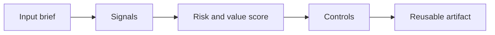

# AI-Driven Testing and QA

> AI can write tests quickly. The engineering skill is knowing which risks deserve tests, which generated tests are shallow, and which failures should block a release.

**Type:** Build
**Languages:** Python
**Prerequisites:** Phase 11 Lesson 01 (Prompt Engineering), Phase 11 Lesson 10 (Evaluation & Testing)
**Time:** ~45 minutes
**Capability:** Engineering - AI-Driven Testing & QA

## Learning Objectives

- Identify the operational signals that make this capability relevant in day-to-day LHIND work
- Build a lightweight Python artifact that turns an ambiguous AI idea into a structured plan
- Map risk, value, uncertainty, and controls into a practical course exercise
- Use the generated worksheet as a reusable starting point for team enablement
- Explain when the topic belongs in awareness training, guided pilot work, or a launch gate

## The Problem

A delivery team asks an assistant to generate tests for a new claim-processing service. The assistant creates many unit tests, all green. Later, an edge case in date handling breaks production because the tests mostly checked happy paths. The team did not need more test files. It needed a better risk model for what to test.

This lesson treats the course as a working session, not as a slide deck. Participants should leave with something they can use in the next project conversation: a checklist, matrix, prompt pack, memo, or scoring worksheet.

## The Concept

AI-supported QA works when it starts from risk, not from code coverage vanity. Use AI to expand test ideas, enumerate edge cases, generate fixtures, and critique missing scenarios. Keep humans responsible for risk weighting, oracle design, and deciding which checks belong in CI.

The recurring pattern is simple: identify the workflow, surface the signals, choose the right level of control, and produce an artifact that makes the next decision easier.

### Signals to Look For

- state transition
- money impact
- date logic
- external dependency

### Controls to Teach

- property tests
- golden cases
- regression suite
- manual exploratory pass

### Target Roles

- Technology Consulting
- Application Management

## Use It

Use the planner during refinement, before implementation, and again in pull request review. It helps teams ask whether the test suite protects the behavior users and operations actually depend on.

The expected output is not a final answer from AI. It is a better human conversation. The artifact makes the assumptions visible enough that a team can challenge them, tune the controls, and agree on the next step.

### Workshop Flow

1. Start with a real workflow from the participant's team.
2. Capture the signals in plain language.
3. Score impact and uncertainty together.
4. Review the recommended controls.
5. Decide whether the next step is awareness, practice, pilot, or launch gate.

## Reusable Artifact

AI-assisted QA matrix for stories, edge cases, and release gates.

The output template in `outputs/template-ai-qa-matrix.md` can be copied into a project kickoff, enablement workshop, or team retro. Keep the artifact short enough that teams actually use it.

## Key Takeaways

- The course is about operational judgment, not generic AI enthusiasm.
- A reusable artifact beats a one-time presentation because it changes the next project conversation.
- The right control level depends on workflow risk, uncertainty, business impact, and role accountability.
- AI can accelerate analysis, but the team still owns the decision, review, and rollout.
