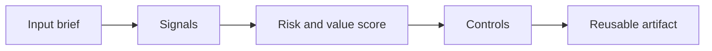

# Code Modernization with AI

> The fastest way to modernize legacy code is not to ask AI for a rewrite. It is to make the unknown system explainable enough that small safe changes become possible.

**Type:** Build
**Languages:** Python
**Prerequisites:** Phase 11 Lesson 01 (Prompt Engineering), Phase 11 Lesson 10 (Evaluation & Testing)
**Time:** ~45 minutes
**Capability:** Engineering - AI-Supported Code Modernization

## Learning Objectives

- Identify the operational signals that make this capability relevant in day-to-day LHIND work
- Build a lightweight Python artifact that turns an ambiguous AI idea into a structured plan
- Map risk, value, uncertainty, and controls into a practical course exercise
- Use the generated worksheet as a reusable starting point for team enablement
- Explain when the topic belongs in awareness training, guided pilot work, or a launch gate

## The Problem

A team inherits a service with outdated dependencies, unclear ownership, and no reliable tests. A model can summarize files and propose rewrites, but a rewrite would be irresponsible without behavior baselines. The real modernization problem is sequencing: understand, protect, slice, then change.

This lesson treats the course as a working session, not as a slide deck. Participants should leave with something they can use in the next project conversation: a checklist, matrix, prompt pack, memo, or scoring worksheet.

## The Concept

AI helps modernization by accelerating comprehension and backlog shaping. It can map modules, identify coupling, draft strangler seams, and propose tests. The human engineering task is to prevent large speculative rewrites and convert model suggestions into reversible work packages.

The recurring pattern is simple: identify the workflow, surface the signals, choose the right level of control, and produce an artifact that makes the next decision easier.



### Signals to Look For

- low tests
- high coupling
- stale dependency
- production incident

### Controls to Teach

- characterization tests
- small PRs
- rollback plan
- owner review

### Target Roles

- Technology Consulting
- Application Management

## Build It

In the lab you build a modernization backlog generator. It scores code areas by risk, evidence, test coverage, and business value, then emits safe work packages with acceptance checks.

The Python implementation is intentionally small. It is not a production platform. It is a classroom artifact: participants can read it, run it, change the example scenarios, and see how the recommendation changes.

The artifact has four parts:

1. A `Scenario` object that describes the workflow or decision.
2. A signal matcher that identifies relevant risk or value indicators.
3. A scoring function that combines impact, uncertainty, and matched signals.
4. A recommendation that selects a category, priority, and controls.

Run it locally:

```bash
cd phases/11-llm-engineering/20-code-modernization-with-ai/code
python3 main.py
python3 -m unittest discover tests -v
```

## Use It

Use the artifact before migration epics, dependency upgrades, and architecture cleanup. It gives teams a structured way to turn AI code analysis into work that can be reviewed and shipped incrementally.

The expected output is not a final answer from AI. It is a better human conversation. The artifact makes the assumptions visible enough that a team can challenge them, tune the controls, and agree on the next step.

### Workshop Flow

1. Start with a real workflow from the participant's team.
2. Capture the signals in plain language.
3. Score impact and uncertainty together.
4. Review the recommended controls.
5. Decide whether the next step is awareness, practice, pilot, or launch gate.

## Reusable Artifact

Modernization backlog and risk-slicing worksheet.

The output template in `outputs/worksheet-modernization-backlog.md` can be copied into a project kickoff, enablement workshop, or team retro. Keep the artifact short enough that teams actually use it.

## Key Takeaways

- The course is about operational judgment, not generic AI enthusiasm.
- A reusable artifact beats a one-time presentation because it changes the next project conversation.
- The right control level depends on workflow risk, uncertainty, business impact, and role accountability.
- AI can accelerate analysis, but the team still owns the decision, review, and rollout.
