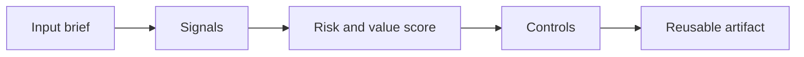

# AI-Assisted Documentation

> AI can draft documentation. Teams still need a standard for what must be true, current, findable, and safe to rely on during an incident.

**Type:** Build
**Languages:** Python
**Prerequisites:** Phase 11 Lesson 01 (Prompt Engineering), Phase 11 Lesson 10 (Evaluation & Testing)
**Time:** ~45 minutes
**Capability:** Engineering - AI-Assisted Documentation

## Learning Objectives

- Identify the operational signals that make this capability relevant in day-to-day LHIND work
- Build a lightweight Python artifact that turns an ambiguous AI idea into a structured plan
- Map risk, value, uncertainty, and controls into a practical course exercise
- Use the generated worksheet as a reusable starting point for team enablement
- Explain when the topic belongs in awareness training, guided pilot work, or a launch gate

## The Problem

A project uses AI to create runbooks and release notes. The text looks polished, but one command is obsolete and one prerequisite is missing. During an incident the runbook slows the team down. The issue was not writing quality. It was documentation verification.

This lesson treats the course as a working session, not as a slide deck. Participants should leave with something they can use in the next project conversation: a checklist, matrix, prompt pack, memo, or scoring worksheet.

## The Concept

AI-assisted documentation needs source grounding, ownership, and freshness checks. Treat generated text as a draft against evidence: code, tickets, architecture decisions, monitoring links, and operational procedures. Good documentation is not more prose. It is a reliable map for action.

The recurring pattern is simple: identify the workflow, surface the signals, choose the right level of control, and produce an artifact that makes the next decision easier.

### Signals to Look For

- missing owner
- no source link
- stale date
- no verification step

### Controls to Teach

- source citation
- owner approval
- review cadence
- command validation

### Target Roles

- Technology Consulting
- Corporate Functions
- Leadership

## Use It

Use it for runbooks, ADRs, API docs, handover pages, and release notes. The scanner helps reviewers catch glossy but untrustworthy AI-generated documentation.

The expected output is not a final answer from AI. It is a better human conversation. The artifact makes the assumptions visible enough that a team can challenge them, tune the controls, and agree on the next step.

### Workshop Flow

1. Start with a real workflow from the participant's team.
2. Capture the signals in plain language.
3. Score impact and uncertainty together.
4. Review the recommended controls.
5. Decide whether the next step is awareness, practice, pilot, or launch gate.

## Reusable Artifact

Documentation quality checklist and review prompt.

The output template in `outputs/checklist-ai-documentation-review.md` can be copied into a project kickoff, enablement workshop, or team retro. Keep the artifact short enough that teams actually use it.

## Key Takeaways

- The course is about operational judgment, not generic AI enthusiasm.
- A reusable artifact beats a one-time presentation because it changes the next project conversation.
- The right control level depends on workflow risk, uncertainty, business impact, and role accountability.
- AI can accelerate analysis, but the team still owns the decision, review, and rollout.
