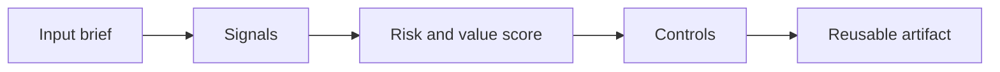

# Sustainable Software and Green Coding for AI Systems

> Every AI feature has a cost shape. Green coding means making latency, compute, model size, caching, and value explicit instead of pretending every request deserves the biggest model.

**Type:** Build
**Languages:** Python
**Prerequisites:** Phase 11 Lesson 01 (Prompt Engineering), Phase 11 Lesson 10 (Evaluation & Testing)
**Time:** ~45 minutes
**Capability:** Engineering - Sustainable Software & Green Coding

## Learning Objectives

- Identify the operational signals that make this capability relevant in day-to-day LHIND work
- Build a lightweight Python artifact that turns an ambiguous AI idea into a structured plan
- Map risk, value, uncertainty, and controls into a practical course exercise
- Use the generated worksheet as a reusable starting point for team enablement
- Explain when the topic belongs in awareness training, guided pilot work, or a launch gate

## The Problem

A prototype uses a large model for every classification, summary, and formatting task. It works, but latency is high and the monthly bill surprises the sponsor. Worse, the expensive calls add little value for routine tasks that could use rules, caching, or a smaller model.

This lesson treats the course as a working session, not as a slide deck. Participants should leave with something they can use in the next project conversation: a checklist, matrix, prompt pack, memo, or scoring worksheet.

## The Concept

Sustainable AI engineering starts with right-sizing. Match task criticality and complexity to the lightest reliable method. Cache stable outputs, batch where possible, measure tokens and latency, and document when a larger model is justified.

The recurring pattern is simple: identify the workflow, surface the signals, choose the right level of control, and produce an artifact that makes the next decision easier.



### Signals to Look For

- high volume
- repeatable request
- low risk
- large context

### Controls to Teach

- caching
- batching
- small model fallback
- token budget

### Target Roles

- Technology Consulting
- Application Management

## Build It

In the lab you build a workload estimator that recommends rule, small model, large model, cache, or human review based on complexity, reuse, risk, and value.

The Python implementation is intentionally small. It is not a production platform. It is a classroom artifact: participants can read it, run it, change the example scenarios, and see how the recommendation changes.

The artifact has four parts:

1. A `Scenario` object that describes the workflow or decision.
2. A signal matcher that identifies relevant risk or value indicators.
3. A scoring function that combines impact, uncertainty, and matched signals.
4. A recommendation that selects a category, priority, and controls.

Run it locally:

```bash
cd phases/11-llm-engineering/22-sustainable-software-green-coding/code
python3 main.py
python3 -m unittest discover tests -v
```

## Use It

Use the estimator during architecture review and cost planning. It turns green coding from a slogan into concrete design decisions that reduce waste without weakening user outcomes.

The expected output is not a final answer from AI. It is a better human conversation. The artifact makes the assumptions visible enough that a team can challenge them, tune the controls, and agree on the next step.

### Workshop Flow

1. Start with a real workflow from the participant's team.
2. Capture the signals in plain language.
3. Score impact and uncertainty together.
4. Review the recommended controls.
5. Decide whether the next step is awareness, practice, pilot, or launch gate.

## Reusable Artifact

AI workload right-sizing and sustainability review worksheet.

The output template in `outputs/worksheet-ai-workload-rightsizing.md` can be copied into a project kickoff, enablement workshop, or team retro. Keep the artifact short enough that teams actually use it.

## Key Takeaways

- The course is about operational judgment, not generic AI enthusiasm.
- A reusable artifact beats a one-time presentation because it changes the next project conversation.
- The right control level depends on workflow risk, uncertainty, business impact, and role accountability.
- AI can accelerate analysis, but the team still owns the decision, review, and rollout.
