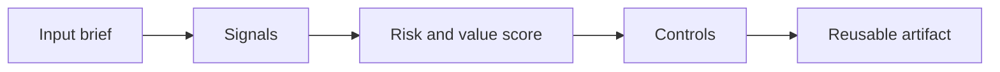

# AI-Enhanced User Research

> AI can summarize interviews in seconds. The product skill is protecting the signal from bias, privacy mistakes, and premature certainty.

**Type:** Build
**Languages:** Python
**Prerequisites:** Phase 11 Lesson 01 (Prompt Engineering), Phase 11 Lesson 10 (Evaluation & Testing)
**Time:** ~45 minutes
**Capability:** Product and Process - AI-Enhanced User Research

## Learning Objectives

- Identify the operational signals that make this capability relevant in day-to-day LHIND work
- Build a lightweight Python artifact that turns an ambiguous AI idea into a structured plan
- Map risk, value, uncertainty, and controls into a practical course exercise
- Use the generated worksheet as a reusable starting point for team enablement
- Explain when the topic belongs in awareness training, guided pilot work, or a launch gate

## The Problem

A product team uploads interview notes to an assistant and asks for personas. The assistant produces confident segments and polished quotes. But some notes include personal data, the sample is biased toward power users, and the generated personas flatten important disagreement.

This lesson treats the course as a working session, not as a slide deck. Participants should leave with something they can use in the next project conversation: a checklist, matrix, prompt pack, memo, or scoring worksheet.

## The Concept

AI-enhanced research should accelerate synthesis, not replace research judgment. Use AI to cluster observations, extract themes, draft hypotheses, and find contradictions. Keep the team responsible for anonymization, sampling limits, evidence strength, and deciding what deserves another interview.

The recurring pattern is simple: identify the workflow, surface the signals, choose the right level of control, and produce an artifact that makes the next decision easier.



### Signals to Look For

- personal data
- single-source claim
- contradiction
- high emotion

### Controls to Teach

- anonymization
- evidence tags
- sample warning
- follow-up question

### Target Roles

- Products & Value Streams
- Business & Strategy Consulting

## Build It

In the lab you build a research synthesis helper. It anonymizes notes, extracts observations, clusters themes, flags weak evidence, and emits follow-up questions.

The Python implementation is intentionally small. It is not a production platform. It is a classroom artifact: participants can read it, run it, change the example scenarios, and see how the recommendation changes.

The artifact has four parts:

1. A `Scenario` object that describes the workflow or decision.
2. A signal matcher that identifies relevant risk or value indicators.
3. A scoring function that combines impact, uncertainty, and matched signals.
4. A recommendation that selects a category, priority, and controls.

Run it locally:

```bash
cd phases/11-llm-engineering/23-ai-enhanced-user-research/code
python3 main.py
python3 -m unittest discover tests -v
```

## Use It

Use the helper after interviews, support-ticket reviews, or usability tests. It helps product teams move faster while keeping claims traceable to evidence.

The expected output is not a final answer from AI. It is a better human conversation. The artifact makes the assumptions visible enough that a team can challenge them, tune the controls, and agree on the next step.

### Workshop Flow

1. Start with a real workflow from the participant's team.
2. Capture the signals in plain language.
3. Score impact and uncertainty together.
4. Review the recommended controls.
5. Decide whether the next step is awareness, practice, pilot, or launch gate.

## Reusable Artifact

Research synthesis canvas with evidence strength and follow-up questions.

The output template in `outputs/canvas-ai-research-synthesis.md` can be copied into a project kickoff, enablement workshop, or team retro. Keep the artifact short enough that teams actually use it.

## Key Takeaways

- The course is about operational judgment, not generic AI enthusiasm.
- A reusable artifact beats a one-time presentation because it changes the next project conversation.
- The right control level depends on workflow risk, uncertainty, business impact, and role accountability.
- AI can accelerate analysis, but the team still owns the decision, review, and rollout.
