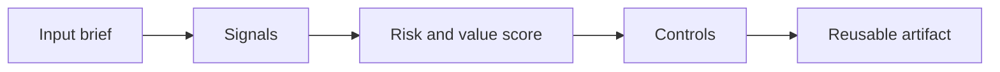

# AI Use Case Spotting and Automation Discovery

> A good AI use case is not any task that mentions text. It is a workflow with pain, data, repeatability, risk controls, and a measurable value hypothesis.

**Type:** Build
**Languages:** Python
**Prerequisites:** Phase 11 Lesson 01 (Prompt Engineering), Phase 11 Lesson 10 (Evaluation & Testing)
**Time:** ~45 minutes
**Capability:** Advisory and Business Consulting - AI & Automation Use Case Spotting

## Learning Objectives

- Identify the operational signals that make this capability relevant in day-to-day LHIND work
- Build a lightweight Python artifact that turns an ambiguous AI idea into a structured plan
- Map risk, value, uncertainty, and controls into a practical course exercise
- Use the generated worksheet as a reusable starting point for team enablement
- Explain when the topic belongs in awareness training, guided pilot work, or a launch gate

## The Problem

A workshop produces 60 AI ideas. Everyone is excited, but the list mixes automation, reporting, search, decision support, and novelty demos. Three months later, nothing ships because no one separated attractive ideas from viable use cases.

This lesson treats the course as a working session, not as a slide deck. Participants should leave with something they can use in the next project conversation: a checklist, matrix, prompt pack, memo, or scoring worksheet.

## The Concept

Use case spotting is a discipline of framing. Capture the workflow, user, trigger, input data, decision point, output, risk, and value metric. Then classify whether the right solution is rule automation, AI assistance, retrieval, prediction, or process redesign.

The recurring pattern is simple: identify the workflow, surface the signals, choose the right level of control, and produce an artifact that makes the next decision easier.

### Signals to Look For

- repeatable workflow
- text-heavy input
- measurable pain
- clear owner

### Controls to Teach

- pilot metric
- risk review
- data readiness check
- owner signoff

### Target Roles

- Business & Strategy Consulting
- Project Management & Agility

## Use It

Use the scorer in discovery workshops and portfolio reviews. It helps teams turn broad AI enthusiasm into a prioritized experiment backlog.

The expected output is not a final answer from AI. It is a better human conversation. The artifact makes the assumptions visible enough that a team can challenge them, tune the controls, and agree on the next step.

### Workshop Flow

1. Start with a real workflow from the participant's team.
2. Capture the signals in plain language.
3. Score impact and uncertainty together.
4. Review the recommended controls.
5. Decide whether the next step is awareness, practice, pilot, or launch gate.

## Reusable Artifact

AI use-case discovery canvas and prioritization score.

The output template in `outputs/canvas-ai-use-case-discovery.md` can be copied into a project kickoff, enablement workshop, or team retro. Keep the artifact short enough that teams actually use it.

## Key Takeaways

- The course is about operational judgment, not generic AI enthusiasm.
- A reusable artifact beats a one-time presentation because it changes the next project conversation.
- The right control level depends on workflow risk, uncertainty, business impact, and role accountability.
- AI can accelerate analysis, but the team still owns the decision, review, and rollout.

## Exercises

1. **Establish a baseline.** Run the lesson demo, then capture the inputs, outputs, and one invariant that demonstrates this objective: Identify the operational signals that make this capability relevant in day-to-day LHIND work.
2. **Change one variable.** Modify a single input or parameter and use the resulting evidence to investigate this objective: Build a lightweight Python artifact that turns an ambiguous AI idea into a structured plan.
3. **Probe an edge case.** Predict the result before running it, compare prediction with observation, and explain the discrepancy while applying this objective: Map risk, value, uncertainty, and controls into a practical course exercise.

## Reference Solution

Use the canonical [main.py](../code/main.py) as the executable baseline. A complete solution records a successful run, identifies the invariant tied to “Identify the operational signals that make this capability relevant in day-to-day LHIND work,” and changes only one variable for the comparison. The edge-case result must distinguish the prediction from the observation, explain the cause using “Map risk, value, uncertainty, and controls into a practical course exercise,” and cite a repeatable check rather than relying on visual inspection alone.
