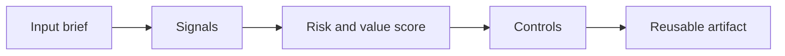

# AI Cost and Value Economics

> An AI business case fails when it counts model calls precisely but hand-waves adoption, review effort, integration work, and operational ownership.

**Type:** Build
**Languages:** Python
**Prerequisites:** Phase 11 Lesson 01 (Prompt Engineering), Phase 11 Lesson 10 (Evaluation & Testing)
**Time:** ~45 minutes
**Capability:** Advisory and Business Consulting - AI Cost & Value Economics

## Learning Objectives

- Identify the operational signals that make this capability relevant in day-to-day LHIND work
- Build a lightweight Python artifact that turns an ambiguous AI idea into a structured plan
- Map risk, value, uncertainty, and controls into a practical course exercise
- Use the generated worksheet as a reusable starting point for team enablement
- Explain when the topic belongs in awareness training, guided pilot work, or a launch gate

## The Problem

A team claims an assistant will save 20 minutes per employee per day. The model cost looks small, so the project is approved. Later, adoption is low, reviewers still check every output, integration work is higher than expected, and the benefit never appears in operations metrics.

This lesson treats the course as a working session, not as a slide deck. Participants should leave with something they can use in the next project conversation: a checklist, matrix, prompt pack, memo, or scoring worksheet.

## The Concept

AI economics has two sides: cost structure and value realization. Costs include licenses, tokens, integration, monitoring, review, change management, and support. Value only counts when behavior changes and the metric moves.

The recurring pattern is simple: identify the workflow, surface the signals, choose the right level of control, and produce an artifact that makes the next decision easier.



### Signals to Look For

- token volume
- license cost
- review effort
- adoption rate

### Controls to Teach

- baseline metric
- assumption log
- sensitivity range
- benefits owner

### Target Roles

- Business & Strategy Consulting
- Leadership

## Build It

In the lab you build an ROI model that combines volume, adoption, time saved, review effort, quality gain, risk reduction, and operating cost into a transparent business-case range.

The Python implementation is intentionally small. It is not a production platform. It is a classroom artifact: participants can read it, run it, change the example scenarios, and see how the recommendation changes.

The artifact has four parts:

1. A `Scenario` object that describes the workflow or decision.
2. A signal matcher that identifies relevant risk or value indicators.
3. A scoring function that combines impact, uncertainty, and matched signals.
4. A recommendation that selects a category, priority, and controls.

Run it locally:

```bash
cd phases/11-llm-engineering/25-ai-cost-value-economics/code
python3 main.py
python3 -m unittest discover tests -v
```

## Use It

Use it before funding decisions and after pilots. It makes assumptions visible so business and engineering can discuss what must be true for value to materialize.

The expected output is not a final answer from AI. It is a better human conversation. The artifact makes the assumptions visible enough that a team can challenge them, tune the controls, and agree on the next step.

### Workshop Flow

1. Start with a real workflow from the participant's team.
2. Capture the signals in plain language.
3. Score impact and uncertainty together.
4. Review the recommended controls.
5. Decide whether the next step is awareness, practice, pilot, or launch gate.

## Reusable Artifact

AI value case calculator and assumption log.

The output template in `outputs/calculator-ai-value-case.md` can be copied into a project kickoff, enablement workshop, or team retro. Keep the artifact short enough that teams actually use it.

## Key Takeaways

- The course is about operational judgment, not generic AI enthusiasm.
- A reusable artifact beats a one-time presentation because it changes the next project conversation.
- The right control level depends on workflow risk, uncertainty, business impact, and role accountability.
- AI can accelerate analysis, but the team still owns the decision, review, and rollout.
