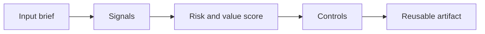

# Consultative Prompting

> Consultative prompting is not asking for prettier slides. It is using AI to sharpen hypotheses, expose weak logic, and prepare better client conversations.

**Type:** Build
**Languages:** Python
**Prerequisites:** Phase 11 Lesson 01 (Prompt Engineering), Phase 11 Lesson 10 (Evaluation & Testing)
**Time:** ~45 minutes
**Capability:** Advisory and Business Consulting - Consultative Prompting

## Learning Objectives

- Identify the operational signals that make this capability relevant in day-to-day LHIND work
- Build a lightweight Python artifact that turns an ambiguous AI idea into a structured plan
- Map risk, value, uncertainty, and controls into a practical course exercise
- Use the generated worksheet as a reusable starting point for team enablement
- Explain when the topic belongs in awareness training, guided pilot work, or a launch gate

## The Problem

A consultant asks an assistant to draft a workshop agenda. The agenda looks professional but generic. It does not reflect stakeholder tension, decision criteria, risks, or the client context. The prompt produced output, but it did not improve the consulting work.

This lesson treats the course as a working session, not as a slide deck. Participants should leave with something they can use in the next project conversation: a checklist, matrix, prompt pack, memo, or scoring worksheet.

## The Concept

Consultative prompting starts with the consulting move: clarify, diagnose, structure, challenge, synthesize, recommend. The prompt should encode context, audience, decision, constraints, and desired thinking pattern. Strong prompts ask the model to reveal assumptions and alternatives, not just produce text.

The recurring pattern is simple: identify the workflow, surface the signals, choose the right level of control, and produce an artifact that makes the next decision easier.



### Signals to Look For

- unclear decision
- stakeholder tension
- weak hypothesis
- missing constraint

### Controls to Teach

- assumption check
- counterargument
- audience fit
- source grounding

### Target Roles

- Business & Strategy Consulting
- Project Management & Agility

## Build It

In the lab you build a prompt composer for consulting tasks. It turns a situation brief into prompts for discovery questions, issue trees, workshop design, proposal framing, and executive synthesis.

The Python implementation is intentionally small. It is not a production platform. It is a classroom artifact: participants can read it, run it, change the example scenarios, and see how the recommendation changes.

The artifact has four parts:

1. A `Scenario` object that describes the workflow or decision.
2. A signal matcher that identifies relevant risk or value indicators.
3. A scoring function that combines impact, uncertainty, and matched signals.
4. A recommendation that selects a category, priority, and controls.

Run it locally:

```bash
cd phases/11-llm-engineering/26-consultative-prompting/code
python3 main.py
python3 -m unittest discover tests -v
```

## Use It

Use the composer before meetings, proposals, workshops, and steering updates. It helps teams use AI as a thinking partner without outsourcing judgment.

The expected output is not a final answer from AI. It is a better human conversation. The artifact makes the assumptions visible enough that a team can challenge them, tune the controls, and agree on the next step.

### Workshop Flow

1. Start with a real workflow from the participant's team.
2. Capture the signals in plain language.
3. Score impact and uncertainty together.
4. Review the recommended controls.
5. Decide whether the next step is awareness, practice, pilot, or launch gate.

## Reusable Artifact

Consultative prompt pack for discovery, synthesis, and recommendation work.

The output template in `outputs/prompt-pack-consultative-prompting.md` can be copied into a project kickoff, enablement workshop, or team retro. Keep the artifact short enough that teams actually use it.

## Key Takeaways

- The course is about operational judgment, not generic AI enthusiasm.
- A reusable artifact beats a one-time presentation because it changes the next project conversation.
- The right control level depends on workflow risk, uncertainty, business impact, and role accountability.
- AI can accelerate analysis, but the team still owns the decision, review, and rollout.
