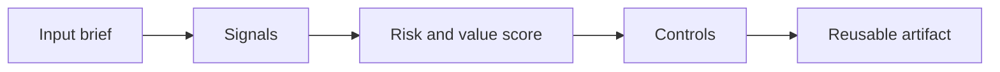

# Consultative Prompting

> Consultative prompting is not asking for prettier slides. It is using AI to sharpen hypotheses, expose weak logic, and prepare better client conversations.

**Type:** Build
**Languages:** Python
**Prerequisites:** Phase 11 Lesson 01 (Prompt Engineering), Phase 11 Lesson 10 (Evaluation & Testing)
**Time:** ~45 minutes
**Capability:** Advisory and Business Consulting - Consultative Prompting

## Learning Objectives

- Identify the operational signals that make this capability relevant in day-to-day LHIND work
- Build a lightweight Python artifact that turns an ambiguous AI idea into a structured plan
- Map risk, value, uncertainty, and controls into a practical course exercise
- Use the generated worksheet as a reusable starting point for team enablement
- Explain when the topic belongs in awareness training, guided pilot work, or a launch gate

## The Problem

A consultant asks an assistant to draft a workshop agenda. The agenda looks professional but generic. It does not reflect stakeholder tension, decision criteria, risks, or the client context. The prompt produced output, but it did not improve the consulting work.

This lesson treats the course as a working session, not as a slide deck. Participants should leave with something they can use in the next project conversation: a checklist, matrix, prompt pack, memo, or scoring worksheet.

## The Concept

Consultative prompting starts with the consulting move: clarify, diagnose, structure, challenge, synthesize, recommend. The prompt should encode context, audience, decision, constraints, and desired thinking pattern. Strong prompts ask the model to reveal assumptions and alternatives, not just produce text.

The recurring pattern is simple: identify the workflow, surface the signals, choose the right level of control, and produce an artifact that makes the next decision easier.

### Signals to Look For

- unclear decision
- stakeholder tension
- weak hypothesis
- missing constraint

### Controls to Teach

- assumption check
- counterargument
- audience fit
- source grounding

### Target Roles

- Business & Strategy Consulting
- Project Management & Agility

## Use It

Use the composer before meetings, proposals, workshops, and steering updates. It helps teams use AI as a thinking partner without outsourcing judgment.

The expected output is not a final answer from AI. It is a better human conversation. The artifact makes the assumptions visible enough that a team can challenge them, tune the controls, and agree on the next step.

### Workshop Flow

1. Start with a real workflow from the participant's team.
2. Capture the signals in plain language.
3. Score impact and uncertainty together.
4. Review the recommended controls.
5. Decide whether the next step is awareness, practice, pilot, or launch gate.

## Reusable Artifact

Consultative prompt pack for discovery, synthesis, and recommendation work.

The output template in `outputs/prompt-pack-consultative-prompting.md` can be copied into a project kickoff, enablement workshop, or team retro. Keep the artifact short enough that teams actually use it.

## Key Takeaways

- The course is about operational judgment, not generic AI enthusiasm.
- A reusable artifact beats a one-time presentation because it changes the next project conversation.
- The right control level depends on workflow risk, uncertainty, business impact, and role accountability.
- AI can accelerate analysis, but the team still owns the decision, review, and rollout.

## Build It

Reconstruct **Consultative Prompting** by following `Scenario` on the text "red fox". Run `python3 main.py` and verify that the tokenizer/retriever reports zero or a clear empty-input result, rather than borrowing a result from the previous text.

## Ship It

Hand off `outputs/prompt-pack-consultative-prompting.md` with the command `python3 main.py`, the accepted input shape (the text "red fox"), the expected observable result, and a failure note for malformed inputs.

## Exercises

Make the experiment auditable. Save the input, output, and one sentence explaining how the result bears on the claim.

1. **Trace the happy path.** Run [main.py](../code/main.py) with `python3 main.py` from the lesson's `code/` directory. Record the smallest input that demonstrates “Identify the operational signals that make this capability relevant in day-to-day LHIND work”. Point to `normalize()`, `signal_matches()`, `score_scenario()` and name the returned field or printed value that serves as evidence.
2. **Perturb the input.** Change exactly one input, threshold, or option that affects “Build a lightweight Python artifact that turns an ambiguous AI idea into a structured plan”. Predict the direction of the change before running it, then compare the two outputs and explain why the other fields should stay stable.
3. **Test a failure case.** Construct a case that stresses “Map risk, value, uncertainty, and controls into a practical course exercise”: choose an empty collection, missing field, maximum-sized value, malformed record, or another boundary that fits this lesson. Write the expected behavior first and distinguish an intentional guard from an accidental crash.
4. **Transfer the result.** Open outputs/prompt-pack-consultative-prompting.md and adapt one example to a real workflow. State the owner, evidence, and next decision required for “Use the generated worksheet as a reusable starting point for team enablement”; mark any assumption that the demo does not establish.

## Reference Solution

A useful submission records python3 main.py, the observed output, and the conclusion drawn from it. It should contain:

- evidence for “Identify the operational signals that make this capability relevant in day-to-day LHIND work” with the relevant input and returned field;
- a one-variable comparison that makes “Build a lightweight Python artifact that turns an ambiguous AI idea into a structured plan” visible;
- a predicted and observed boundary result for “Map risk, value, uncertainty, and controls into a practical course exercise”, including why the behavior is safe; and
- one concrete update to outputs/prompt-pack-consultative-prompting.md that applies “Use the generated worksheet as a reusable starting point for team enablement” without hiding uncertainty.

Use normalize(), signal_matches(), score_scenario() to explain the result, not only the prose output. If the experiment disagrees with the prediction, keep the failed prediction in the receipt and revise the explanation rather than changing the input until it passes.
