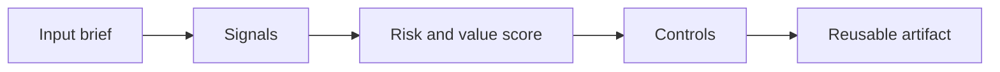

# AI Workforce Strategy

> AI workforce strategy is not a training calendar. It is a plan for how work changes, which skills matter, and how teams adopt new ways of operating safely.

**Type:** Build
**Languages:** Python
**Prerequisites:** Phase 11 Lesson 01 (Prompt Engineering), Phase 11 Lesson 10 (Evaluation & Testing)
**Time:** ~45 minutes
**Capability:** Leadership and Strategy - AI Workforce Strategy

## Learning Objectives

- Identify the operational signals that make this capability relevant in day-to-day LHIND work
- Build a lightweight Python artifact that turns an ambiguous AI idea into a structured plan
- Map risk, value, uncertainty, and controls into a practical course exercise
- Use the generated worksheet as a reusable starting point for team enablement
- Explain when the topic belongs in awareness training, guided pilot work, or a launch gate

## The Problem

A leadership team launches AI training for everyone. Attendance is high, but daily behavior barely changes. Some teams use AI heavily, others avoid it, and managers cannot explain which tasks should change or how performance expectations should evolve.

This lesson treats the course as a working session, not as a slide deck. Participants should leave with something they can use in the next project conversation: a checklist, matrix, prompt pack, memo, or scoring worksheet.

## The Concept

Workforce strategy starts at task level. Identify which tasks are assisted, automated, redesigned, or protected. Then define role expectations, enablement paths, champions, governance, and metrics that show whether adoption improves outcomes.

The recurring pattern is simple: identify the workflow, surface the signals, choose the right level of control, and produce an artifact that makes the next decision easier.



### Signals to Look For

- high frequency task
- skill gap
- manager dependency
- adoption blocker

### Controls to Teach

- role expectation
- champion network
- training path
- adoption metric

### Target Roles

- Leadership
- Corporate Functions

## Build It

In the lab you build a workforce impact mapper. It scores tasks by AI suitability, risk, frequency, skill gap, and change effort, then recommends enablement actions for teams.

The Python implementation is intentionally small. It is not a production platform. It is a classroom artifact: participants can read it, run it, change the example scenarios, and see how the recommendation changes.

The artifact has four parts:

1. A `Scenario` object that describes the workflow or decision.
2. A signal matcher that identifies relevant risk or value indicators.
3. A scoring function that combines impact, uncertainty, and matched signals.
4. A recommendation that selects a category, priority, and controls.

Run it locally:

```bash
cd phases/11-llm-engineering/28-ai-workforce-strategy/code
python3 main.py
python3 -m unittest discover tests -v
```

## Use It

Use it for team planning, capability programs, and leadership reviews. It translates AI ambition into role-specific development paths and adoption governance.

The expected output is not a final answer from AI. It is a better human conversation. The artifact makes the assumptions visible enough that a team can challenge them, tune the controls, and agree on the next step.

### Workshop Flow

1. Start with a real workflow from the participant's team.
2. Capture the signals in plain language.
3. Score impact and uncertainty together.
4. Review the recommended controls.
5. Decide whether the next step is awareness, practice, pilot, or launch gate.

## Reusable Artifact

AI workforce impact map and enablement roadmap.

The output template in `outputs/roadmap-ai-workforce-strategy.md` can be copied into a project kickoff, enablement workshop, or team retro. Keep the artifact short enough that teams actually use it.

## Key Takeaways

- The course is about operational judgment, not generic AI enthusiasm.
- A reusable artifact beats a one-time presentation because it changes the next project conversation.
- The right control level depends on workflow risk, uncertainty, business impact, and role accountability.
- AI can accelerate analysis, but the team still owns the decision, review, and rollout.
