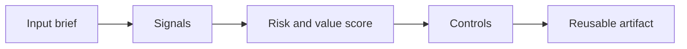

# Decision Making with AI

> AI can improve decisions only when leaders keep ownership of the question, evidence, uncertainty, and final accountability.

**Type:** Build
**Languages:** Python
**Prerequisites:** Phase 11 Lesson 01 (Prompt Engineering), Phase 11 Lesson 10 (Evaluation & Testing)
**Time:** ~45 minutes
**Capability:** Leadership and Strategy - Decision Making with AI

## Learning Objectives

- Identify the operational signals that make this capability relevant in day-to-day LHIND work
- Build a lightweight Python artifact that turns an ambiguous AI idea into a structured plan
- Map risk, value, uncertainty, and controls into a practical course exercise
- Use the generated worksheet as a reusable starting point for team enablement
- Explain when the topic belongs in awareness training, guided pilot work, or a launch gate

## The Problem

A manager asks an assistant whether to stop a project. The answer sounds confident and lists reasons. But the model does not own the budget, understand political constraints, or know which evidence is incomplete. Treating the answer as a recommendation would be a governance failure.

This lesson treats the course as a working session, not as a slide deck. Participants should leave with something they can use in the next project conversation: a checklist, matrix, prompt pack, memo, or scoring worksheet.

## The Concept

AI-supported decision making separates analysis from accountability. The system can structure options, surface assumptions, compare scenarios, and identify missing evidence. Humans define decision rights, risk appetite, constraints, and what level of confidence is enough to act.

The recurring pattern is simple: identify the workflow, surface the signals, choose the right level of control, and produce an artifact that makes the next decision easier.

### Signals to Look For

- high uncertainty
- irreversible decision
- stakeholder conflict
- missing evidence

### Controls to Teach

- decision owner
- confidence threshold
- scenario review
- evidence gap log

### Target Roles

- Leadership
- Project Management & Agility

## Use It

Use it for steering decisions, prioritization, portfolio tradeoffs, and operational escalations. It improves decision quality without pretending the model is the decision maker.

The expected output is not a final answer from AI. It is a better human conversation. The artifact makes the assumptions visible enough that a team can challenge them, tune the controls, and agree on the next step.

### Workshop Flow

1. Start with a real workflow from the participant's team.
2. Capture the signals in plain language.
3. Score impact and uncertainty together.
4. Review the recommended controls.
5. Decide whether the next step is awareness, practice, pilot, or launch gate.

## Reusable Artifact

AI-supported decision memo and scenario checklist.

The output template in `outputs/memo-ai-supported-decision.md` can be copied into a project kickoff, enablement workshop, or team retro. Keep the artifact short enough that teams actually use it.

## Key Takeaways

- The course is about operational judgment, not generic AI enthusiasm.
- A reusable artifact beats a one-time presentation because it changes the next project conversation.
- The right control level depends on workflow risk, uncertainty, business impact, and role accountability.
- AI can accelerate analysis, but the team still owns the decision, review, and rollout.
