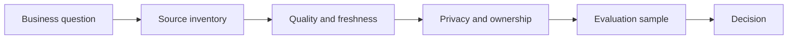

# Data Literacy for AI Projects

> AI projects fail early when nobody can say which data is allowed, fresh, representative, and good enough for the decision.

**Type:** Build
**Languages:** Python
**Prerequisites:** Phase 11 Lesson 05 (Context Engineering), Phase 11 Lesson 10 (Evaluation & Testing)
**Time:** ~45 minutes
**Capability:** Foundation - Data Literacy

## Learning Objectives

- Identify the data signals that decide whether an AI workflow is feasible
- Build a small Python data-readiness triage artifact
- Map data quality, privacy, freshness, ownership, and evaluation into one worksheet
- Use data-readiness controls before a pilot starts
- Explain when a use case needs awareness, cleanup, a guided pilot, or a launch gate

## The Problem

A team wants an assistant for customer or employee questions. The prompt looks simple, but the data is spread across SharePoint folders, old exports, local spreadsheets, and undocumented process notes. Some content is stale, some is sensitive, and nobody owns the final answer quality.

The lesson teaches participants to ask the data questions before discussing model choice. Good AI use cases start with the evidence base, not with a demo.

## The Concept

Data literacy for AI is the ability to reason about sources, quality, representativeness, permissions, and evaluation. The point is not to turn every learner into a data engineer. The point is to make every learner able to spot when the data story is too weak for reliable AI.



### Signals to Look For

- unclear source owner
- stale data
- quality issue
- sensitive field

### Controls to Teach

- source inventory
- quality threshold
- privacy classification
- evaluation sample

### Target Roles

- Business & Strategy Consulting
- Products & Value Streams
- Corporate Functions
- Leadership

## Build It

In the lab you build a data-readiness triage tool. It accepts short scenarios, detects data signals, scores readiness risk, and recommends the minimum control level for the next step.

Run it locally:

```bash
cd phases/11-llm-engineering/30-data-literacy-for-ai-projects/code
python3 main.py
python3 -m unittest discover tests -v
```

## Use It

Use the artifact in discovery, requirements work, and pilot reviews. It creates a shared vocabulary for data quality without requiring a full data-platform deep dive.

### Workshop Flow

1. Start with one real workflow and list the sources it would use.
2. Mark source owners, freshness, sensitivity, and known quality issues.
3. Score the scenario with the Python artifact.
4. Decide whether the next step is cleanup, a pilot, or a governance gate.
5. Save the worksheet with the project brief.

## Reusable Artifact

Data-readiness triage worksheet.

The template in `outputs/worksheet-data-readiness-triage.md` can be copied into a discovery note, product brief, or AI initiative intake.

## Key Takeaways

- Data literacy is an operating skill for every AI project role.
- Model choice cannot compensate for stale, uncontrolled, or unowned sources.
- Evaluation samples should be planned before a pilot starts.
- Data controls should be lightweight enough that teams actually use them.
