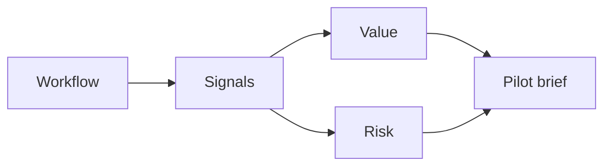

# AI Use Case Identification Workshop

> A strong AI use case is not an idea with the word AI attached. It is a workflow with evidence, value, risk, ownership, and a path to measurement.

**Type:** Build
**Languages:** Python
**Prerequisites:** Phase 11 Lesson 10 (Evaluation & Testing), Phase 11 Lesson 25 (AI Cost and Value Economics)
**Time:** ~45 minutes
**Capability:** Advisory and Business Consulting - AI and Automation Use Case Spotting

## Learning Objectives

- Identify workflow signals that make AI or automation worth exploring
- Build a use-case scoring artifact in Python
- Compare value, risk, volume, variance, and ownership
- Convert rough ideas into pilot briefs
- Explain when a use case should be dropped, practiced, piloted, or launch-gated

## The Problem

Teams often collect AI ideas in a backlog, but the ideas are not comparable. One idea saves minutes, another reduces risk, another improves quality, and another is simply a demo request. Without a shared scoring method, prioritization becomes opinion-driven.

## The Concept

Use-case discovery starts with the workflow. Look for repeated work, high volume, variation, quality pain, decision delays, and handoff friction. Then check whether the data and operating model can support the idea.

### Signals to Look For

- manual work
- high volume
- process variance
- handoff delay

### Controls to Teach

- use case canvas
- value risk score
- pilot metric
- accountable owner

### Target Roles

- Business & Strategy Consulting
- Products & Value Streams
- Project Management
- Leadership

## Use It

Use the artifact in discovery workshops, process reviews, and portfolio grooming. The output should be a short pilot brief, not a broad transformation promise.

## Reusable Artifact

Use-case canvas and pilot brief.

The template in `outputs/canvas-ai-use-case-pilot.md` can be used to capture value, risk, owner, data, metric, and next step.

## Worked scenario

The demo's first case is **invoice intake**: High volume manual work with process variance. Treat the labels manual work, high volume, process variance, handoff delay as evidence to inspect, not as an automatic approval. The implementation's signal matcher looks for those terms in the scenario name, description, and explicit signal list; then the scorer combines impact, uncertainty, and two points per matched signal (capped at 20). The priority function maps that score to a control level: launch gate at 16 or above, guided pilot at 11–15, team practice at 7–10, and awareness below 7.

Run the case and check which of the controls — use case canvas, value risk score, pilot metric, accountable owner — appear in the returned row. Ask three questions: Which signal is supported by an observable source? Which control has an owner who can act this week? What evidence would move the case to a different priority? Then change one signal or impact value and rerun it. If the priority changes, explain whether the change came from the score, the matching rule, or both. The score is a triage aid; it does not replace domain approval, privacy review, or a pilot metric. Keep that distinction in the artifact and in the handoff.
## Key Takeaways

- Start with a workflow, not with a tool.
- A use case needs measurable value and an accountable owner.
- High-risk or high-uncertainty ideas need stronger controls.
- A pilot brief should be specific enough to test.

## Build It

Reconstruct **AI Use Case Identification Workshop** by following `Scenario` on the demo’s smallest built-in fixture. Run `python3 main.py` and verify that the result reports the empty case explicitly or raises the documented validation error.

## Ship It

Hand off `outputs/canvas-ai-use-case-pilot.md` with the command `python3 main.py`, the accepted input shape (the demo’s smallest built-in fixture), the expected observable result, and a failure note for malformed inputs.

## Exercises

Start with the smallest reproducible run. Keep the input, output, and interpretation together so another reader can repeat the check.

1. **Trace the happy path.** Run [main.py](../code/main.py) with `python3 main.py` from the lesson's `code/` directory. Record the smallest input that demonstrates “Identify workflow signals that make AI or automation worth exploring”. Point to `normalize()`, `signal_matches()`, `score_scenario()` and name the returned field or printed value that serves as evidence.
2. **Perturb the input.** Change exactly one input, threshold, or option that affects “Build a use-case scoring artifact in Python”. Predict the direction of the change before running it, then compare the two outputs and explain why the other fields should stay stable.
3. **Test a failure case.** Construct a case that stresses “Compare value, risk, volume, variance, and ownership”: choose an empty collection, missing field, maximum-sized value, malformed record, or another boundary that fits this lesson. Write the expected behavior first and distinguish an intentional guard from an accidental crash.
4. **Transfer the result.** Open outputs/canvas-ai-use-case-pilot.md and adapt one example to a real workflow. State the owner, evidence, and next decision required for “Convert rough ideas into pilot briefs”; mark any assumption that the demo does not establish.

## Reference Solution

Your solution is complete when it records python3 main.py, the captured output, and a short interpretation. Show:

- evidence for “Identify workflow signals that make AI or automation worth exploring” with the relevant input and returned field;
- a one-variable comparison that makes “Build a use-case scoring artifact in Python” visible;
- a predicted and observed boundary result for “Compare value, risk, volume, variance, and ownership”, including why the behavior is safe; and
- one concrete update to outputs/canvas-ai-use-case-pilot.md that applies “Convert rough ideas into pilot briefs” without hiding uncertainty.

Use normalize(), signal_matches(), score_scenario() to explain the result, not only the prose output. If the experiment disagrees with the prediction, keep the failed prediction in the receipt and revise the explanation rather than changing the input until it passes.
