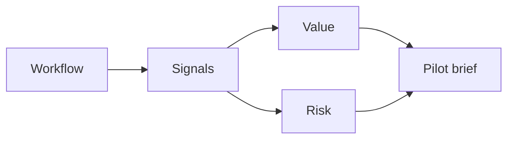

# AI Use Case Identification Workshop

> A strong AI use case is not an idea with the word AI attached. It is a workflow with evidence, value, risk, ownership, and a path to measurement.

**Type:** Build
**Languages:** Python
**Prerequisites:** Phase 11 Lesson 10 (Evaluation & Testing), Phase 11 Lesson 25 (AI Cost and Value Economics)
**Time:** ~45 minutes
**Capability:** Advisory and Business Consulting - AI and Automation Use Case Spotting

## Learning Objectives

- Identify workflow signals that make AI or automation worth exploring
- Build a use-case scoring artifact in Python
- Compare value, risk, volume, variance, and ownership
- Convert rough ideas into pilot briefs
- Explain when a use case should be dropped, practiced, piloted, or launch-gated

## The Problem

Teams often collect AI ideas in a backlog, but the ideas are not comparable. One idea saves minutes, another reduces risk, another improves quality, and another is simply a demo request. Without a shared scoring method, prioritization becomes opinion-driven.

## The Concept

Use-case discovery starts with the workflow. Look for repeated work, high volume, variation, quality pain, decision delays, and handoff friction. Then check whether the data and operating model can support the idea.

### Signals to Look For

- manual work
- high volume
- process variance
- handoff delay

### Controls to Teach

- use case canvas
- value risk score
- pilot metric
- accountable owner

### Target Roles

- Business & Strategy Consulting
- Products & Value Streams
- Project Management
- Leadership

## Use It

Use the artifact in discovery workshops, process reviews, and portfolio grooming. The output should be a short pilot brief, not a broad transformation promise.

## Reusable Artifact

Use-case canvas and pilot brief.

The template in `outputs/canvas-ai-use-case-pilot.md` can be used to capture value, risk, owner, data, metric, and next step.

## Key Takeaways

- Start with a workflow, not with a tool.
- A use case needs measurable value and an accountable owner.
- High-risk or high-uncertainty ideas need stronger controls.
- A pilot brief should be specific enough to test.
