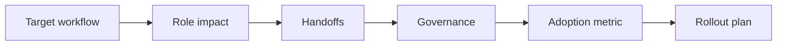

# AI Change Management and Team Integration

> AI adoption is not finished when a tool is available. It is finished when roles, handoffs, review duties, and behavior changes are clear.

**Type:** Build
**Languages:** Python
**Prerequisites:** Phase 11 Lesson 18 (Responsible AI Compliance Workflow), Phase 11 Lesson 90 (AI Workforce Strategy)
**Time:** ~45 minutes
**Capability:** Leadership and Strategy - Managing AI Transformations

## Learning Objectives

- Identify adoption signals that block AI use in real teams
- Build a change-readiness planner in Python
- Map role impact, adoption friction, governance gaps, and handoffs
- Select controls for team integration and rollout
- Explain why AI change needs operating routines, not only communication

## The Problem

A tool is launched, a few early adopters use it, and then adoption stalls. Some teams worry about accountability, some do not know when AI is allowed, and some managers cannot see whether behavior changed. The missing piece is team integration.

## The Concept

AI change management links people, process, risk, and measurement. Every new AI workflow needs a role map, a human review point, an adoption metric, and a way to handle exceptions.

### Signals to Look For

- role impact
- adoption friction
- governance gap
- process handoff

### Controls to Teach

- role map
- stakeholder plan
- training path
- adoption metric

### Target Roles

- Leadership
- Project Management
- Corporate Functions
- Business & Strategy Consulting

## Use It

Use the artifact when moving from pilot to rollout, when defining team responsibilities, or when preparing a leader conversation about AI adoption.

## Reusable Artifact

AI change integration plan.

The template in `outputs/plan-ai-change-integration.md` can be used as a rollout checklist for team-level adoption.

## Worked scenario

The demo's first case is **rollout to service team**: High role impact with adoption friction and process handoff. Treat the labels role impact, adoption friction, governance gap, process handoff as evidence to inspect, not as an automatic approval. The implementation's signal matcher looks for those terms in the scenario name, description, and explicit signal list; then the scorer combines impact, uncertainty, and two points per matched signal (capped at 20). The priority function maps that score to a control level: launch gate at 16 or above, guided pilot at 11–15, team practice at 7–10, and awareness below 7.

Run the case and check which of the controls — role map, stakeholder plan, training path, adoption metric — appear in the returned row. Ask three questions: Which signal is supported by an observable source? Which control has an owner who can act this week? What evidence would move the case to a different priority? Then change one signal or impact value and rerun it. If the priority changes, explain whether the change came from the score, the matching rule, or both. The score is a triage aid; it does not replace domain approval, privacy review, or a pilot metric. Keep that distinction in the artifact and in the handoff.
## Key Takeaways

- AI change is a workflow redesign problem.
- Adoption needs role clarity and a measurable behavior shift.
- Human review points must be explicit.
- Governance language should be translated into team routines.

## Build It

Reconstruct **AI Change Management and Team Integration** by following `Scenario` on the demo’s smallest built-in fixture. Run `python3 main.py` and verify that the result reports the empty case explicitly or raises the documented validation error.

## Ship It

Hand off `outputs/plan-ai-change-integration.md` with the command `python3 main.py`, the accepted input shape (the demo’s smallest built-in fixture), the expected observable result, and a failure note for malformed inputs.

## Exercises

Use the demo as evidence, not as a ceremony: record what went in, what came out, and why that observation supports the objective.

1. **Start with a known input.** Run [main.py](../code/main.py) with `python3 main.py` from the lesson's `code/` directory. Record the smallest input that demonstrates “Identify adoption signals that block AI use in real teams”. Point to `normalize()`, `signal_matches()`, `score_scenario()` and name the returned field or printed value that serves as evidence.
2. **Run a controlled comparison.** Change exactly one input, threshold, or option that affects “Build a change-readiness planner in Python”. Predict the direction of the change before running it, then compare the two outputs and explain why the other fields should stay stable.
3. **Try the smallest valid counterexample.** Construct a case that stresses “Map role impact, adoption friction, governance gaps, and handoffs”: choose an empty collection, missing field, maximum-sized value, malformed record, or another boundary that fits this lesson. Write the expected behavior first and distinguish an intentional guard from an accidental crash.
4. **Transfer the result.** Open outputs/plan-ai-change-integration.md and adapt one example to a real workflow. State the owner, evidence, and next decision required for “Select controls for team integration and rollout”; mark any assumption that the demo does not establish.

## Reference Solution

The reference run should leave a small receipt: python3 main.py, its captured output, and your interpretation. Include:

- evidence for “Identify adoption signals that block AI use in real teams” with the relevant input and returned field;
- a one-variable comparison that makes “Build a change-readiness planner in Python” visible;
- a predicted and observed boundary result for “Map role impact, adoption friction, governance gaps, and handoffs”, including why the behavior is safe; and
- one concrete update to outputs/plan-ai-change-integration.md that applies “Select controls for team integration and rollout” without hiding uncertainty.

Use normalize(), signal_matches(), score_scenario() to explain the result, not only the prose output. If the experiment disagrees with the prediction, keep the failed prediction in the receipt and revise the explanation rather than changing the input until it passes.
