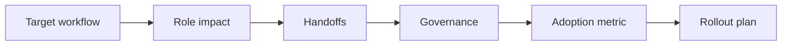

# AI Change Management and Team Integration

> AI adoption is not finished when a tool is available. It is finished when roles, handoffs, review duties, and behavior changes are clear.

**Type:** Build
**Languages:** Python
**Prerequisites:** Phase 11 Lesson 18 (Responsible AI Compliance Workflow), Phase 11 Lesson 90 (AI Workforce Strategy)
**Time:** ~45 minutes
**Capability:** Leadership and Strategy - Managing AI Transformations

## Learning Objectives

- Identify adoption signals that block AI use in real teams
- Build a change-readiness planner in Python
- Map role impact, adoption friction, governance gaps, and handoffs
- Select controls for team integration and rollout
- Explain why AI change needs operating routines, not only communication

## The Problem

A tool is launched, a few early adopters use it, and then adoption stalls. Some teams worry about accountability, some do not know when AI is allowed, and some managers cannot see whether behavior changed. The missing piece is team integration.

## The Concept

AI change management links people, process, risk, and measurement. Every new AI workflow needs a role map, a human review point, an adoption metric, and a way to handle exceptions.



### Signals to Look For

- role impact
- adoption friction
- governance gap
- process handoff

### Controls to Teach

- role map
- stakeholder plan
- training path
- adoption metric

### Target Roles

- Leadership
- Project Management
- Corporate Functions
- Business & Strategy Consulting

## Build It

In the lab you build a change-readiness planner. It scores rollout scenarios and recommends the minimum controls needed before broader team adoption.

Run it locally:

```bash
cd phases/11-llm-engineering/33-ai-change-management-team-integration/code
python3 main.py
python3 -m unittest discover tests -v
```

## Use It

Use the artifact when moving from pilot to rollout, when defining team responsibilities, or when preparing a leader conversation about AI adoption.

## Reusable Artifact

AI change integration plan.

The template in `outputs/plan-ai-change-integration.md` can be used as a rollout checklist for team-level adoption.

## Key Takeaways

- AI change is a workflow redesign problem.
- Adoption needs role clarity and a measurable behavior shift.
- Human review points must be explicit.
- Governance language should be translated into team routines.
