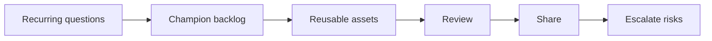

# AI Champion Enablement

> An AI champion is useful when they turn scattered experiments into reusable assets, shared standards, and better team habits.

**Type:** Build
**Languages:** Python
**Prerequisites:** Phase 11 Lesson 31 (Hands-on Prompt Clinic), Phase 11 Lesson 33 (AI Change Management and Team Integration)
**Time:** ~45 minutes
**Capability:** Leadership and Strategy - AI Champion and Community Lead

## Learning Objectives

- Identify team signals that call for an AI champion activity
- Build a champion backlog planner in Python
- Prioritize office hours, reusable assets, brown bags, and escalation support
- Define quality controls for shared AI enablement materials
- Explain how champions support adoption without becoming the approval bottleneck

## The Problem

Teams often have scattered AI experiments: a useful prompt in one channel, a good review checklist in another, and several repeated questions in meetings. Without a champion routine, the learning stays local and fragile.

## The Concept

Champion work is an enablement loop. Observe repeated questions, collect reusable assets, review quality, share patterns, and escalate risks. The champion does not own every AI decision. They help the team reuse what works and know when to ask for help.



### Signals to Look For

- recurring question
- team blocker
- reusable prompt
- community need

### Controls to Teach

- office hours plan
- contribution backlog
- quality rubric
- escalation path

### Target Roles

- AI Champions
- Community Leads
- Leadership
- Project Management

## Build It

In the lab you build a champion backlog planner. It scores enablement opportunities and recommends which champion activity to run next.

Run it locally:

```bash
cd phases/11-llm-engineering/34-ai-champion-enablement/code
python3 main.py
python3 -m unittest discover tests -v
```

## Use It

Use the artifact to plan office hours, brown-bag sessions, reusable prompt packs, and contribution reviews. It keeps champion work focused on repeated team needs.

## Reusable Artifact

AI champion backlog.

The template in `outputs/backlog-ai-champion-enablement.md` can be used to manage reusable AI enablement assets and community requests.

## Key Takeaways

- Champions scale learning by making useful practices reusable.
- A champion backlog prevents enablement from becoming random support work.
- Shared assets need quality review and ownership.
- Champions should escalate risks rather than silently absorb them.
