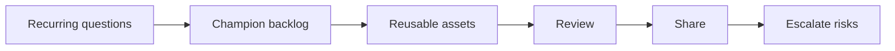

# AI Champion Enablement

> An AI champion is useful when they turn scattered experiments into reusable assets, shared standards, and better team habits.

**Type:** Build
**Languages:** Python
**Prerequisites:** Phase 11 Lesson 31 (Hands-on Prompt Clinic), Phase 11 Lesson 33 (AI Change Management and Team Integration)
**Time:** ~45 minutes
**Capability:** Leadership and Strategy - AI Champion and Community Lead

## Learning Objectives

- Identify team signals that call for an AI champion activity
- Build a champion backlog planner in Python
- Prioritize office hours, reusable assets, brown bags, and escalation support
- Define quality controls for shared AI enablement materials
- Explain how champions support adoption without becoming the approval bottleneck

## The Problem

Teams often have scattered AI experiments: a useful prompt in one channel, a good review checklist in another, and several repeated questions in meetings. Without a champion routine, the learning stays local and fragile.

## The Concept

Champion work is an enablement loop. Observe repeated questions, collect reusable assets, review quality, share patterns, and escalate risks. The champion does not own every AI decision. They help the team reuse what works and know when to ask for help.

### Signals to Look For

- recurring question
- team blocker
- reusable prompt
- community need

### Controls to Teach

- office hours plan
- contribution backlog
- quality rubric
- escalation path

### Target Roles

- AI Champions
- Community Leads
- Leadership
- Project Management

## Use It

Use the artifact to plan office hours, brown-bag sessions, reusable prompt packs, and contribution reviews. It keeps champion work focused on repeated team needs.

## Reusable Artifact

AI champion backlog.

The template in `outputs/backlog-ai-champion-enablement.md` can be used to manage reusable AI enablement assets and community requests.

## Worked scenario

The demo's first case is **prompt pack request**: Reusable prompt request with recurring question across teams. Treat the labels recurring question, team blocker, reusable prompt, community need as evidence to inspect, not as an automatic approval. The implementation's signal matcher looks for those terms in the scenario name, description, and explicit signal list; then the scorer combines impact, uncertainty, and two points per matched signal (capped at 20). The priority function maps that score to a control level: launch gate at 16 or above, guided pilot at 11–15, team practice at 7–10, and awareness below 7.

Run the case and check which of the controls — office hours plan, contribution backlog, quality rubric, escalation path — appear in the returned row. Ask three questions: Which signal is supported by an observable source? Which control has an owner who can act this week? What evidence would move the case to a different priority? Then change one signal or impact value and rerun it. If the priority changes, explain whether the change came from the score, the matching rule, or both. The score is a triage aid; it does not replace domain approval, privacy review, or a pilot metric. Keep that distinction in the artifact and in the handoff.
## Key Takeaways

- Champions scale learning by making useful practices reusable.
- A champion backlog prevents enablement from becoming random support work.
- Shared assets need quality review and ownership.
- Champions should escalate risks rather than silently absorb them.

## Build It

Reconstruct **AI Champion Enablement** by following `Scenario` on the demo’s smallest built-in fixture. Run `python3 main.py` and verify that the result reports the empty case explicitly or raises the documented validation error.

## Ship It

Hand off `outputs/backlog-ai-champion-enablement.md` with the command `python3 main.py`, the accepted input shape (the demo’s smallest built-in fixture), the expected observable result, and a failure note for malformed inputs.

## Exercises

Make the experiment auditable. Save the input, output, and one sentence explaining how the result bears on the claim.

1. **Reproduce the control run.** Run [main.py](../code/main.py) with `python3 main.py` from the lesson's `code/` directory. Record the smallest input that demonstrates “Identify team signals that call for an AI champion activity”. Point to `normalize()`, `signal_matches()`, `score_scenario()` and name the returned field or printed value that serves as evidence.
2. **Change one decision.** Change exactly one input, threshold, or option that affects “Build a champion backlog planner in Python”. Predict the direction of the change before running it, then compare the two outputs and explain why the other fields should stay stable.
3. **Probe a boundary.** Construct a case that stresses “Prioritize office hours, reusable assets, brown bags, and escalation support”: choose an empty collection, missing field, maximum-sized value, malformed record, or another boundary that fits this lesson. Write the expected behavior first and distinguish an intentional guard from an accidental crash.
4. **Transfer the result.** Open outputs/backlog-ai-champion-enablement.md and adapt one example to a real workflow. State the owner, evidence, and next decision required for “Define quality controls for shared AI enablement materials”; mark any assumption that the demo does not establish.

## Reference Solution

A useful submission records python3 main.py, the observed output, and the conclusion drawn from it. It should contain:

- evidence for “Identify team signals that call for an AI champion activity” with the relevant input and returned field;
- a one-variable comparison that makes “Build a champion backlog planner in Python” visible;
- a predicted and observed boundary result for “Prioritize office hours, reusable assets, brown bags, and escalation support”, including why the behavior is safe; and
- one concrete update to outputs/backlog-ai-champion-enablement.md that applies “Define quality controls for shared AI enablement materials” without hiding uncertainty.

Use normalize(), signal_matches(), score_scenario() to explain the result, not only the prose output. If the experiment disagrees with the prediction, keep the failed prediction in the receipt and revise the explanation rather than changing the input until it passes.
