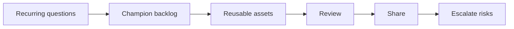

# AI Champion Enablement

> An AI champion is useful when they turn scattered experiments into reusable assets, shared standards, and better team habits.

**Type:** Build
**Languages:** Python
**Prerequisites:** Phase 11 Lesson 31 (Hands-on Prompt Clinic), Phase 11 Lesson 33 (AI Change Management and Team Integration)
**Time:** ~45 minutes
**Capability:** Leadership and Strategy - AI Champion and Community Lead

## Learning Objectives

- Identify team signals that call for an AI champion activity
- Build a champion backlog planner in Python
- Prioritize office hours, reusable assets, brown bags, and escalation support
- Define quality controls for shared AI enablement materials
- Explain how champions support adoption without becoming the approval bottleneck

## The Problem

Teams often have scattered AI experiments: a useful prompt in one channel, a good review checklist in another, and several repeated questions in meetings. Without a champion routine, the learning stays local and fragile.

## The Concept

Champion work is an enablement loop. Observe repeated questions, collect reusable assets, review quality, share patterns, and escalate risks. The champion does not own every AI decision. They help the team reuse what works and know when to ask for help.

### Signals to Look For

- recurring question
- team blocker
- reusable prompt
- community need

### Controls to Teach

- office hours plan
- contribution backlog
- quality rubric
- escalation path

### Target Roles

- AI Champions
- Community Leads
- Leadership
- Project Management

## Use It

Use the artifact to plan office hours, brown-bag sessions, reusable prompt packs, and contribution reviews. It keeps champion work focused on repeated team needs.

## Reusable Artifact

AI champion backlog.

The template in `outputs/backlog-ai-champion-enablement.md` can be used to manage reusable AI enablement assets and community requests.

## Key Takeaways

- Champions scale learning by making useful practices reusable.
- A champion backlog prevents enablement from becoming random support work.
- Shared assets need quality review and ownership.
- Champions should escalate risks rather than silently absorb them.

## Exercises

1. **Establish a baseline.** Run the lesson demo, then capture the inputs, outputs, and one invariant that demonstrates this objective: Identify team signals that call for an AI champion activity.
2. **Change one variable.** Modify a single input or parameter and use the resulting evidence to investigate this objective: Build a champion backlog planner in Python.
3. **Probe an edge case.** Predict the result before running it, compare prediction with observation, and explain the discrepancy while applying this objective: Prioritize office hours, reusable assets, brown bags, and escalation support.

## Reference Solution

Use the canonical [main.py](../code/main.py) as the executable baseline. A complete solution records a successful run, identifies the invariant tied to “Identify team signals that call for an AI champion activity,” and changes only one variable for the comparison. The edge-case result must distinguish the prediction from the observation, explain the cause using “Prioritize office hours, reusable assets, brown bags, and escalation support,” and cite a repeatable check rather than relying on visual inspection alone.
