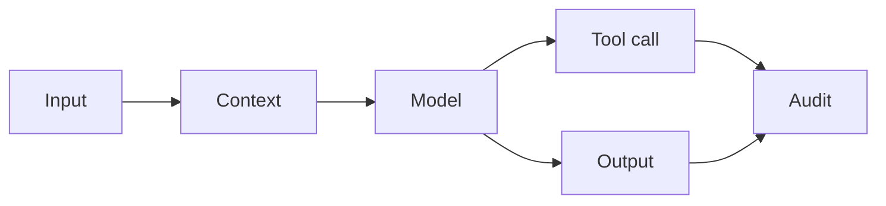

# AI Security and Prompt Injection Defense

> AI security starts when teams treat model input, retrieved documents, tool calls, and generated actions as separate trust boundaries.

**Type:** Build
**Languages:** Python
**Prerequisites:** Phase 11 Lesson 12 (Guardrails), Phase 11 Lesson 18 (Responsible AI Compliance Workflow)
**Time:** ~45 minutes
**Capability:** Foundation - Corporate Ethics, Compliance, and IT Security

## Learning Objectives

- Identify common AI security signals in prompts, tools, retrieval, and outputs
- Build a lightweight threat-triage artifact in Python
- Map prompt injection, data leakage, unsafe tool use, and audit gaps to controls
- Choose when an AI workflow needs team practice, a guided pilot, or a launch gate
- Explain why AI security belongs in product and process design, not only in final review

## The Problem

A team connects an assistant to internal documents and workflow tools. The demo works, but nobody has checked whether a retrieved document can override instructions, whether sensitive data can be exposed, or whether a tool call can trigger an unsafe action.

This lesson turns AI security into a practical triage workflow for project teams.

## The Concept

AI systems add new trust boundaries. Prompts can be hostile, context can contain hidden instructions, outputs can leak sensitive data, and tools can turn text into action. Security training should help teams identify these boundaries before launch.

### Signals to Look For

- prompt injection
- sensitive data
- unsafe tool
- missing audit

### Controls to Teach

- trust boundary map
- allowlist
- human approval
- audit log

### Target Roles

- Technology Consulting
- Application Management
- Products & Value Streams
- Corporate Functions

## Use It

Use the artifact during architecture reviews, compliance intake, tool-use design, and release readiness checks.

## Reusable Artifact

AI security triage checklist.

The template in `outputs/checklist-ai-security-triage.md` can be used before an assistant receives access to internal data or tools.

## Key Takeaways

- Prompt injection is a trust-boundary problem.
- Tool access requires explicit approval and audit controls.
- Security controls should be proportional to impact and uncertainty.
- AI security work belongs in the design phase, not only at go-live.

## Exercises

1. **Establish a baseline.** Run the lesson demo, then capture the inputs, outputs, and one invariant that demonstrates this objective: Identify common AI security signals in prompts, tools, retrieval, and outputs.
2. **Change one variable.** Modify a single input or parameter and use the resulting evidence to investigate this objective: Build a lightweight threat-triage artifact in Python.
3. **Probe an edge case.** Predict the result before running it, compare prediction with observation, and explain the discrepancy while applying this objective: Map prompt injection, data leakage, unsafe tool use, and audit gaps to controls.

## Reference Solution

Use the canonical [main.py](../code/main.py) as the executable baseline. A complete solution records a successful run, identifies the invariant tied to “Identify common AI security signals in prompts, tools, retrieval, and outputs,” and changes only one variable for the comparison. The edge-case result must distinguish the prediction from the observation, explain the cause using “Map prompt injection, data leakage, unsafe tool use, and audit gaps to controls,” and cite a repeatable check rather than relying on visual inspection alone.
