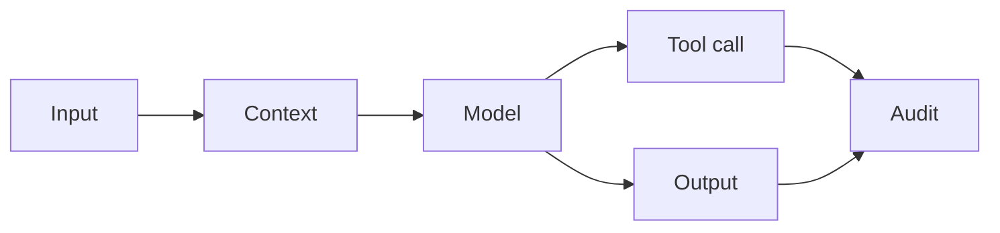

# AI Security and Prompt Injection Defense

> AI security starts when teams treat model input, retrieved documents, tool calls, and generated actions as separate trust boundaries.

**Type:** Build
**Languages:** Python
**Prerequisites:** Phase 11 Lesson 12 (Guardrails), Phase 11 Lesson 18 (Responsible AI Compliance Workflow)
**Time:** ~45 minutes
**Capability:** Foundation - Corporate Ethics, Compliance, and IT Security

## Learning Objectives

- Identify common AI security signals in prompts, tools, retrieval, and outputs
- Build a lightweight threat-triage artifact in Python
- Map prompt injection, data leakage, unsafe tool use, and audit gaps to controls
- Choose when an AI workflow needs team practice, a guided pilot, or a launch gate
- Explain why AI security belongs in product and process design, not only in final review

## The Problem

A team connects an assistant to internal documents and workflow tools. The demo works, but nobody has checked whether a retrieved document can override instructions, whether sensitive data can be exposed, or whether a tool call can trigger an unsafe action.

This lesson turns AI security into a practical triage workflow for project teams.

## The Concept

AI systems add new trust boundaries. Prompts can be hostile, context can contain hidden instructions, outputs can leak sensitive data, and tools can turn text into action. Security training should help teams identify these boundaries before launch.

### Signals to Look For

- prompt injection
- sensitive data
- unsafe tool
- missing audit

### Controls to Teach

- trust boundary map
- allowlist
- human approval
- audit log

### Target Roles

- Technology Consulting
- Application Management
- Products & Value Streams
- Corporate Functions

## Use It

Use the artifact during architecture reviews, compliance intake, tool-use design, and release readiness checks.

## Reusable Artifact

AI security triage checklist.

The template in `outputs/checklist-ai-security-triage.md` can be used before an assistant receives access to internal data or tools.

## Key Takeaways

- Prompt injection is a trust-boundary problem.
- Tool access requires explicit approval and audit controls.
- Security controls should be proportional to impact and uncertainty.
- AI security work belongs in the design phase, not only at go-live.

## Build It

Reconstruct **AI Security and Prompt Injection Defense** by following `Scenario` on the text "red fox". Run `python3 main.py` and verify that the tokenizer/retriever reports zero or a clear empty-input result, rather than borrowing a result from the previous text.

## Ship It

Hand off `outputs/checklist-ai-security-triage.md` with the command `python3 main.py`, the accepted input shape (the text "red fox"), the expected observable result, and a failure note for malformed inputs.

## Exercises

Begin with a control run and leave a short receipt: input, output, and the reasoning that connects them to the objective.

1. **Trace the happy path.** Run [main.py](../code/main.py) with `python3 main.py` from the lesson's `code/` directory. Record the smallest input that demonstrates “Identify common AI security signals in prompts, tools, retrieval, and outputs”. Point to `normalize()`, `signal_matches()`, `score_scenario()` and name the returned field or printed value that serves as evidence.
2. **Perturb the input.** Change exactly one input, threshold, or option that affects “Build a lightweight threat-triage artifact in Python”. Predict the direction of the change before running it, then compare the two outputs and explain why the other fields should stay stable.
3. **Test a failure case.** Construct a case that stresses “Map prompt injection, data leakage, unsafe tool use, and audit gaps to controls”: choose an empty collection, missing field, maximum-sized value, malformed record, or another boundary that fits this lesson. Write the expected behavior first and distinguish an intentional guard from an accidental crash.
4. **Transfer the result.** Open outputs/checklist-ai-security-triage.md and adapt one example to a real workflow. State the owner, evidence, and next decision required for “Choose when an AI workflow needs team practice, a guided pilot, or a launch gate”; mark any assumption that the demo does not establish.

## Reference Solution

Keep the solution auditable: run python3 main.py, save the output, and explain what it demonstrates. Include:

- evidence for “Identify common AI security signals in prompts, tools, retrieval, and outputs” with the relevant input and returned field;
- a one-variable comparison that makes “Build a lightweight threat-triage artifact in Python” visible;
- a predicted and observed boundary result for “Map prompt injection, data leakage, unsafe tool use, and audit gaps to controls”, including why the behavior is safe; and
- one concrete update to outputs/checklist-ai-security-triage.md that applies “Choose when an AI workflow needs team practice, a guided pilot, or a launch gate” without hiding uncertainty.

Use normalize(), signal_matches(), score_scenario() to explain the result, not only the prose output. If the experiment disagrees with the prediction, keep the failed prediction in the receipt and revise the explanation rather than changing the input until it passes.
