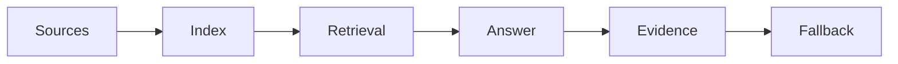

# Internal Knowledge Assistants with RAG

> A useful internal assistant is not a chatbot over every document. It is a governed retrieval workflow with source ownership, evaluation, and escalation.

**Type:** Build
**Languages:** Python
**Prerequisites:** Phase 11 Lesson 06 (RAG), Phase 11 Lesson 30 (Data Literacy for AI Projects)
**Time:** ~45 minutes
**Capability:** Foundation - Personal AI Productivity and Data Literacy

## Learning Objectives

- Identify when an internal knowledge assistant is a good fit
- Build a source-readiness planner in Python
- Map ownership, freshness, permissions, and evaluation into a RAG intake
- Choose controls before indexing internal knowledge
- Explain why source governance matters more than chatbot polish

## The Problem

Many teams want a SharePoint or Confluence assistant. The hard part is not the chat box. The hard part is knowing which sources are allowed, who owns them, what is stale, and how wrong answers will be caught.

## The Concept

RAG makes knowledge available at query time. For internal assistants, that knowledge must be curated. A useful assistant needs a source inventory, permission model, evaluation sample, and fallback path when the answer is uncertain.

### Signals to Look For

- source sprawl
- stale content
- permission risk
- no evaluation set

### Controls to Teach

- source owner
- freshness rule
- access boundary
- answer evaluation

### Target Roles

- Corporate Functions
- Products & Value Streams
- Application Management
- Business & Strategy Consulting

## Use It

Use the artifact before building a knowledge assistant, during source cleanup, and when defining support handoff for uncertain answers.

## Reusable Artifact

Internal knowledge assistant intake.

The template in `outputs/intake-internal-knowledge-assistant.md` can be used before indexing internal sources.

## Worked scenario

The demo's first case is **service knowledge bot**: Source sprawl with stale content and permission risk. Treat the labels source sprawl, stale content, permission risk, no evaluation set as evidence to inspect, not as an automatic approval. The implementation's signal matcher looks for those terms in the scenario name, description, and explicit signal list; then the scorer combines impact, uncertainty, and two points per matched signal (capped at 20). The priority function maps that score to a control level: launch gate at 16 or above, guided pilot at 11–15, team practice at 7–10, and awareness below 7.

Run the case and check which of the controls — source owner, freshness rule, access boundary, answer evaluation — appear in the returned row. Ask three questions: Which signal is supported by an observable source? Which control has an owner who can act this week? What evidence would move the case to a different priority? Then change one signal or impact value and rerun it. If the priority changes, explain whether the change came from the score, the matching rule, or both. The score is a triage aid; it does not replace domain approval, privacy review, or a pilot metric. Keep that distinction in the artifact and in the handoff.
## Key Takeaways

- Internal RAG quality depends on source governance.
- Permissions and freshness are product requirements.
- Evaluation samples should include real user questions.
- A fallback path is part of the assistant design.

## Build It

Reconstruct **Internal Knowledge Assistants with RAG** by following `Scenario` on the text "red fox". Run `python3 main.py` and verify that the tokenizer/retriever reports zero or a clear empty-input result, rather than borrowing a result from the previous text.

## Ship It

Hand off `outputs/intake-internal-knowledge-assistant.md` with the command `python3 main.py`, the accepted input shape (the text "red fox"), the expected observable result, and a failure note for malformed inputs.

## Exercises

Treat this as a lab exercise. Preserve the setup and result, then explain which observation is doing the evidentiary work.

1. **Start with a known input.** Run [main.py](../code/main.py) with `python3 main.py` from the lesson's `code/` directory. Record the smallest input that demonstrates “Identify when an internal knowledge assistant is a good fit”. Point to `normalize()`, `signal_matches()`, `score_scenario()` and name the returned field or printed value that serves as evidence.
2. **Run a controlled comparison.** Change exactly one input, threshold, or option that affects “Build a source-readiness planner in Python”. Predict the direction of the change before running it, then compare the two outputs and explain why the other fields should stay stable.
3. **Try the smallest valid counterexample.** Construct a case that stresses “Map ownership, freshness, permissions, and evaluation into a RAG intake”: choose an empty collection, missing field, maximum-sized value, malformed record, or another boundary that fits this lesson. Write the expected behavior first and distinguish an intentional guard from an accidental crash.
4. **Transfer the result.** Open outputs/intake-internal-knowledge-assistant.md and adapt one example to a real workflow. State the owner, evidence, and next decision required for “Choose controls before indexing internal knowledge”; mark any assumption that the demo does not establish.

## Reference Solution

A complete handoff records python3 main.py, the observed output, and the reasoning behind it. Check:

- evidence for “Identify when an internal knowledge assistant is a good fit” with the relevant input and returned field;
- a one-variable comparison that makes “Build a source-readiness planner in Python” visible;
- a predicted and observed boundary result for “Map ownership, freshness, permissions, and evaluation into a RAG intake”, including why the behavior is safe; and
- one concrete update to outputs/intake-internal-knowledge-assistant.md that applies “Choose controls before indexing internal knowledge” without hiding uncertainty.

Use normalize(), signal_matches(), score_scenario() to explain the result, not only the prose output. If the experiment disagrees with the prediction, keep the failed prediction in the receipt and revise the explanation rather than changing the input until it passes.
