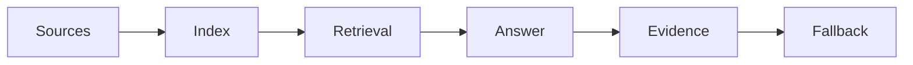

# Internal Knowledge Assistants with RAG

> A useful internal assistant is not a chatbot over every document. It is a governed retrieval workflow with source ownership, evaluation, and escalation.

**Type:** Build
**Languages:** Python
**Prerequisites:** Phase 11 Lesson 06 (RAG), Phase 11 Lesson 30 (Data Literacy for AI Projects)
**Time:** ~45 minutes
**Capability:** Foundation - Personal AI Productivity and Data Literacy

## Learning Objectives

- Identify when an internal knowledge assistant is a good fit
- Build a source-readiness planner in Python
- Map ownership, freshness, permissions, and evaluation into a RAG intake
- Choose controls before indexing internal knowledge
- Explain why source governance matters more than chatbot polish

## The Problem

Many teams want a SharePoint or Confluence assistant. The hard part is not the chat box. The hard part is knowing which sources are allowed, who owns them, what is stale, and how wrong answers will be caught.

## The Concept

RAG makes knowledge available at query time. For internal assistants, that knowledge must be curated. A useful assistant needs a source inventory, permission model, evaluation sample, and fallback path when the answer is uncertain.

### Signals to Look For

- source sprawl
- stale content
- permission risk
- no evaluation set

### Controls to Teach

- source owner
- freshness rule
- access boundary
- answer evaluation

### Target Roles

- Corporate Functions
- Products & Value Streams
- Application Management
- Business & Strategy Consulting

## Use It

Use the artifact before building a knowledge assistant, during source cleanup, and when defining support handoff for uncertain answers.

## Reusable Artifact

Internal knowledge assistant intake.

The template in `outputs/intake-internal-knowledge-assistant.md` can be used before indexing internal sources.

## Key Takeaways

- Internal RAG quality depends on source governance.
- Permissions and freshness are product requirements.
- Evaluation samples should include real user questions.
- A fallback path is part of the assistant design.

## Exercises

1. **Establish a baseline.** Run the lesson demo, then capture the inputs, outputs, and one invariant that demonstrates this objective: Identify when an internal knowledge assistant is a good fit.
2. **Change one variable.** Modify a single input or parameter and use the resulting evidence to investigate this objective: Build a source-readiness planner in Python.
3. **Probe an edge case.** Predict the result before running it, compare prediction with observation, and explain the discrepancy while applying this objective: Map ownership, freshness, permissions, and evaluation into a RAG intake.

## Reference Solution

Use the canonical [main.py](../code/main.py) as the executable baseline. A complete solution records a successful run, identifies the invariant tied to “Identify when an internal knowledge assistant is a good fit,” and changes only one variable for the comparison. The edge-case result must distinguish the prediction from the observation, explain the cause using “Map ownership, freshness, permissions, and evaluation into a RAG intake,” and cite a repeatable check rather than relying on visual inspection alone.
