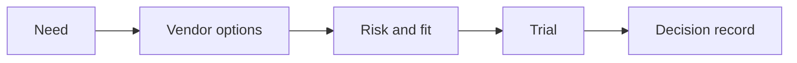

# AI Vendor and Procurement Evaluation

> Buying AI responsibly means comparing value, data handling, security, integration, lock-in, and operating cost before the contract is signed.

**Type:** Build
**Languages:** Python
**Prerequisites:** Phase 11 Lesson 27 (AI Ecosystem and Vendor Landscape), Phase 11 Lesson 18 (Responsible AI Compliance Workflow)
**Time:** ~45 minutes
**Capability:** Advisory and Business Consulting - AI Ecosystem Knowledge

## Learning Objectives

- Identify vendor evaluation signals before procurement decisions
- Build a vendor-fit scoring artifact in Python
- Compare security, data handling, integration, cost, and lock-in
- Choose controls for trials, approvals, and rollout
- Explain why AI vendor selection needs operating evidence, not only feature comparison

## The Problem

A vendor demo looks strong, but the team has not checked data residency, integration ownership, audit evidence, pricing behavior, or exit strategy. The decision feels fast but creates long-term risk.

## The Concept

AI procurement is a risk and fit decision. A useful comparison looks beyond features: it checks enterprise controls, technical integration, operating model, support, and cost behavior.

### Signals to Look For

- data residency
- security evidence
- lock in
- unclear pricing

### Controls to Teach

- vendor scorecard
- trial criteria
- exit plan
- approval record

### Target Roles

- Corporate Functions
- Leadership
- Business & Strategy Consulting
- Technology Consulting

## Use It

Use the artifact in vendor shortlisting, proof-of-concept planning, and procurement reviews.

## Reusable Artifact

AI vendor scorecard.

The template in `outputs/scorecard-ai-vendor-evaluation.md` can be used before a paid trial or contract decision.

## Worked scenario

The demo's first case is **enterprise assistant vendor**: Unclear pricing with lock in and missing security evidence. Treat the labels data residency, security evidence, lock in, unclear pricing as evidence to inspect, not as an automatic approval. The implementation's signal matcher looks for those terms in the scenario name, description, and explicit signal list; then the scorer combines impact, uncertainty, and two points per matched signal (capped at 20). The priority function maps that score to a control level: launch gate at 16 or above, guided pilot at 11–15, team practice at 7–10, and awareness below 7.

Run the case and check which of the controls — vendor scorecard, trial criteria, exit plan, approval record — appear in the returned row. Ask three questions: Which signal is supported by an observable source? Which control has an owner who can act this week? What evidence would move the case to a different priority? Then change one signal or impact value and rerun it. If the priority changes, explain whether the change came from the score, the matching rule, or both. The score is a triage aid; it does not replace domain approval, privacy review, or a pilot metric. Keep that distinction in the artifact and in the handoff.
## Key Takeaways

- AI vendor choice is an operating-model decision.
- Feature lists are incomplete without security and data controls.
- Pricing needs scenario-based comparison.
- Every vendor decision should have an exit plan.

## Build It

Reconstruct **AI Vendor and Procurement Evaluation** by following `Scenario` on the demo’s smallest built-in fixture. Run `python3 main.py` and verify that the result reports the empty case explicitly or raises the documented validation error.

## Ship It

Hand off `outputs/scorecard-ai-vendor-evaluation.md` with the command `python3 main.py`, the accepted input shape (the demo’s smallest built-in fixture), the expected observable result, and a failure note for malformed inputs.

## Exercises

Start with the smallest reproducible run. Keep the input, output, and interpretation together so another reader can repeat the check.

1. **Reproduce the control run.** Run [main.py](../code/main.py) with `python3 main.py` from the lesson's `code/` directory. Record the smallest input that demonstrates “Identify vendor evaluation signals before procurement decisions”. Point to `normalize()`, `signal_matches()`, `score_scenario()` and name the returned field or printed value that serves as evidence.
2. **Change one decision.** Change exactly one input, threshold, or option that affects “Build a vendor-fit scoring artifact in Python”. Predict the direction of the change before running it, then compare the two outputs and explain why the other fields should stay stable.
3. **Probe a boundary.** Construct a case that stresses “Compare security, data handling, integration, cost, and lock-in”: choose an empty collection, missing field, maximum-sized value, malformed record, or another boundary that fits this lesson. Write the expected behavior first and distinguish an intentional guard from an accidental crash.
4. **Transfer the result.** Open outputs/scorecard-ai-vendor-evaluation.md and adapt one example to a real workflow. State the owner, evidence, and next decision required for “Choose controls for trials, approvals, and rollout”; mark any assumption that the demo does not establish.

## Reference Solution

Your solution is complete when it records python3 main.py, the captured output, and a short interpretation. Show:

- evidence for “Identify vendor evaluation signals before procurement decisions” with the relevant input and returned field;
- a one-variable comparison that makes “Build a vendor-fit scoring artifact in Python” visible;
- a predicted and observed boundary result for “Compare security, data handling, integration, cost, and lock-in”, including why the behavior is safe; and
- one concrete update to outputs/scorecard-ai-vendor-evaluation.md that applies “Choose controls for trials, approvals, and rollout” without hiding uncertainty.

Use normalize(), signal_matches(), score_scenario() to explain the result, not only the prose output. If the experiment disagrees with the prediction, keep the failed prediction in the receipt and revise the explanation rather than changing the input until it passes.
