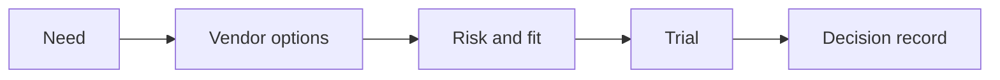

# AI Vendor and Procurement Evaluation

> Buying AI responsibly means comparing value, data handling, security, integration, lock-in, and operating cost before the contract is signed.

**Type:** Build
**Languages:** Python
**Prerequisites:** Phase 11 Lesson 27 (AI Ecosystem and Vendor Landscape), Phase 11 Lesson 18 (Responsible AI Compliance Workflow)
**Time:** ~45 minutes
**Capability:** Advisory and Business Consulting - AI Ecosystem Knowledge

## Learning Objectives

- Identify vendor evaluation signals before procurement decisions
- Build a vendor-fit scoring artifact in Python
- Compare security, data handling, integration, cost, and lock-in
- Choose controls for trials, approvals, and rollout
- Explain why AI vendor selection needs operating evidence, not only feature comparison

## The Problem

A vendor demo looks strong, but the team has not checked data residency, integration ownership, audit evidence, pricing behavior, or exit strategy. The decision feels fast but creates long-term risk.

## The Concept

AI procurement is a risk and fit decision. A useful comparison looks beyond features: it checks enterprise controls, technical integration, operating model, support, and cost behavior.

### Signals to Look For

- data residency
- security evidence
- lock in
- unclear pricing

### Controls to Teach

- vendor scorecard
- trial criteria
- exit plan
- approval record

### Target Roles

- Corporate Functions
- Leadership
- Business & Strategy Consulting
- Technology Consulting

## Use It

Use the artifact in vendor shortlisting, proof-of-concept planning, and procurement reviews.

## Reusable Artifact

AI vendor scorecard.

The template in `outputs/scorecard-ai-vendor-evaluation.md` can be used before a paid trial or contract decision.

## Key Takeaways

- AI vendor choice is an operating-model decision.
- Feature lists are incomplete without security and data controls.
- Pricing needs scenario-based comparison.
- Every vendor decision should have an exit plan.

## Exercises

1. **Establish a baseline.** Run the lesson demo, then capture the inputs, outputs, and one invariant that demonstrates this objective: Identify vendor evaluation signals before procurement decisions.
2. **Change one variable.** Modify a single input or parameter and use the resulting evidence to investigate this objective: Build a vendor-fit scoring artifact in Python.
3. **Probe an edge case.** Predict the result before running it, compare prediction with observation, and explain the discrepancy while applying this objective: Compare security, data handling, integration, cost, and lock-in.

## Reference Solution

Use the canonical [main.py](../code/main.py) as the executable baseline. A complete solution records a successful run, identifies the invariant tied to “Identify vendor evaluation signals before procurement decisions,” and changes only one variable for the comparison. The edge-case result must distinguish the prediction from the observation, explain the cause using “Compare security, data handling, integration, cost, and lock-in,” and cite a repeatable check rather than relying on visual inspection alone.
