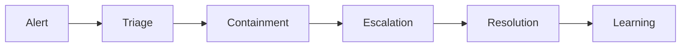

# AI Operations and Incident Response

> AI features need runbooks because model behavior, retrieval quality, tool calls, cost, and safety controls can all fail in production.

**Type:** Build
**Languages:** Python
**Prerequisites:** Phase 11 Lesson 13 (Building a Production LLM Application), Phase 11 Lesson 19 (AI-Driven Testing and QA)
**Time:** ~45 minutes
**Capability:** Engineering - AI Systems Operations

## Learning Objectives

- Identify operational signals for AI incidents
- Build an incident triage artifact in Python
- Map quality drift, cost spikes, tool failure, and safety alerts to controls
- Define runbook steps for support and escalation
- Explain why AI operations needs both technical and business ownership

## The Problem

An assistant is live. Suddenly answers degrade, costs spike, a tool integration fails, or a guardrail blocks valid work. Without a runbook, support teams improvise and the business loses trust.

## The Concept

AI operations extends standard service management. Teams need observability, incident classification, rollback paths, human escalation, and post-incident learning for model-specific failures.

### Signals to Look For

- quality drift
- cost spike
- tool failure
- safety alert

### Controls to Teach

- runbook
- rollback path
- escalation owner
- postmortem

### Target Roles

- Application Management
- Technology Consulting
- Products & Value Streams
- Project Management

## Use It

Use the artifact when preparing support handoff, release gates, service reviews, and AI incident runbooks.

## Reusable Artifact

AI incident response runbook.

The template in `outputs/runbook-ai-incident-response.md` can be used for production readiness or service transition.

## Worked scenario

The demo's first case is **production assistant**: Cost spike and quality drift after release. Treat the labels quality drift, cost spike, tool failure, safety alert as evidence to inspect, not as an automatic approval. The implementation's signal matcher looks for those terms in the scenario name, description, and explicit signal list; then the scorer combines impact, uncertainty, and two points per matched signal (capped at 20). The priority function maps that score to a control level: launch gate at 16 or above, guided pilot at 11–15, team practice at 7–10, and awareness below 7.

Run the case and check which of the controls — runbook, rollback path, escalation owner, postmortem — appear in the returned row. Ask three questions: Which signal is supported by an observable source? Which control has an owner who can act this week? What evidence would move the case to a different priority? Then change one signal or impact value and rerun it. If the priority changes, explain whether the change came from the score, the matching rule, or both. The score is a triage aid; it does not replace domain approval, privacy review, or a pilot metric. Keep that distinction in the artifact and in the handoff.
## Key Takeaways

- AI incidents are not only uptime incidents.
- Cost, quality, safety, and tool behavior need monitoring.
- Every AI feature needs escalation owners.
- Postmortems should update evals, prompts, tools, and runbooks.

## Build It

Reconstruct **AI Operations and Incident Response** by following `Scenario` on the demo’s smallest built-in fixture. Run `python3 main.py` and verify that the result reports the empty case explicitly or raises the documented validation error.

## Ship It

Hand off `outputs/runbook-ai-incident-response.md` with the command `python3 main.py`, the accepted input shape (the demo’s smallest built-in fixture), the expected observable result, and a failure note for malformed inputs.

## Exercises

Use the demo as evidence, not as a ceremony: record what went in, what came out, and why that observation supports the objective.

1. **Trace the happy path.** Run [main.py](../code/main.py) with `python3 main.py` from the lesson's `code/` directory. Record the smallest input that demonstrates “Identify operational signals for AI incidents”. Point to `normalize()`, `signal_matches()`, `score_scenario()` and name the returned field or printed value that serves as evidence.
2. **Perturb the input.** Change exactly one input, threshold, or option that affects “Build an incident triage artifact in Python”. Predict the direction of the change before running it, then compare the two outputs and explain why the other fields should stay stable.
3. **Test a failure case.** Construct a case that stresses “Map quality drift, cost spikes, tool failure, and safety alerts to controls”: choose an empty collection, missing field, maximum-sized value, malformed record, or another boundary that fits this lesson. Write the expected behavior first and distinguish an intentional guard from an accidental crash.
4. **Transfer the result.** Open outputs/runbook-ai-incident-response.md and adapt one example to a real workflow. State the owner, evidence, and next decision required for “Define runbook steps for support and escalation”; mark any assumption that the demo does not establish.

## Reference Solution

The reference run should leave a small receipt: python3 main.py, its captured output, and your interpretation. Include:

- evidence for “Identify operational signals for AI incidents” with the relevant input and returned field;
- a one-variable comparison that makes “Build an incident triage artifact in Python” visible;
- a predicted and observed boundary result for “Map quality drift, cost spikes, tool failure, and safety alerts to controls”, including why the behavior is safe; and
- one concrete update to outputs/runbook-ai-incident-response.md that applies “Define runbook steps for support and escalation” without hiding uncertainty.

Use normalize(), signal_matches(), score_scenario() to explain the result, not only the prose output. If the experiment disagrees with the prediction, keep the failed prediction in the receipt and revise the explanation rather than changing the input until it passes.
