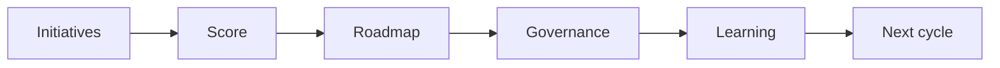

# AI Portfolio and Roadmap Management

> A healthy AI portfolio balances quick wins, strategic bets, risk controls, capacity, and measurable learning across the organization.

**Type:** Build
**Languages:** Python
**Prerequisites:** Phase 11 Lesson 25 (AI Cost and Value Economics), Phase 11 Lesson 29 (Decision Making with AI)
**Time:** ~45 minutes
**Capability:** Leadership and Strategy - Managing AI Transformations

## Learning Objectives

- Identify portfolio signals across AI initiatives
- Build a roadmap scoring artifact in Python
- Balance value, risk, dependency, capacity, and learning
- Choose controls for portfolio review and steering
- Explain why AI portfolios need kill criteria as much as launch criteria

## The Problem

Several AI initiatives start at once. Each looks promising, but nobody can compare value, dependency, risk, staffing, and evidence. Without portfolio discipline, teams overcommit and weak pilots keep running.

## The Concept

AI portfolio management turns scattered initiatives into a managed set of bets. It makes tradeoffs explicit, sets review cadence, and defines when to scale, pause, or stop.

### Signals to Look For

- unclear owner
- dependency risk
- capacity conflict
- weak metric

### Controls to Teach

- portfolio board
- review cadence
- kill criteria
- scaling decision

### Target Roles

- Leadership
- Project Management
- Business & Strategy Consulting
- Products & Value Streams

## Use It

Use the artifact in portfolio reviews, leadership steering, product planning, and transformation roadmaps.

## Reusable Artifact

AI portfolio roadmap board.

The template in `outputs/board-ai-portfolio-roadmap.md` can be used to compare initiatives and steer the next cycle.

## Key Takeaways

- AI roadmaps need evidence, capacity, and controls.
- Not every pilot should scale.
- Kill criteria protect teams from zombie initiatives.
- Portfolio review should connect business value with operational readiness.
