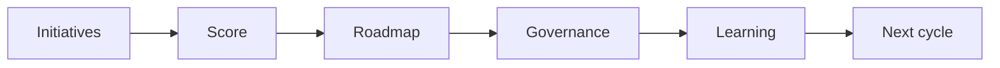

# AI Portfolio and Roadmap Management

> A healthy AI portfolio balances quick wins, strategic bets, risk controls, capacity, and measurable learning across the organization.

**Type:** Build
**Languages:** Python
**Prerequisites:** Phase 11 Lesson 25 (AI Cost and Value Economics), Phase 11 Lesson 29 (Decision Making with AI)
**Time:** ~45 minutes
**Capability:** Leadership and Strategy - Managing AI Transformations

## Learning Objectives

- Identify portfolio signals across AI initiatives
- Build a roadmap scoring artifact in Python
- Balance value, risk, dependency, capacity, and learning
- Choose controls for portfolio review and steering
- Explain why AI portfolios need kill criteria as much as launch criteria

## The Problem

Several AI initiatives start at once. Each looks promising, but nobody can compare value, dependency, risk, staffing, and evidence. Without portfolio discipline, teams overcommit and weak pilots keep running.

## The Concept

AI portfolio management turns scattered initiatives into a managed set of bets. It makes tradeoffs explicit, sets review cadence, and defines when to scale, pause, or stop.

### Signals to Look For

- unclear owner
- dependency risk
- capacity conflict
- weak metric

### Controls to Teach

- portfolio board
- review cadence
- kill criteria
- scaling decision

### Target Roles

- Leadership
- Project Management
- Business & Strategy Consulting
- Products & Value Streams

## Use It

Use the artifact in portfolio reviews, leadership steering, product planning, and transformation roadmaps.

## Reusable Artifact

AI portfolio roadmap board.

The template in `outputs/board-ai-portfolio-roadmap.md` can be used to compare initiatives and steer the next cycle.

## Worked scenario

The demo's first case is **multi-team rollout**: Capacity conflict with dependency risk and weak metric. Treat the labels unclear owner, dependency risk, capacity conflict, weak metric as evidence to inspect, not as an automatic approval. The implementation's signal matcher looks for those terms in the scenario name, description, and explicit signal list; then the scorer combines impact, uncertainty, and two points per matched signal (capped at 20). The priority function maps that score to a control level: launch gate at 16 or above, guided pilot at 11–15, team practice at 7–10, and awareness below 7.

Run the case and check which of the controls — portfolio board, review cadence, kill criteria, scaling decision — appear in the returned row. Ask three questions: Which signal is supported by an observable source? Which control has an owner who can act this week? What evidence would move the case to a different priority? Then change one signal or impact value and rerun it. If the priority changes, explain whether the change came from the score, the matching rule, or both. The score is a triage aid; it does not replace domain approval, privacy review, or a pilot metric. Keep that distinction in the artifact and in the handoff.
## Key Takeaways

- AI roadmaps need evidence, capacity, and controls.
- Not every pilot should scale.
- Kill criteria protect teams from zombie initiatives.
- Portfolio review should connect business value with operational readiness.

## Build It

Reconstruct **AI Portfolio and Roadmap Management** by following `Scenario` on the demo’s smallest built-in fixture. Run `python3 main.py` and verify that the result reports the empty case explicitly or raises the documented validation error.

## Ship It

Hand off `outputs/board-ai-portfolio-roadmap.md` with the command `python3 main.py`, the accepted input shape (the demo’s smallest built-in fixture), the expected observable result, and a failure note for malformed inputs.

## Exercises

Make the experiment auditable. Save the input, output, and one sentence explaining how the result bears on the claim.

1. **Start with a known input.** Run [main.py](../code/main.py) with `python3 main.py` from the lesson's `code/` directory. Record the smallest input that demonstrates “Identify portfolio signals across AI initiatives”. Point to `normalize()`, `signal_matches()`, `score_scenario()` and name the returned field or printed value that serves as evidence.
2. **Run a controlled comparison.** Change exactly one input, threshold, or option that affects “Build a roadmap scoring artifact in Python”. Predict the direction of the change before running it, then compare the two outputs and explain why the other fields should stay stable.
3. **Try the smallest valid counterexample.** Construct a case that stresses “Balance value, risk, dependency, capacity, and learning”: choose an empty collection, missing field, maximum-sized value, malformed record, or another boundary that fits this lesson. Write the expected behavior first and distinguish an intentional guard from an accidental crash.
4. **Transfer the result.** Open outputs/board-ai-portfolio-roadmap.md and adapt one example to a real workflow. State the owner, evidence, and next decision required for “Choose controls for portfolio review and steering”; mark any assumption that the demo does not establish.

## Reference Solution

A useful submission records python3 main.py, the observed output, and the conclusion drawn from it. It should contain:

- evidence for “Identify portfolio signals across AI initiatives” with the relevant input and returned field;
- a one-variable comparison that makes “Build a roadmap scoring artifact in Python” visible;
- a predicted and observed boundary result for “Balance value, risk, dependency, capacity, and learning”, including why the behavior is safe; and
- one concrete update to outputs/board-ai-portfolio-roadmap.md that applies “Choose controls for portfolio review and steering” without hiding uncertainty.

Use normalize(), signal_matches(), score_scenario() to explain the result, not only the prose output. If the experiment disagrees with the prediction, keep the failed prediction in the receipt and revise the explanation rather than changing the input until it passes.
