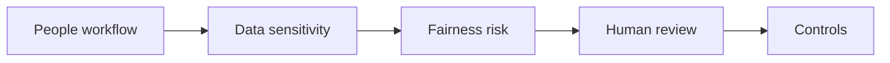

# AI for HR and People Processes

> AI in HR is useful only when privacy, fairness, manager accountability, and employee trust are designed into the workflow from the start.

**Type:** Build
**Languages:** Python
**Prerequisites:** Phase 11 Lesson 18 (Responsible AI Compliance Workflow), Phase 11 Lesson 33 (AI Change Management and Team Integration)
**Time:** ~45 minutes
**Capability:** Corporate Functions - HR AI Enablement

## Learning Objectives

- Identify HR workflows where AI support is useful and where it is risky
- Build a people-process triage artifact in Python
- Map privacy, fairness, employee impact, and manager review to controls
- Choose when an HR use case needs practice, a guided pilot, or a launch gate
- Explain why AI can support HR work but must not remove human accountability

## The Problem

HR teams want to use AI for job descriptions, policy explanations, learning paths, feedback summaries, and process guidance. The risks are high: personal data, fairness, employee trust, and manager responsibility all matter.

## The Concept

AI-supported HR work needs a strict operating frame. The model can draft, summarize, and structure. Humans own judgment, decisions, employee communication, and sensitive escalations.

### Signals to Look For

- personal data
- fairness risk
- employee impact
- manager decision

### Controls to Teach

- privacy review
- fairness check
- human decision owner
- communication script

### Legal Frame

- Recruitment, evaluation, promotion, termination, and performance-monitoring use cases fall under Annex III, point 4 of the EU AI Act (employment and workers management is a high-risk category) — conformity assessment and human oversight apply.
- An AI output that drives a decision with legal or similarly significant effect on an employee, made without meaningful human review, engages Art. 22 GDPR.
- In Germany, introducing or using a technical system designed to monitor employee behaviour or performance requires prior co-determination with the works council under § 87 Abs. 1 Nr. 6 BetrVG — this covers AI-based monitoring and evaluation tools.

### Target Roles

- Corporate Functions
- Leadership
- Project Management & Agility

## Use It

Use the artifact before using AI in HR workflows, people enablement, learning paths, policy support, or manager-facing communication.

## Reusable Artifact

HR AI use-case triage sheet.

The template in `outputs/sheet-hr-ai-use-case-triage.md` can be used in HR intake or enablement planning.

## Key Takeaways

- HR use cases require privacy and fairness controls.
- AI can draft and structure, but humans own people decisions.
- Employee trust is a design requirement.
- Communication should clearly state where AI supports and where humans decide.

## Build It

Reconstruct **AI for HR and People Processes** by following `Scenario` on the demo’s smallest built-in fixture. Run `python3 main.py` and verify that the result reports the empty case explicitly or raises the documented validation error.

## Ship It

Hand off `outputs/sheet-hr-ai-use-case-triage.md` with the command `python3 main.py`, the accepted input shape (the demo’s smallest built-in fixture), the expected observable result, and a failure note for malformed inputs.

## Exercises

Begin with a control run and leave a short receipt: input, output, and the reasoning that connects them to the objective.

1. **Reproduce the control run.** Run [main.py](../code/main.py) with `python3 main.py` from the lesson's `code/` directory. Record the smallest input that demonstrates “Identify HR workflows where AI support is useful and where it is risky”. Point to `normalize()`, `signal_matches()`, `score_scenario()` and name the returned field or printed value that serves as evidence.
2. **Change one decision.** Change exactly one input, threshold, or option that affects “Build a people-process triage artifact in Python”. Predict the direction of the change before running it, then compare the two outputs and explain why the other fields should stay stable.
3. **Probe a boundary.** Construct a case that stresses “Map privacy, fairness, employee impact, and manager review to controls”: choose an empty collection, missing field, maximum-sized value, malformed record, or another boundary that fits this lesson. Write the expected behavior first and distinguish an intentional guard from an accidental crash.
4. **Transfer the result.** Open outputs/sheet-hr-ai-use-case-triage.md and adapt one example to a real workflow. State the owner, evidence, and next decision required for “Choose when an HR use case needs practice, a guided pilot, or a launch gate”; mark any assumption that the demo does not establish.

## Reference Solution

Keep the solution auditable: run python3 main.py, save the output, and explain what it demonstrates. Include:

- evidence for “Identify HR workflows where AI support is useful and where it is risky” with the relevant input and returned field;
- a one-variable comparison that makes “Build a people-process triage artifact in Python” visible;
- a predicted and observed boundary result for “Map privacy, fairness, employee impact, and manager review to controls”, including why the behavior is safe; and
- one concrete update to outputs/sheet-hr-ai-use-case-triage.md that applies “Choose when an HR use case needs practice, a guided pilot, or a launch gate” without hiding uncertainty.

Use normalize(), signal_matches(), score_scenario() to explain the result, not only the prose output. If the experiment disagrees with the prediction, keep the failed prediction in the receipt and revise the explanation rather than changing the input until it passes.
