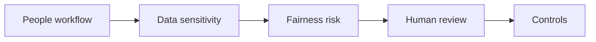

# AI for HR and People Processes

> AI in HR is useful only when privacy, fairness, manager accountability, and employee trust are designed into the workflow from the start.

**Type:** Build
**Languages:** Python
**Prerequisites:** Phase 11 Lesson 18 (Responsible AI Compliance Workflow), Phase 11 Lesson 33 (AI Change Management and Team Integration)
**Time:** ~45 minutes
**Capability:** Corporate Functions - HR AI Enablement

## Learning Objectives

- Identify HR workflows where AI support is useful and where it is risky
- Build a people-process triage artifact in Python
- Map privacy, fairness, employee impact, and manager review to controls
- Choose when an HR use case needs practice, a guided pilot, or a launch gate
- Explain why AI can support HR work but must not remove human accountability

## The Problem

HR teams want to use AI for job descriptions, policy explanations, learning paths, feedback summaries, and process guidance. The risks are high: personal data, fairness, employee trust, and manager responsibility all matter.

## The Concept

AI-supported HR work needs a strict operating frame. The model can draft, summarize, and structure. Humans own judgment, decisions, employee communication, and sensitive escalations.

### Signals to Look For

- personal data
- fairness risk
- employee impact
- manager decision

### Controls to Teach

- privacy review
- fairness check
- human decision owner
- communication script

### Legal Frame

- Recruitment, evaluation, promotion, termination, and performance-monitoring use cases fall under Annex III, point 4 of the EU AI Act (employment and workers management is a high-risk category) — conformity assessment and human oversight apply.
- An AI output that drives a decision with legal or similarly significant effect on an employee, made without meaningful human review, engages Art. 22 GDPR.
- In Germany, introducing or using a technical system designed to monitor employee behaviour or performance requires prior co-determination with the works council under § 87 Abs. 1 Nr. 6 BetrVG — this covers AI-based monitoring and evaluation tools.

### Target Roles

- Corporate Functions
- Leadership
- Project Management & Agility

## Use It

Use the artifact before using AI in HR workflows, people enablement, learning paths, policy support, or manager-facing communication.

## Reusable Artifact

HR AI use-case triage sheet.

The template in `outputs/sheet-hr-ai-use-case-triage.md` can be used in HR intake or enablement planning.

## Key Takeaways

- HR use cases require privacy and fairness controls.
- AI can draft and structure, but humans own people decisions.
- Employee trust is a design requirement.
- Communication should clearly state where AI supports and where humans decide.

## Exercises

1. **Establish a baseline.** Run the lesson demo, then capture the inputs, outputs, and one invariant that demonstrates this objective: Identify HR workflows where AI support is useful and where it is risky.
2. **Change one variable.** Modify a single input or parameter and use the resulting evidence to investigate this objective: Build a people-process triage artifact in Python.
3. **Probe an edge case.** Predict the result before running it, compare prediction with observation, and explain the discrepancy while applying this objective: Map privacy, fairness, employee impact, and manager review to controls.

## Reference Solution

Use the canonical [main.py](../code/main.py) as the executable baseline. A complete solution records a successful run, identifies the invariant tied to “Identify HR workflows where AI support is useful and where it is risky,” and changes only one variable for the comparison. The edge-case result must distinguish the prediction from the observation, explain the cause using “Map privacy, fairness, employee impact, and manager review to controls,” and cite a repeatable check rather than relying on visual inspection alone.
