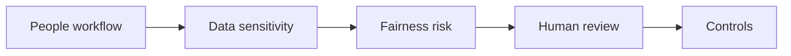

# AI for HR and People Processes

> AI in HR is useful only when privacy, fairness, manager accountability, and employee trust are designed into the workflow from the start.

**Type:** Build
**Languages:** Python
**Prerequisites:** Phase 11 Lesson 18 (Responsible AI Compliance Workflow), Phase 11 Lesson 33 (AI Change Management and Team Integration)
**Time:** ~45 minutes
**Capability:** Corporate Functions - HR AI Enablement

## Learning Objectives

- Identify HR workflows where AI support is useful and where it is risky
- Build a people-process triage artifact in Python
- Map privacy, fairness, employee impact, and manager review to controls
- Choose when an HR use case needs practice, a guided pilot, or a launch gate
- Explain why AI can support HR work but must not remove human accountability

## The Problem

HR teams want to use AI for job descriptions, policy explanations, learning paths, feedback summaries, and process guidance. The risks are high: personal data, fairness, employee trust, and manager responsibility all matter.

## The Concept

AI-supported HR work needs a strict operating frame. The model can draft, summarize, and structure. Humans own judgment, decisions, employee communication, and sensitive escalations.



### Signals to Look For

- personal data
- fairness risk
- employee impact
- manager decision

### Controls to Teach

- privacy review
- fairness check
- human decision owner
- communication script

### Target Roles

- Corporate Functions
- Leadership
- Project Management & Agility

## Build It

In the lab you build an HR AI triage planner. It ranks people-process scenarios and recommends the controls needed before a pilot or rollout.

Run it locally:

```bash
cd phases/11-llm-engineering/40-ai-for-hr-people-processes/code
python3 main.py
python3 -m unittest discover tests -v
```

## Use It

Use the artifact before using AI in HR workflows, people enablement, learning paths, policy support, or manager-facing communication.

## Reusable Artifact

HR AI use-case triage sheet.

The template in `outputs/sheet-hr-ai-use-case-triage.md` can be used in HR intake or enablement planning.

## Key Takeaways

- HR use cases require privacy and fairness controls.
- AI can draft and structure, but humans own people decisions.
- Employee trust is a design requirement.
- Communication should clearly state where AI supports and where humans decide.
