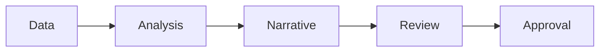

# AI for Finance and Controlling

> AI can speed finance work, but numbers still need source traceability, variance logic, approval controls, and a human owner.

**Type:** Build
**Languages:** Python
**Prerequisites:** Phase 11 Lesson 25 (AI Cost and Value Economics), Phase 11 Lesson 29 (Decision Making with AI)
**Time:** ~45 minutes
**Capability:** Corporate Functions - Finance AI Enablement

## Learning Objectives

- Identify finance workflows where AI can assist without owning the decision
- Build a finance-control triage artifact in Python
- Map source traceability, variance explanation, forecast uncertainty, and approval risk
- Select controls for finance analysis and reporting workflows
- Explain why AI-generated finance narratives must be checked against source data

## The Problem

Finance teams can use AI to draft commentary, summarize variance drivers, explain reports, and prepare scenarios. The risk is that a plausible narrative hides weak data, wrong assumptions, or missing approvals.

## The Concept

AI can help finance teams reason faster, but the control model must be explicit. Source data, assumptions, variance logic, and approvals should be visible before outputs are shared.

### Signals to Look For

- source mismatch
- forecast uncertainty
- approval risk
- variance gap

### Controls to Teach

- source trace
- assumption log
- variance check
- approval owner

### Target Roles

- Corporate Functions
- Leadership
- Business & Strategy Consulting

## Use It

Use the artifact for finance commentary, controlling reviews, scenario planning, and management reporting.

## Reusable Artifact

Finance AI review sheet.

The template in `outputs/sheet-finance-ai-review.md` can be used before AI-assisted financial analysis is shared.

## Worked scenario

The demo's first case is **monthly commentary**: Variance gap with source mismatch before management reporting. Treat the labels source mismatch, forecast uncertainty, approval risk, variance gap as evidence to inspect, not as an automatic approval. The implementation's signal matcher looks for those terms in the scenario name, description, and explicit signal list; then the scorer combines impact, uncertainty, and two points per matched signal (capped at 20). The priority function maps that score to a control level: launch gate at 16 or above, guided pilot at 11–15, team practice at 7–10, and awareness below 7.

Run the case and check which of the controls — source trace, assumption log, variance check, approval owner — appear in the returned row. Ask three questions: Which signal is supported by an observable source? Which control has an owner who can act this week? What evidence would move the case to a different priority? Then change one signal or impact value and rerun it. If the priority changes, explain whether the change came from the score, the matching rule, or both. The score is a triage aid; it does not replace domain approval, privacy review, or a pilot metric. Keep that distinction in the artifact and in the handoff.
## Key Takeaways

- AI can draft finance narratives, but source checks are mandatory.
- Forecasts need uncertainty language.
- Approval owners remain accountable.
- Variance explanations should be linked to evidence.

## Build It

Reconstruct **AI for Finance and Controlling** by following `Scenario` on the demo’s smallest built-in fixture. Run `python3 main.py` and verify that the result reports the empty case explicitly or raises the documented validation error.

## Ship It

Hand off `outputs/sheet-finance-ai-review.md` with the command `python3 main.py`, the accepted input shape (the demo’s smallest built-in fixture), the expected observable result, and a failure note for malformed inputs.

## Exercises

Treat this as a lab exercise. Preserve the setup and result, then explain which observation is doing the evidentiary work.

1. **Trace the happy path.** Run [main.py](../code/main.py) with `python3 main.py` from the lesson's `code/` directory. Record the smallest input that demonstrates “Identify finance workflows where AI can assist without owning the decision”. Point to `normalize()`, `signal_matches()`, `score_scenario()` and name the returned field or printed value that serves as evidence.
2. **Perturb the input.** Change exactly one input, threshold, or option that affects “Build a finance-control triage artifact in Python”. Predict the direction of the change before running it, then compare the two outputs and explain why the other fields should stay stable.
3. **Test a failure case.** Construct a case that stresses “Map source traceability, variance explanation, forecast uncertainty, and approval risk”: choose an empty collection, missing field, maximum-sized value, malformed record, or another boundary that fits this lesson. Write the expected behavior first and distinguish an intentional guard from an accidental crash.
4. **Transfer the result.** Open outputs/sheet-finance-ai-review.md and adapt one example to a real workflow. State the owner, evidence, and next decision required for “Select controls for finance analysis and reporting workflows”; mark any assumption that the demo does not establish.

## Reference Solution

A complete handoff records python3 main.py, the observed output, and the reasoning behind it. Check:

- evidence for “Identify finance workflows where AI can assist without owning the decision” with the relevant input and returned field;
- a one-variable comparison that makes “Build a finance-control triage artifact in Python” visible;
- a predicted and observed boundary result for “Map source traceability, variance explanation, forecast uncertainty, and approval risk”, including why the behavior is safe; and
- one concrete update to outputs/sheet-finance-ai-review.md that applies “Select controls for finance analysis and reporting workflows” without hiding uncertainty.

Use normalize(), signal_matches(), score_scenario() to explain the result, not only the prose output. If the experiment disagrees with the prediction, keep the failed prediction in the receipt and revise the explanation rather than changing the input until it passes.
