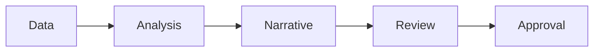

# AI for Finance and Controlling

> AI can speed finance work, but numbers still need source traceability, variance logic, approval controls, and a human owner.

**Type:** Build
**Languages:** Python
**Prerequisites:** Phase 11 Lesson 25 (AI Cost and Value Economics), Phase 11 Lesson 29 (Decision Making with AI)
**Time:** ~45 minutes
**Capability:** Corporate Functions - Finance AI Enablement

## Learning Objectives

- Identify finance workflows where AI can assist without owning the decision
- Build a finance-control triage artifact in Python
- Map source traceability, variance explanation, forecast uncertainty, and approval risk
- Select controls for finance analysis and reporting workflows
- Explain why AI-generated finance narratives must be checked against source data

## The Problem

Finance teams can use AI to draft commentary, summarize variance drivers, explain reports, and prepare scenarios. The risk is that a plausible narrative hides weak data, wrong assumptions, or missing approvals.

## The Concept

AI can help finance teams reason faster, but the control model must be explicit. Source data, assumptions, variance logic, and approvals should be visible before outputs are shared.

### Signals to Look For

- source mismatch
- forecast uncertainty
- approval risk
- variance gap

### Controls to Teach

- source trace
- assumption log
- variance check
- approval owner

### Target Roles

- Corporate Functions
- Leadership
- Business & Strategy Consulting

## Use It

Use the artifact for finance commentary, controlling reviews, scenario planning, and management reporting.

## Reusable Artifact

Finance AI review sheet.

The template in `outputs/sheet-finance-ai-review.md` can be used before AI-assisted financial analysis is shared.

## Key Takeaways

- AI can draft finance narratives, but source checks are mandatory.
- Forecasts need uncertainty language.
- Approval owners remain accountable.
- Variance explanations should be linked to evidence.

## Exercises

1. **Establish a baseline.** Run the lesson demo, then capture the inputs, outputs, and one invariant that demonstrates this objective: Identify finance workflows where AI can assist without owning the decision.
2. **Change one variable.** Modify a single input or parameter and use the resulting evidence to investigate this objective: Build a finance-control triage artifact in Python.
3. **Probe an edge case.** Predict the result before running it, compare prediction with observation, and explain the discrepancy while applying this objective: Map source traceability, variance explanation, forecast uncertainty, and approval risk.

## Reference Solution

Use the canonical [main.py](../code/main.py) as the executable baseline. A complete solution records a successful run, identifies the invariant tied to “Identify finance workflows where AI can assist without owning the decision,” and changes only one variable for the comparison. The edge-case result must distinguish the prediction from the observation, explain the cause using “Map source traceability, variance explanation, forecast uncertainty, and approval risk,” and cite a repeatable check rather than relying on visual inspection alone.
