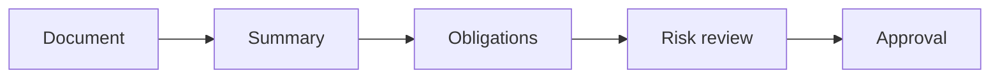

# AI for Legal, Procurement, and Compliance

> AI can accelerate review preparation, but legal and procurement teams still own obligations, evidence, negotiation, and final judgment.

**Type:** Build
**Languages:** Python
**Prerequisites:** Phase 11 Lesson 18 (Responsible AI Compliance Workflow), Phase 11 Lesson 37 (AI Vendor and Procurement Evaluation)
**Time:** ~45 minutes
**Capability:** Corporate Functions - Legal and Procurement AI Enablement

## Learning Objectives

- Identify where AI can support legal, procurement, and compliance workflows
- Build a clause-and-obligation triage artifact in Python
- Map confidentiality, obligation risk, vendor terms, and missing evidence to controls
- Choose review controls before AI-assisted legal or procurement outputs are used
- Explain why AI can prepare work but cannot own legal interpretation

## The Problem

Legal and procurement teams can use AI to summarize policies, compare vendor terms, draft questions, and prepare review notes. The risk is that a generated summary misses obligations, weakens negotiation, or exposes confidential material.

## The Concept

AI-supported legal and procurement work should separate preparation from judgment. The model may help structure information, but legal interpretation, risk acceptance, and negotiation positions require accountable human review.

### Signals to Look For

- confidential term
- obligation risk
- vendor clause
- missing evidence

### Controls to Teach

- confidentiality check
- clause register
- legal reviewer
- decision record

### Target Roles

- Corporate Functions
- Business & Strategy Consulting
- Leadership

## Use It

Use the artifact for AI-assisted policy summaries, vendor comparisons, contract review preparation, and compliance intake.

## Reusable Artifact

Legal and procurement AI review sheet.

The template in `outputs/sheet-legal-procurement-ai-review.md` can be used before generated review notes are shared.

## Key Takeaways

- AI can prepare legal and procurement work, not own it.
- Confidentiality and obligation risk must be checked first.
- Vendor terms need traceable evidence.
- Human reviewers remain accountable for decisions.
