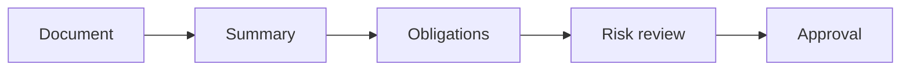

# AI for Legal, Procurement, and Compliance

> AI can accelerate review preparation, but legal and procurement teams still own obligations, evidence, negotiation, and final judgment.

**Type:** Build
**Languages:** Python
**Prerequisites:** Phase 11 Lesson 18 (Responsible AI Compliance Workflow), Phase 11 Lesson 37 (AI Vendor and Procurement Evaluation)
**Time:** ~45 minutes
**Capability:** Corporate Functions - Legal and Procurement AI Enablement

## Learning Objectives

- Identify where AI can support legal, procurement, and compliance workflows
- Build a clause-and-obligation triage artifact in Python
- Map confidentiality, obligation risk, vendor terms, and missing evidence to controls
- Choose review controls before AI-assisted legal or procurement outputs are used
- Explain why AI can prepare work but cannot own legal interpretation

## The Problem

Legal and procurement teams can use AI to summarize policies, compare vendor terms, draft questions, and prepare review notes. The risk is that a generated summary misses obligations, weakens negotiation, or exposes confidential material.

## The Concept

AI-supported legal and procurement work should separate preparation from judgment. The model may help structure information, but legal interpretation, risk acceptance, and negotiation positions require accountable human review.

### Signals to Look For

- confidential term
- obligation risk
- vendor clause
- missing evidence

### Controls to Teach

- confidentiality check
- clause register
- legal reviewer
- decision record

### Target Roles

- Corporate Functions
- Business & Strategy Consulting
- Leadership

## Use It

Use the artifact for AI-assisted policy summaries, vendor comparisons, contract review preparation, and compliance intake.

## Reusable Artifact

Legal and procurement AI review sheet.

The template in `outputs/sheet-legal-procurement-ai-review.md` can be used before generated review notes are shared.

## Worked scenario

The demo's first case is **vendor terms review**: Vendor clause with obligation risk and missing evidence. Treat the labels confidential term, obligation risk, vendor clause, missing evidence as evidence to inspect, not as an automatic approval. The implementation's signal matcher looks for those terms in the scenario name, description, and explicit signal list; then the scorer combines impact, uncertainty, and two points per matched signal (capped at 20). The priority function maps that score to a control level: launch gate at 16 or above, guided pilot at 11–15, team practice at 7–10, and awareness below 7.

Run the case and check which of the controls — confidentiality check, clause register, legal reviewer, decision record — appear in the returned row. Ask three questions: Which signal is supported by an observable source? Which control has an owner who can act this week? What evidence would move the case to a different priority? Then change one signal or impact value and rerun it. If the priority changes, explain whether the change came from the score, the matching rule, or both. The score is a triage aid; it does not replace domain approval, privacy review, or a pilot metric. Keep that distinction in the artifact and in the handoff.
## Key Takeaways

- AI can prepare legal and procurement work, not own it.
- Confidentiality and obligation risk must be checked first.
- Vendor terms need traceable evidence.
- Human reviewers remain accountable for decisions.

## Build It

Reconstruct **AI for Legal, Procurement, and Compliance** by following `Scenario` on the demo’s smallest built-in fixture. Run `python3 main.py` and verify that the result reports the empty case explicitly or raises the documented validation error.

## Ship It

Hand off `outputs/sheet-legal-procurement-ai-review.md` with the command `python3 main.py`, the accepted input shape (the demo’s smallest built-in fixture), the expected observable result, and a failure note for malformed inputs.

## Exercises

Start with the smallest reproducible run. Keep the input, output, and interpretation together so another reader can repeat the check.

1. **Start with a known input.** Run [main.py](../code/main.py) with `python3 main.py` from the lesson's `code/` directory. Record the smallest input that demonstrates “Identify where AI can support legal, procurement, and compliance workflows”. Point to `normalize()`, `signal_matches()`, `score_scenario()` and name the returned field or printed value that serves as evidence.
2. **Run a controlled comparison.** Change exactly one input, threshold, or option that affects “Build a clause-and-obligation triage artifact in Python”. Predict the direction of the change before running it, then compare the two outputs and explain why the other fields should stay stable.
3. **Try the smallest valid counterexample.** Construct a case that stresses “Map confidentiality, obligation risk, vendor terms, and missing evidence to controls”: choose an empty collection, missing field, maximum-sized value, malformed record, or another boundary that fits this lesson. Write the expected behavior first and distinguish an intentional guard from an accidental crash.
4. **Transfer the result.** Open outputs/sheet-legal-procurement-ai-review.md and adapt one example to a real workflow. State the owner, evidence, and next decision required for “Choose review controls before AI-assisted legal or procurement outputs are used”; mark any assumption that the demo does not establish.

## Reference Solution

Your solution is complete when it records python3 main.py, the captured output, and a short interpretation. Show:

- evidence for “Identify where AI can support legal, procurement, and compliance workflows” with the relevant input and returned field;
- a one-variable comparison that makes “Build a clause-and-obligation triage artifact in Python” visible;
- a predicted and observed boundary result for “Map confidentiality, obligation risk, vendor terms, and missing evidence to controls”, including why the behavior is safe; and
- one concrete update to outputs/sheet-legal-procurement-ai-review.md that applies “Choose review controls before AI-assisted legal or procurement outputs are used” without hiding uncertainty.

Use normalize(), signal_matches(), score_scenario() to explain the result, not only the prose output. If the experiment disagrees with the prediction, keep the failed prediction in the receipt and revise the explanation rather than changing the input until it passes.
