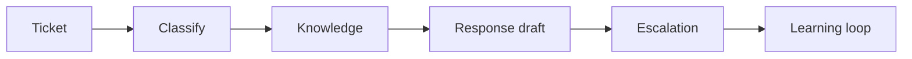

# AI for Service Management and Support

> AI support automation works when it improves triage, knowledge reuse, and handoffs without hiding accountability or service risk.

**Type:** Build
**Languages:** Python
**Prerequisites:** Phase 11 Lesson 36 (Internal Knowledge Assistants with RAG), Phase 11 Lesson 38 (AI Operations and Incident Response)
**Time:** ~45 minutes
**Capability:** Application Management - Service AI Enablement

## Learning Objectives

- Identify service workflows where AI can assist safely
- Build a support-triage artifact in Python
- Map ticket volume, SLA pressure, knowledge gap, and escalation risk
- Choose controls for support automation and service handoff
- Explain why AI support systems need escalation and runbook discipline

## The Problem

Service teams want AI to summarize tickets, draft responses, suggest knowledge articles, and classify incidents. If the system hides uncertainty or misses escalation criteria, support quality can degrade quickly.

## The Concept

Service AI should reduce friction while keeping ownership clear. The workflow needs a service scope, knowledge source, confidence rule, escalation path, and learning loop.

### Signals to Look For

- high ticket volume
- SLA pressure
- knowledge gap
- escalation risk

### Controls to Teach

- service scope
- confidence threshold
- escalation path
- knowledge update

### Target Roles

- Application Management
- Project Management & Agility
- Technology Consulting

## Use It

Use the artifact for service desk pilots, support knowledge assistants, ticket summarization, incident intake, and service transition.

## Reusable Artifact

Service AI readiness checklist.

The template in `outputs/checklist-service-ai-readiness.md` can be used before introducing AI into support workflows.

## Key Takeaways

- AI support must preserve service ownership.
- Escalation criteria should be explicit.
- Knowledge updates are part of the learning loop.
- Confidence thresholds prevent silent automation failure.
