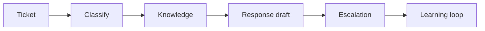

# AI for Service Management and Support

> AI support automation works when it improves triage, knowledge reuse, and handoffs without hiding accountability or service risk.

**Type:** Build
**Languages:** Python
**Prerequisites:** Phase 11 Lesson 36 (Internal Knowledge Assistants with RAG), Phase 11 Lesson 38 (AI Operations and Incident Response)
**Time:** ~45 minutes
**Capability:** Application Management - Service AI Enablement

## Learning Objectives

- Identify service workflows where AI can assist safely
- Build a support-triage artifact in Python
- Map ticket volume, SLA pressure, knowledge gap, and escalation risk
- Choose controls for support automation and service handoff
- Explain why AI support systems need escalation and runbook discipline

## The Problem

Service teams want AI to summarize tickets, draft responses, suggest knowledge articles, and classify incidents. If the system hides uncertainty or misses escalation criteria, support quality can degrade quickly.

## The Concept

Service AI should reduce friction while keeping ownership clear. The workflow needs a service scope, knowledge source, confidence rule, escalation path, and learning loop.

### Signals to Look For

- high ticket volume
- SLA pressure
- knowledge gap
- escalation risk

### Controls to Teach

- service scope
- confidence threshold
- escalation path
- knowledge update

### Target Roles

- Application Management
- Project Management & Agility
- Technology Consulting

## Use It

Use the artifact for service desk pilots, support knowledge assistants, ticket summarization, incident intake, and service transition.

## Reusable Artifact

Service AI readiness checklist.

The template in `outputs/checklist-service-ai-readiness.md` can be used before introducing AI into support workflows.

## Worked scenario

The demo's first case is **ticket assistant**: High ticket volume with SLA pressure and knowledge gap. Treat the labels high ticket volume, SLA pressure, knowledge gap, escalation risk as evidence to inspect, not as an automatic approval. The implementation's signal matcher looks for those terms in the scenario name, description, and explicit signal list; then the scorer combines impact, uncertainty, and two points per matched signal (capped at 20). The priority function maps that score to a control level: launch gate at 16 or above, guided pilot at 11–15, team practice at 7–10, and awareness below 7.

Run the case and check which of the controls — service scope, confidence threshold, escalation path, knowledge update — appear in the returned row. Ask three questions: Which signal is supported by an observable source? Which control has an owner who can act this week? What evidence would move the case to a different priority? Then change one signal or impact value and rerun it. If the priority changes, explain whether the change came from the score, the matching rule, or both. The score is a triage aid; it does not replace domain approval, privacy review, or a pilot metric. Keep that distinction in the artifact and in the handoff.
## Key Takeaways

- AI support must preserve service ownership.
- Escalation criteria should be explicit.
- Knowledge updates are part of the learning loop.
- Confidence thresholds prevent silent automation failure.

## Build It

Reconstruct **AI for Service Management and Support** by following `Scenario` on a graph with edges (0,1) and (1,2). Run `python3 main.py` and verify that degrees, adjacency, or connectivity expose the isolated/no-edge case explicitly.

## Ship It

Hand off `outputs/checklist-service-ai-readiness.md` with the command `python3 main.py`, the accepted input shape (a graph with edges (0,1) and (1,2)), the expected observable result, and a failure note for malformed inputs.

## Exercises

Use the demo as evidence, not as a ceremony: record what went in, what came out, and why that observation supports the objective.

1. **Reproduce the control run.** Run [main.py](../code/main.py) with `python3 main.py` from the lesson's `code/` directory. Record the smallest input that demonstrates “Identify service workflows where AI can assist safely”. Point to `normalize()`, `signal_matches()`, `score_scenario()` and name the returned field or printed value that serves as evidence.
2. **Change one decision.** Change exactly one input, threshold, or option that affects “Build a support-triage artifact in Python”. Predict the direction of the change before running it, then compare the two outputs and explain why the other fields should stay stable.
3. **Probe a boundary.** Construct a case that stresses “Map ticket volume, SLA pressure, knowledge gap, and escalation risk”: choose an empty collection, missing field, maximum-sized value, malformed record, or another boundary that fits this lesson. Write the expected behavior first and distinguish an intentional guard from an accidental crash.
4. **Transfer the result.** Open outputs/checklist-service-ai-readiness.md and adapt one example to a real workflow. State the owner, evidence, and next decision required for “Choose controls for support automation and service handoff”; mark any assumption that the demo does not establish.

## Reference Solution

The reference run should leave a small receipt: python3 main.py, its captured output, and your interpretation. Include:

- evidence for “Identify service workflows where AI can assist safely” with the relevant input and returned field;
- a one-variable comparison that makes “Build a support-triage artifact in Python” visible;
- a predicted and observed boundary result for “Map ticket volume, SLA pressure, knowledge gap, and escalation risk”, including why the behavior is safe; and
- one concrete update to outputs/checklist-service-ai-readiness.md that applies “Choose controls for support automation and service handoff” without hiding uncertainty.

Use normalize(), signal_matches(), score_scenario() to explain the result, not only the prose output. If the experiment disagrees with the prediction, keep the failed prediction in the receipt and revise the explanation rather than changing the input until it passes.
