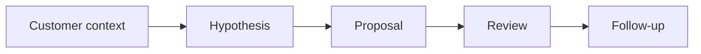

# AI for Sales and Product Consulting

> AI helps product and sales teams when it sharpens customer context, value hypotheses, proposal quality, and follow-up discipline without inventing facts.

**Type:** Build
**Languages:** Python
**Prerequisites:** Phase 11 Lesson 23 (AI-Enhanced User Research), Phase 11 Lesson 26 (Consultative Prompting)
**Time:** ~45 minutes
**Capability:** Products & Value Streams - Sales and Product AI Enablement

## Learning Objectives

- Identify sales and product consulting workflows where AI can support preparation
- Build a customer-context triage artifact in Python
- Map customer signal, value hypothesis, proposal risk, and follow-up gap to controls
- Select review controls before AI-assisted customer material is shared
- Explain why AI should improve preparation without inventing customer facts

## The Problem

Product and sales teams use AI to prepare discovery questions, proposal drafts, customer summaries, and competitive notes. The risk is that a polished output invents context, overstates value, or weakens trust.

## The Concept

AI can support customer-facing work when the source context is clear. Teams need a value hypothesis, evidence check, stakeholder review, and follow-up plan before sharing material externally.

### Signals to Look For

- customer signal
- value hypothesis
- proposal risk
- follow up gap

### Controls to Teach

- source check
- value story
- stakeholder review
- follow up plan

### Target Roles

- Products & Value Streams
- Business & Strategy Consulting
- Leadership

## Use It

Use the artifact for discovery preparation, product consulting, proposal review, value-story shaping, and customer follow-up planning.

## Reusable Artifact

Customer-context AI preparation sheet.

The template in `outputs/sheet-sales-product-ai-prep.md` can be used before AI-assisted material is shared externally.

## Key Takeaways

- Customer-facing AI outputs need evidence checks.
- AI can sharpen value stories but should not invent context.
- Stakeholder review protects trust.
- Follow-up discipline turns preparation into better customer action.

## Exercises

1. **Establish a baseline.** Run the lesson demo, then capture the inputs, outputs, and one invariant that demonstrates this objective: Identify sales and product consulting workflows where AI can support preparation.
2. **Change one variable.** Modify a single input or parameter and use the resulting evidence to investigate this objective: Build a customer-context triage artifact in Python.
3. **Probe an edge case.** Predict the result before running it, compare prediction with observation, and explain the discrepancy while applying this objective: Map customer signal, value hypothesis, proposal risk, and follow-up gap to controls.

## Reference Solution

Use the canonical [main.py](../code/main.py) as the executable baseline. A complete solution records a successful run, identifies the invariant tied to “Identify sales and product consulting workflows where AI can support preparation,” and changes only one variable for the comparison. The edge-case result must distinguish the prediction from the observation, explain the cause using “Map customer signal, value hypothesis, proposal risk, and follow-up gap to controls,” and cite a repeatable check rather than relying on visual inspection alone.
