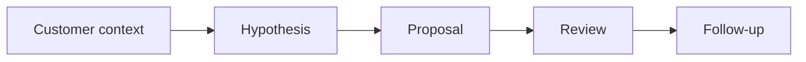

# AI for Sales and Product Consulting

> AI helps product and sales teams when it sharpens customer context, value hypotheses, proposal quality, and follow-up discipline without inventing facts.

**Type:** Build
**Languages:** Python
**Prerequisites:** Phase 11 Lesson 23 (AI-Enhanced User Research), Phase 11 Lesson 26 (Consultative Prompting)
**Time:** ~45 minutes
**Capability:** Products & Value Streams - Sales and Product AI Enablement

## Learning Objectives

- Identify sales and product consulting workflows where AI can support preparation
- Build a customer-context triage artifact in Python
- Map customer signal, value hypothesis, proposal risk, and follow-up gap to controls
- Select review controls before AI-assisted customer material is shared
- Explain why AI should improve preparation without inventing customer facts

## The Problem

Product and sales teams use AI to prepare discovery questions, proposal drafts, customer summaries, and competitive notes. The risk is that a polished output invents context, overstates value, or weakens trust.

## The Concept

AI can support customer-facing work when the source context is clear. Teams need a value hypothesis, evidence check, stakeholder review, and follow-up plan before sharing material externally.

### Signals to Look For

- customer signal
- value hypothesis
- proposal risk
- follow up gap

### Controls to Teach

- source check
- value story
- stakeholder review
- follow up plan

### Target Roles

- Products & Value Streams
- Business & Strategy Consulting
- Leadership

## Use It

Use the artifact for discovery preparation, product consulting, proposal review, value-story shaping, and customer follow-up planning.

## Reusable Artifact

Customer-context AI preparation sheet.

The template in `outputs/sheet-sales-product-ai-prep.md` can be used before AI-assisted material is shared externally.

## Worked scenario

The demo's first case is **proposal draft**: Proposal risk with weak customer signal and untested value hypothesis. Treat the labels customer signal, value hypothesis, proposal risk, follow up gap as evidence to inspect, not as an automatic approval. The implementation's signal matcher looks for those terms in the scenario name, description, and explicit signal list; then the scorer combines impact, uncertainty, and two points per matched signal (capped at 20). The priority function maps that score to a control level: launch gate at 16 or above, guided pilot at 11–15, team practice at 7–10, and awareness below 7.

Run the case and check which of the controls — source check, value story, stakeholder review, follow up plan — appear in the returned row. Ask three questions: Which signal is supported by an observable source? Which control has an owner who can act this week? What evidence would move the case to a different priority? Then change one signal or impact value and rerun it. If the priority changes, explain whether the change came from the score, the matching rule, or both. The score is a triage aid; it does not replace domain approval, privacy review, or a pilot metric. Keep that distinction in the artifact and in the handoff.
## Key Takeaways

- Customer-facing AI outputs need evidence checks.
- AI can sharpen value stories but should not invent context.
- Stakeholder review protects trust.
- Follow-up discipline turns preparation into better customer action.

## Build It

Reconstruct **AI for Sales and Product Consulting** by following `Scenario` on the text "red fox". Run `python3 main.py` and verify that the tokenizer/retriever reports zero or a clear empty-input result, rather than borrowing a result from the previous text.

## Ship It

Hand off `outputs/sheet-sales-product-ai-prep.md` with the command `python3 main.py`, the accepted input shape (the text "red fox"), the expected observable result, and a failure note for malformed inputs.

## Exercises

Make the experiment auditable. Save the input, output, and one sentence explaining how the result bears on the claim.

1. **Trace the happy path.** Run [main.py](../code/main.py) with `python3 main.py` from the lesson's `code/` directory. Record the smallest input that demonstrates “Identify sales and product consulting workflows where AI can support preparation”. Point to `normalize()`, `signal_matches()`, `score_scenario()` and name the returned field or printed value that serves as evidence.
2. **Perturb the input.** Change exactly one input, threshold, or option that affects “Build a customer-context triage artifact in Python”. Predict the direction of the change before running it, then compare the two outputs and explain why the other fields should stay stable.
3. **Test a failure case.** Construct a case that stresses “Map customer signal, value hypothesis, proposal risk, and follow-up gap to controls”: choose an empty collection, missing field, maximum-sized value, malformed record, or another boundary that fits this lesson. Write the expected behavior first and distinguish an intentional guard from an accidental crash.
4. **Transfer the result.** Open outputs/sheet-sales-product-ai-prep.md and adapt one example to a real workflow. State the owner, evidence, and next decision required for “Select review controls before AI-assisted customer material is shared”; mark any assumption that the demo does not establish.

## Reference Solution

A useful submission records python3 main.py, the observed output, and the conclusion drawn from it. It should contain:

- evidence for “Identify sales and product consulting workflows where AI can support preparation” with the relevant input and returned field;
- a one-variable comparison that makes “Build a customer-context triage artifact in Python” visible;
- a predicted and observed boundary result for “Map customer signal, value hypothesis, proposal risk, and follow-up gap to controls”, including why the behavior is safe; and
- one concrete update to outputs/sheet-sales-product-ai-prep.md that applies “Select review controls before AI-assisted customer material is shared” without hiding uncertainty.

Use normalize(), signal_matches(), score_scenario() to explain the result, not only the prose output. If the experiment disagrees with the prediction, keep the failed prediction in the receipt and revise the explanation rather than changing the input until it passes.
