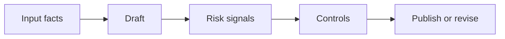

# AI for Corporate Communications and Marketing

> AI can speed up communication work only when claims, tone, audience, and approval are made explicit before publication.

**Type:** Build
**Languages:** Python
**Prerequisites:** Phase 11 Lesson 21 (AI-Assisted Documentation), Phase 11 Lesson 26 (Consultative Prompting)
**Time:** ~45 minutes
**Capability:** Corporate Communications - Message Quality and Review

## Learning Objectives

- Identify communication scenarios where AI support creates brand or approval risk
- Build a message-review artifact in Python
- Map audience risk, brand claim, sensitive topic, and approval gap to controls
- Select review controls before AI-assisted messages are published
- Explain why AI communication work needs sources, tone checks, and ownership

## The Problem

AI can draft announcements, intranet posts, campaign copy, leadership briefs, and customer-facing messages quickly. The risk is that polished text hides weak sources, overstates a claim, misses tone, or bypasses approval.

## The Concept

Communications teams need a repeatable gate. Before using AI-assisted copy, check the audience, claim, sensitivity, and owner. The course artifact turns those signals into a review priority.

### Signals to Look For

- audience risk
- brand claim
- sensitive topic
- approval gap

### Controls to Teach

- source pack
- tone check
- approval owner
- channel plan

### Target Roles

- Corporate Functions
- Leadership
- Business & Strategy Consulting

## Use It

Use the artifact for intranet updates, campaign drafts, leadership notes, customer-facing messages, and change communication.

## Reusable Artifact

Communication AI review checklist.

The template in `outputs/checklist-communications-ai-review.md` can be used before AI-assisted messages are sent or published.

## Worked scenario

The demo's first case is **press note**: External brand claim about AI service impact with approval gap. Treat the labels audience risk, brand claim, sensitive topic, approval gap as evidence to inspect, not as an automatic approval. The implementation's signal matcher looks for those terms in the scenario name, description, and explicit signal list; then the scorer combines impact, uncertainty, and two points per matched signal (capped at 20). The priority function maps that score to a control level: launch gate at 16 or above, guided pilot at 11–15, team practice at 7–10, and awareness below 7.

Run the case and check which of the controls — source pack, tone check, approval owner, channel plan — appear in the returned row. Ask three questions: Which signal is supported by an observable source? Which control has an owner who can act this week? What evidence would move the case to a different priority? Then change one signal or impact value and rerun it. If the priority changes, explain whether the change came from the score, the matching rule, or both. The score is a triage aid; it does not replace domain approval, privacy review, or a pilot metric. Keep that distinction in the artifact and in the handoff.
## Key Takeaways

- AI-assisted communication needs explicit source and approval checks.
- Tone quality is not the same as factual reliability.
- Sensitive messages need a named owner.
- The channel plan decides how much review is required.

## Build It

Reconstruct **AI for Corporate Communications and Marketing** by following `Scenario` on the demo’s smallest built-in fixture. Run `python3 main.py` and verify that the result reports the empty case explicitly or raises the documented validation error.

## Ship It

Hand off `outputs/checklist-communications-ai-review.md` with the command `python3 main.py`, the accepted input shape (the demo’s smallest built-in fixture), the expected observable result, and a failure note for malformed inputs.

## Exercises

Begin with a control run and leave a short receipt: input, output, and the reasoning that connects them to the objective.

1. **Start with a known input.** Run [main.py](../code/main.py) with `python3 main.py` from the lesson's `code/` directory. Record the smallest input that demonstrates “Identify communication scenarios where AI support creates brand or approval risk”. Point to `normalize()`, `signal_matches()`, `score_scenario()` and name the returned field or printed value that serves as evidence.
2. **Run a controlled comparison.** Change exactly one input, threshold, or option that affects “Build a message-review artifact in Python”. Predict the direction of the change before running it, then compare the two outputs and explain why the other fields should stay stable.
3. **Try the smallest valid counterexample.** Construct a case that stresses “Map audience risk, brand claim, sensitive topic, and approval gap to controls”: choose an empty collection, missing field, maximum-sized value, malformed record, or another boundary that fits this lesson. Write the expected behavior first and distinguish an intentional guard from an accidental crash.
4. **Transfer the result.** Open outputs/checklist-communications-ai-review.md and adapt one example to a real workflow. State the owner, evidence, and next decision required for “Select review controls before AI-assisted messages are published”; mark any assumption that the demo does not establish.

## Reference Solution

Keep the solution auditable: run python3 main.py, save the output, and explain what it demonstrates. Include:

- evidence for “Identify communication scenarios where AI support creates brand or approval risk” with the relevant input and returned field;
- a one-variable comparison that makes “Build a message-review artifact in Python” visible;
- a predicted and observed boundary result for “Map audience risk, brand claim, sensitive topic, and approval gap to controls”, including why the behavior is safe; and
- one concrete update to outputs/checklist-communications-ai-review.md that applies “Select review controls before AI-assisted messages are published” without hiding uncertainty.

Use normalize(), signal_matches(), score_scenario() to explain the result, not only the prose output. If the experiment disagrees with the prediction, keep the failed prediction in the receipt and revise the explanation rather than changing the input until it passes.
