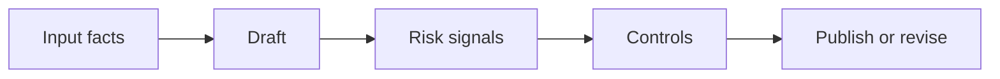

# AI for Corporate Communications and Marketing

> AI can speed up communication work only when claims, tone, audience, and approval are made explicit before publication.

**Type:** Build
**Languages:** Python
**Prerequisites:** Phase 11 Lesson 21 (AI-Assisted Documentation), Phase 11 Lesson 26 (Consultative Prompting)
**Time:** ~45 minutes
**Capability:** Corporate Communications - Message Quality and Review

## Learning Objectives

- Identify communication scenarios where AI support creates brand or approval risk
- Build a message-review artifact in Python
- Map audience risk, brand claim, sensitive topic, and approval gap to controls
- Select review controls before AI-assisted messages are published
- Explain why AI communication work needs sources, tone checks, and ownership

## The Problem

AI can draft announcements, intranet posts, campaign copy, leadership briefs, and customer-facing messages quickly. The risk is that polished text hides weak sources, overstates a claim, misses tone, or bypasses approval.

## The Concept

Communications teams need a repeatable gate. Before using AI-assisted copy, check the audience, claim, sensitivity, and owner. The course artifact turns those signals into a review priority.

### Signals to Look For

- audience risk
- brand claim
- sensitive topic
- approval gap

### Controls to Teach

- source pack
- tone check
- approval owner
- channel plan

### Target Roles

- Corporate Functions
- Leadership
- Business & Strategy Consulting

## Use It

Use the artifact for intranet updates, campaign drafts, leadership notes, customer-facing messages, and change communication.

## Reusable Artifact

Communication AI review checklist.

The template in `outputs/checklist-communications-ai-review.md` can be used before AI-assisted messages are sent or published.

## Key Takeaways

- AI-assisted communication needs explicit source and approval checks.
- Tone quality is not the same as factual reliability.
- Sensitive messages need a named owner.
- The channel plan decides how much review is required.

## Exercises

1. **Establish a baseline.** Run the lesson demo, then capture the inputs, outputs, and one invariant that demonstrates this objective: Identify communication scenarios where AI support creates brand or approval risk.
2. **Change one variable.** Modify a single input or parameter and use the resulting evidence to investigate this objective: Build a message-review artifact in Python.
3. **Probe an edge case.** Predict the result before running it, compare prediction with observation, and explain the discrepancy while applying this objective: Map audience risk, brand claim, sensitive topic, and approval gap to controls.

## Reference Solution

Use the canonical [main.py](../code/main.py) as the executable baseline. A complete solution records a successful run, identifies the invariant tied to “Identify communication scenarios where AI support creates brand or approval risk,” and changes only one variable for the comparison. The edge-case result must distinguish the prediction from the observation, explain the cause using “Map audience risk, brand claim, sensitive topic, and approval gap to controls,” and cite a repeatable check rather than relying on visual inspection alone.
