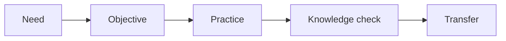

# AI Learning Design and Knowledge Transfer

> AI helps learning teams when it turns role needs into practice, checks, and transfer aids instead of generic training text.

**Type:** Build
**Languages:** Python
**Prerequisites:** Phase 11 Lesson 31 (Hands-on Prompt Clinic), Phase 11 Lesson 34 (AI Champion Enablement)
**Time:** ~45 minutes
**Capability:** Learning - Role-Based AI Enablement

## Learning Objectives

- Identify learning situations where AI can support course design
- Build a learning-design triage artifact in Python
- Map skill gap, role context, practice need, and assessment need to controls
- Choose between micro lessons, workshops, job aids, and assessments
- Explain how AI-generated training content should be grounded in role transfer

## The Problem

Teams often ask for "an AI training" when the real need is more specific: a role skill gap, a guided practice format, a job aid, or a knowledge check. Generic AI text creates training volume without behavior change.

## The Concept

Effective AI learning design starts with transfer. Define the role, the behavior, the practice task, and the evidence that learning happened. Then use AI to speed up drafting without removing instructional judgment.

### Signals to Look For

- skill gap
- role context
- practice need
- assessment need

### Controls to Teach

- objective check
- practice task
- knowledge check
- manager handoff

### Target Roles

- Corporate Functions
- AI Champions
- Leadership
- Project Management & Agility

## Use It

Use the artifact when creating internal AI courses, role enablement paths, workshop plans, job aids, and knowledge checks.

## Reusable Artifact

Learning-design transfer planner.

The template in `outputs/planner-learning-design-transfer.md` can be used before turning a training request into a course or workshop.

## Worked scenario

The demo's first case is **consulting prompt skill**: Role context and practice need for customer-facing prompt work. Treat the labels skill gap, role context, practice need, assessment need as evidence to inspect, not as an automatic approval. The implementation's signal matcher looks for those terms in the scenario name, description, and explicit signal list; then the scorer combines impact, uncertainty, and two points per matched signal (capped at 20). The priority function maps that score to a control level: launch gate at 16 or above, guided pilot at 11–15, team practice at 7–10, and awareness below 7.

Run the case and check which of the controls — objective check, practice task, knowledge check, manager handoff — appear in the returned row. Ask three questions: Which signal is supported by an observable source? Which control has an owner who can act this week? What evidence would move the case to a different priority? Then change one signal or impact value and rerun it. If the priority changes, explain whether the change came from the score, the matching rule, or both. The score is a triage aid; it does not replace domain approval, privacy review, or a pilot metric. Keep that distinction in the artifact and in the handoff.
## Key Takeaways

- Training requests should be translated into role outcomes.
- AI can draft faster, but learning design still needs objectives and practice.
- Knowledge checks should test the target behavior.
- Manager handoff improves transfer into daily work.

## Build It

Reconstruct **AI Learning Design and Knowledge Transfer** by following `Scenario` on the text "red fox". Run `python3 main.py` and verify that the tokenizer/retriever reports zero or a clear empty-input result, rather than borrowing a result from the previous text.

## Ship It

Hand off `outputs/planner-learning-design-transfer.md` with the command `python3 main.py`, the accepted input shape (the text "red fox"), the expected observable result, and a failure note for malformed inputs.

## Exercises

Treat this as a lab exercise. Preserve the setup and result, then explain which observation is doing the evidentiary work.

1. **Reproduce the control run.** Run [main.py](../code/main.py) with `python3 main.py` from the lesson's `code/` directory. Record the smallest input that demonstrates “Identify learning situations where AI can support course design”. Point to `normalize()`, `signal_matches()`, `score_scenario()` and name the returned field or printed value that serves as evidence.
2. **Change one decision.** Change exactly one input, threshold, or option that affects “Build a learning-design triage artifact in Python”. Predict the direction of the change before running it, then compare the two outputs and explain why the other fields should stay stable.
3. **Probe a boundary.** Construct a case that stresses “Map skill gap, role context, practice need, and assessment need to controls”: choose an empty collection, missing field, maximum-sized value, malformed record, or another boundary that fits this lesson. Write the expected behavior first and distinguish an intentional guard from an accidental crash.
4. **Transfer the result.** Open outputs/planner-learning-design-transfer.md and adapt one example to a real workflow. State the owner, evidence, and next decision required for “Choose between micro lessons, workshops, job aids, and assessments”; mark any assumption that the demo does not establish.

## Reference Solution

A complete handoff records python3 main.py, the observed output, and the reasoning behind it. Check:

- evidence for “Identify learning situations where AI can support course design” with the relevant input and returned field;
- a one-variable comparison that makes “Build a learning-design triage artifact in Python” visible;
- a predicted and observed boundary result for “Map skill gap, role context, practice need, and assessment need to controls”, including why the behavior is safe; and
- one concrete update to outputs/planner-learning-design-transfer.md that applies “Choose between micro lessons, workshops, job aids, and assessments” without hiding uncertainty.

Use normalize(), signal_matches(), score_scenario() to explain the result, not only the prose output. If the experiment disagrees with the prediction, keep the failed prediction in the receipt and revise the explanation rather than changing the input until it passes.
