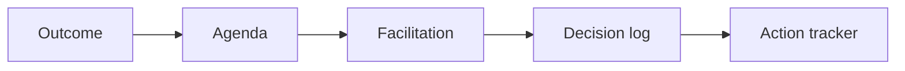

# AI Meeting Facilitation and Workshop Design

> AI makes meetings better when it clarifies outcomes, agendas, decisions, and follow-up before people enter the room.

**Type:** Build
**Languages:** Python
**Prerequisites:** Phase 11 Lesson 26 (Consultative Prompting), Phase 11 Lesson 33 (AI Change Management and Team Integration)
**Time:** ~45 minutes
**Capability:** Collaboration - AI-Supported Meeting Outcomes

## Learning Objectives

- Identify meetings and workshops where AI can improve structure
- Build a meeting-facilitation triage artifact in Python
- Map unclear outcome, mixed audience, decision needed, and follow up risk to controls
- Select facilitation artifacts before a workshop or meeting starts
- Explain why meeting AI should produce decisions and actions, not only summaries

## The Problem

AI is often used after meetings to summarize notes. That helps, but the bigger value comes before the meeting: sharper outcomes, better agendas, cleaner decision logs, and action tracking.

## The Concept

Meeting design starts with the intended outcome. AI can help create an agenda contract, facilitation script, decision log, and action tracker if the risk signals are clear.



### Signals to Look For

- unclear outcome
- mixed audience
- decision needed
- follow up risk

### Controls to Teach

- agenda contract
- facilitation script
- decision log
- action tracker

### Target Roles

- Project Management & Agility
- Leadership
- Business & Strategy Consulting
- Products & Value Streams

## Build It

In the lab you build a meeting and workshop AI planner. It ranks collaboration scenarios and recommends facilitation controls.

Run it locally:

```bash
cd phases/11-llm-engineering/47-ai-meeting-workshop-facilitation/code
python3 main.py
python3 -m unittest discover tests -v
```

## Use It

Use the artifact for roadmap workshops, retrospectives, steering meetings, discovery workshops, and change sessions.

## Reusable Artifact

Meeting AI facilitation canvas.

The template in `outputs/canvas-meeting-workshop-ai.md` can be used before running an AI-assisted workshop or meeting.

## Key Takeaways

- The best AI meeting support starts before the meeting.
- Ambiguous outcomes need stronger facilitation design.
- Decision logs and action trackers prevent summary-only usage.
- Mixed audiences need clearer framing and roles.
