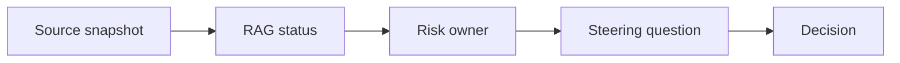

# AI Project Reporting and Steering

> AI project reporting works when status, risks, dependencies, and decisions are tied back to current source evidence.

**Type:** Build
**Languages:** Python
**Prerequisites:** Phase 11 Lesson 25 (AI Cost and Value Economics), Phase 11 Lesson 29 (Decision Making with AI)
**Time:** ~45 minutes
**Capability:** Project Management - AI-Supported Steering

## Learning Objectives

- Identify project reporting scenarios where AI can support steering
- Build a reporting triage artifact in Python
- Map status drift, risk unclear, dependency gap, and decision request to controls
- Select reporting controls before steering material is shared
- Explain why AI-generated status needs source snapshots and explicit decision questions

## The Problem

AI can turn notes, tickets, and project updates into polished status reports. The risk is that old data, unclear risks, and hidden dependencies become a confident narrative that steering groups cannot act on.

## The Concept

Project reporting should connect evidence to action. AI can support the draft, but the report needs source snapshots, RAG status, risk owners, and a clear steering question.

### Signals to Look For

- status drift
- risk unclear
- dependency gap
- decision request

### Controls to Teach

- source snapshot
- rag status
- risk owner
- steering question

### Target Roles

- Project Management & Agility
- Leadership
- Products & Value Streams
- Business & Strategy Consulting

## Use It

Use the artifact for steering packs, weekly status updates, dependency reviews, risk reports, and executive summaries.

## Reusable Artifact

AI steering-report control sheet.

The template in `outputs/sheet-project-reporting-steering.md` can be used before AI-assisted project reports are sent.

## Worked scenario

The demo's first case is **steering pack**: Decision request with risk unclear and dependency gap. Treat the labels status drift, risk unclear, dependency gap, decision request as evidence to inspect, not as an automatic approval. The implementation's signal matcher looks for those terms in the scenario name, description, and explicit signal list; then the scorer combines impact, uncertainty, and two points per matched signal (capped at 20). The priority function maps that score to a control level: launch gate at 16 or above, guided pilot at 11–15, team practice at 7–10, and awareness below 7.

Run the case and check which of the controls — source snapshot, rag status, risk owner, steering question — appear in the returned row. Ask three questions: Which signal is supported by an observable source? Which control has an owner who can act this week? What evidence would move the case to a different priority? Then change one signal or impact value and rerun it. If the priority changes, explain whether the change came from the score, the matching rule, or both. The score is a triage aid; it does not replace domain approval, privacy review, or a pilot metric. Keep that distinction in the artifact and in the handoff.
## Key Takeaways

- AI status reporting must cite current source evidence.
- RAG status should be connected to risks and decisions.
- Ambiguous risks need named owners.
- Steering groups need clear questions, not only polished summaries.

## Build It

Reconstruct **AI Project Reporting and Steering** by following `Scenario` on the demo’s smallest built-in fixture. Run `python3 main.py` and verify that the result reports the empty case explicitly or raises the documented validation error.

## Ship It

Hand off `outputs/sheet-project-reporting-steering.md` with the command `python3 main.py`, the accepted input shape (the demo’s smallest built-in fixture), the expected observable result, and a failure note for malformed inputs.

## Exercises

Start with the smallest reproducible run. Keep the input, output, and interpretation together so another reader can repeat the check.

1. **Trace the happy path.** Run [main.py](../code/main.py) with `python3 main.py` from the lesson's `code/` directory. Record the smallest input that demonstrates “Identify project reporting scenarios where AI can support steering”. Point to `normalize()`, `signal_matches()`, `score_scenario()` and name the returned field or printed value that serves as evidence.
2. **Perturb the input.** Change exactly one input, threshold, or option that affects “Build a reporting triage artifact in Python”. Predict the direction of the change before running it, then compare the two outputs and explain why the other fields should stay stable.
3. **Test a failure case.** Construct a case that stresses “Map status drift, risk unclear, dependency gap, and decision request to controls”: choose an empty collection, missing field, maximum-sized value, malformed record, or another boundary that fits this lesson. Write the expected behavior first and distinguish an intentional guard from an accidental crash.
4. **Transfer the result.** Open outputs/sheet-project-reporting-steering.md and adapt one example to a real workflow. State the owner, evidence, and next decision required for “Select reporting controls before steering material is shared”; mark any assumption that the demo does not establish.

## Reference Solution

Your solution is complete when it records python3 main.py, the captured output, and a short interpretation. Show:

- evidence for “Identify project reporting scenarios where AI can support steering” with the relevant input and returned field;
- a one-variable comparison that makes “Build a reporting triage artifact in Python” visible;
- a predicted and observed boundary result for “Map status drift, risk unclear, dependency gap, and decision request to controls”, including why the behavior is safe; and
- one concrete update to outputs/sheet-project-reporting-steering.md that applies “Select reporting controls before steering material is shared” without hiding uncertainty.

Use normalize(), signal_matches(), score_scenario() to explain the result, not only the prose output. If the experiment disagrees with the prediction, keep the failed prediction in the receipt and revise the explanation rather than changing the input until it passes.
