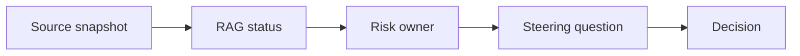

# AI Project Reporting and Steering

> AI project reporting works when status, risks, dependencies, and decisions are tied back to current source evidence.

**Type:** Build
**Languages:** Python
**Prerequisites:** Phase 11 Lesson 25 (AI Cost and Value Economics), Phase 11 Lesson 29 (Decision Making with AI)
**Time:** ~45 minutes
**Capability:** Project Management - AI-Supported Steering

## Learning Objectives

- Identify project reporting scenarios where AI can support steering
- Build a reporting triage artifact in Python
- Map status drift, risk unclear, dependency gap, and decision request to controls
- Select reporting controls before steering material is shared
- Explain why AI-generated status needs source snapshots and explicit decision questions

## The Problem

AI can turn notes, tickets, and project updates into polished status reports. The risk is that old data, unclear risks, and hidden dependencies become a confident narrative that steering groups cannot act on.

## The Concept

Project reporting should connect evidence to action. AI can support the draft, but the report needs source snapshots, RAG status, risk owners, and a clear steering question.

### Signals to Look For

- status drift
- risk unclear
- dependency gap
- decision request

### Controls to Teach

- source snapshot
- rag status
- risk owner
- steering question

### Target Roles

- Project Management & Agility
- Leadership
- Products & Value Streams
- Business & Strategy Consulting

## Use It

Use the artifact for steering packs, weekly status updates, dependency reviews, risk reports, and executive summaries.

## Reusable Artifact

AI steering-report control sheet.

The template in `outputs/sheet-project-reporting-steering.md` can be used before AI-assisted project reports are sent.

## Key Takeaways

- AI status reporting must cite current source evidence.
- RAG status should be connected to risks and decisions.
- Ambiguous risks need named owners.
- Steering groups need clear questions, not only polished summaries.

## Exercises

1. **Establish a baseline.** Run the lesson demo, then capture the inputs, outputs, and one invariant that demonstrates this objective: Identify project reporting scenarios where AI can support steering.
2. **Change one variable.** Modify a single input or parameter and use the resulting evidence to investigate this objective: Build a reporting triage artifact in Python.
3. **Probe an edge case.** Predict the result before running it, compare prediction with observation, and explain the discrepancy while applying this objective: Map status drift, risk unclear, dependency gap, and decision request to controls.

## Reference Solution

Use the canonical [main.py](../code/main.py) as the executable baseline. A complete solution records a successful run, identifies the invariant tied to “Identify project reporting scenarios where AI can support steering,” and changes only one variable for the comparison. The edge-case result must distinguish the prediction from the observation, explain the cause using “Map status drift, risk unclear, dependency gap, and decision request to controls,” and cite a repeatable check rather than relying on visual inspection alone.
